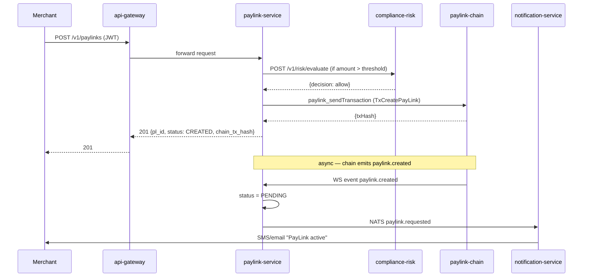
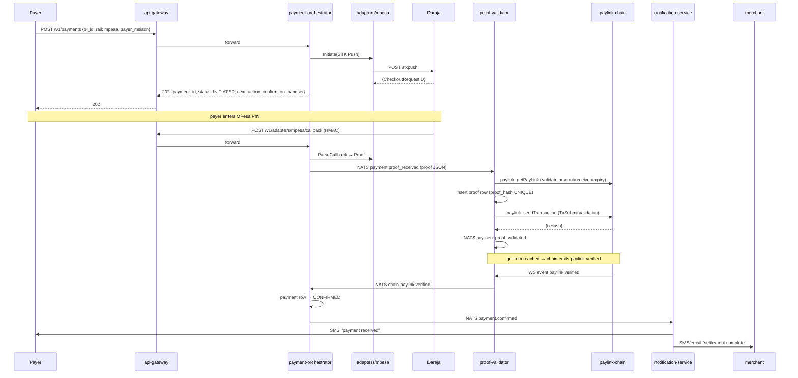
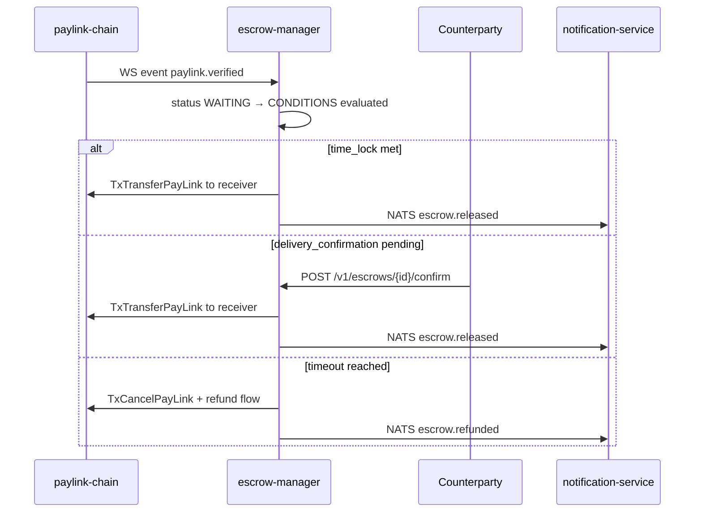
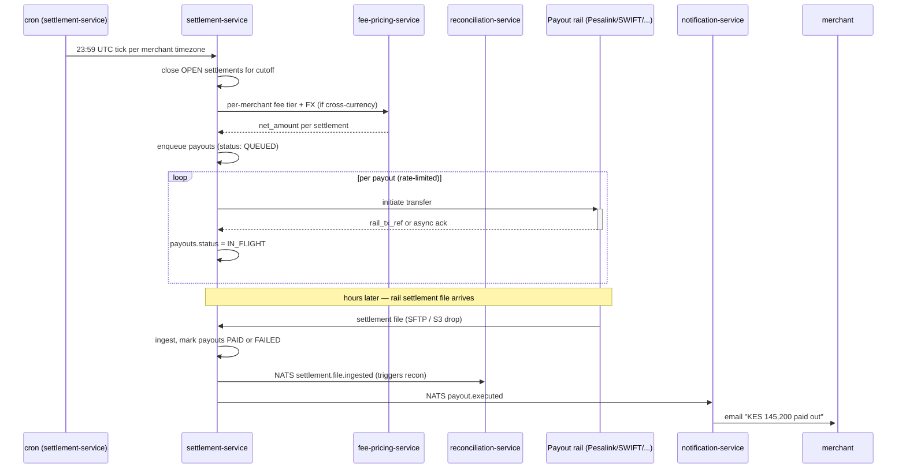
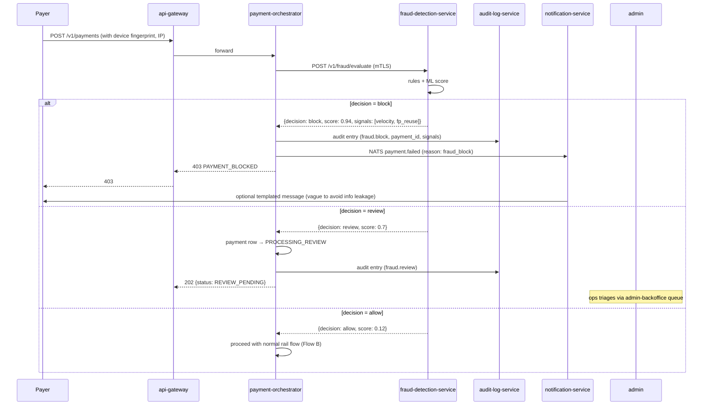

# LinkMint Backend Feature Specification

Scope: the **off-chain microservice fleet** that surrounds `paylink-chain/`. For chain-layer work see [`blockchainfeature.md`](blockchainfeature.md); for product context see [`prd.md`](prd.md); for protocol design see [`system.md`](system.md).

This document is the contract every backend service is built against. Each section lists REST endpoints, event contracts, data model, and acceptance criteria — phase-tagged so a Phase 1 reader can ignore everything else.

## Invariants

Every backend service must respect these four rules without exception:

1. **Non-custodial.** Services never hold, mint, or move user funds. All rail money flows sender → external rail → receiver directly. LinkMint records intent and proofs, never custody.
2. **Canonical rail-proof shape.** All adapters normalize to `{pl_id, rail, tx_id, amount, timestamp, sender, receiver, proof_signature}` before submission. Core services are rail-unaware.
3. **Anti-replay by `proof_hash`.** `proof_hash = SHA256(pl_id || tx_id || amount)`; the chain stores used proof hashes; one proof settles exactly one PayLink.
4. **Byte-exact chain wire format.** Any service constructing a chain transaction MUST import `paylink-chain/internal/types` and `paylink-chain/internal/crypto` (i.e., be a Go service). Reimplementing `Transaction.SignableBytes` or ECDSA `r||s` encoding in another language is prohibited — it silently produces invalid txs.

---

## 1. Architecture Overview

### Topology

```
   ┌────────────────────────────────────────────────────────────────────────┐
   │   Clients: web │ mobile │ CLI │ merchant SDK │ admin console           │
   └──────────────────────────────────┬─────────────────────────────────────┘
                                      │ HTTPS/JSON
                           ┌──────────▼──────────┐
                           │     api-gateway     │   (Python/FastAPI)
                           │ auth · rate · route │
                           └──────────┬──────────┘
                                      │
   ┌──────────────────────────────────┼──────────────────────────────────────┐
   │                       EDGE / IDENTITY TIER                              │
   │  identity-service · merchant-onboarding · admin-backoffice              │
   │  (Python/FastAPI)                                                       │
   └──────────────────────────────────┬──────────────────────────────────────┘
                                      │
   ┌──────────────────────────────────┼──────────────────────────────────────┐
   │                       PRODUCT TIER                                      │
   │  paylink-service · invoice-subscription · escrow-manager                │
   │  fee-pricing · refund-dispute                                           │
   └──────────────────────────────────┬──────────────────────────────────────┘
                                      │     NATS JetStream event bus
   ┌──────────────────────────────────┼──────────────────────────────────────┐
   │                       PAYMENT TIER                                      │
   │  payment-orchestrator ◄─► proof-validator ◄─► settlement-service        │
   │  wallet-service                                                         │
   │  (Go)                                                                   │
   └─────────┬──────────────────────┬─┴───────────────────────────┬──────────┘
             │                      │                             │
             │ adapters             │ JSON-RPC + WS               │
             ▼                      ▼                             │
        ┌─────────┐         ┌──────────────────┐                  │
        │  Rails  │         │  paylink-chain   │◄─────────────────┘
        │ mpesa,  │         │  (Go L1 node)    │
        │ card,   │         └──────────────────┘
        │ crypto, │
        │ bank    │
        └─────────┘

   ┌─────────────────────────────────────────────────────────────────────────┐
   │                       RISK / TRUST TIER                                 │
   │  compliance-risk · fraud-detection · audit-log                          │
   └─────────────────────────────────────────────────────────────────────────┘

   ┌─────────────────────────────────────────────────────────────────────────┐
   │                       SUPPORT TIER                                      │
   │  notification-service · reporting-analytics · reconciliation            │
   └─────────────────────────────────────────────────────────────────────────┘

   Backing stores: PostgreSQL · Redis · NATS JetStream · S3 (artifacts) · ClickHouse (analytics)
```

**Service tiers** — grouping is logical, not deployment:
- **Edge / Identity:** who is calling and is the call allowed at all (auth, accounts, ops console).
- **Product:** what the customer asked for (PayLinks, invoices, escrow, pricing, refunds).
- **Payment:** how the money actually moves (orchestration, proof submission, settlement, wallet).
- **Risk / Trust:** can this happen safely (KYC/AML, fraud, audit).
- **Support:** everything async around the transaction (notifications, reports, reconciliation).

### Communication patterns

- **Synchronous** — REST/JSON between client ↔ api-gateway ↔ services. Internal high-perf paths (orchestrator ↔ proof-validator) use gRPC over the same Kubernetes service mesh.
- **Asynchronous** — NATS JetStream as the event bus. Chosen over Kafka/SQS for operational simplicity at the expected payments TPS; durable subjects + consumer groups cover Kafka's must-haves without the operational footprint. Re-evaluate at >5k TPS sustained.
- **Chain subscription** — every service that reacts to settlement subscribes to the chain's WebSocket event stream via `internal/datastream/`. A `chain-event-mirror` sidecar (lightweight Go binary, part of each chain-adjacent service deployment) translates chain events into NATS subjects under `chain.*` so Python services consume them through one bus.

### Service stack split

| Service | Language | Framework | Tier | Why |
|---|---|---|---|---|
| `api-gateway` | Python 3.12 | FastAPI + `fastapi-limiter` | Edge | Auth, rate-limit, OpenAPI aggregation |
| `identity-service` | Python 3.12 | FastAPI + `authlib` + `sqlmodel` | Edge | User/org/role model; OAuth, MFA, API keys |
| `merchant-onboarding` | Python 3.12 | FastAPI + `sqlmodel` | Edge | Business verification, bank linking, fee tier |
| `admin-backoffice` | Python 3.12 | FastAPI + `sqlmodel` | Edge | Internal ops console: lookup, freeze, override |
| `paylink-service` | Python 3.12 | FastAPI + `sqlmodel` + `dbmate` | Product | CRUD-heavy, schema changes weekly |
| `invoice-subscription` | Python 3.12 | FastAPI + APScheduler | Product | Multi-line invoices + recurring billing |
| `escrow-manager` | Go 1.25 | `chi` + `sqlc` | Product | Time-locked release; touches chain |
| `fee-pricing-service` | Python 3.12 | FastAPI + `sqlmodel` | Product | Per-merchant pricing, FX, fee calc |
| `refund-dispute-service` | Python 3.12 | FastAPI + `sqlmodel` | Product | Refunds + chargebacks + evidence |
| `payment-orchestrator` | Go 1.25 | `chi` + `sqlc` | Payment | Concurrent webhook fan-out; perf-sensitive |
| `proof-validator` | Go 1.25 | `chi` + `sqlc` | Payment | Imports chain crypto; byte-exact tx signing |
| `settlement-service` | Go 1.25 | `chi` + `sqlc` | Payment | Payouts + rail settlement-file ingest |
| `wallet-service` | Go 1.25 | `chi` + `sqlc` | Payment | PLN balance, staking ops, treasury queries |
| `compliance-risk` | Python 3.12 | FastAPI + scikit-learn | Risk | Sanctions screening, KYC/AML |
| `fraud-detection-service` | Python 3.12 | FastAPI + XGBoost + Redis | Risk | Real-time behavioral fraud scoring |
| `audit-log-service` | Go 1.25 | `chi` + append-only store | Risk | Tamper-evident audit trail (hash-chained) |
| `notification-service` | Python 3.12 | FastAPI + Celery + Redis broker | Support | Multi-channel fan-out, retry semantics |
| `reporting-analytics` | Python 3.12 | FastAPI + DuckDB + ClickHouse client | Support | Reports, exports, regulatory filings |
| `reconciliation-service` | Go 1.25 | `chi` + `sqlc` | Support | Daily 3-way recon: DB ↔ chain ↔ rails |

### Cross-cutting concerns

- **Logging** — `slog` (Go) / `structlog` (Python), JSON output, correlation-id propagation via `X-Request-Id` header and `trace_id` event field.
- **Tracing** — OpenTelemetry SDKs, OTLP export to Tempo/Jaeger.
- **Metrics** — Prometheus scrape `/metrics` on every service; standard counters (`http_requests_total`, `nats_messages_consumed_total`, `chain_txs_submitted_total`) plus service-specific.
- **Secrets** — AWS KMS or HashiCorp Vault references; `.env` files for local only, never committed; CI rejects PRs containing `sk_*` / `AKIA*` patterns.
- **Idempotency** — every state-mutating REST endpoint accepts `Idempotency-Key` header; Redis cache keyed `idem:<service>:<key>` with 24h TTL stores the prior response.
- **Service identity** — each service has a service account with mTLS cert; cross-service calls authenticated via SPIFFE/SPIRE.

---

## 2. Services

### 2.1 api-gateway *(Phase 1)*

**Purpose.** Single ingress for all external traffic. Authenticates, rate-limits, routes to upstream services, aggregates OpenAPI specs.

**Endpoints.** Pass-through routing — the gateway owns no business logic. Auth middleware applied per route:

| Pattern | Auth | Target |
|---|---|---|
| `POST /v1/auth/login`, `/refresh`, `/logout`, `/mfa/*` | varies | `identity-service` |
| `POST /v1/auth/oauth/{provider}` | none | `identity-service` |
| `GET, POST, DELETE /v1/users/me`, `/users/me/api-keys` | JWT | `identity-service` |
| `POST /v1/organizations`, `/organizations/{id}/members` | JWT (admin role) | `identity-service` |
| `POST /v1/merchants/onboard`, `/merchants/{id}/bank-accounts` | JWT (merchant) | `merchant-onboarding` |
| `GET, POST /v1/merchants/{id}/contracts`, `/fee-tier` | JWT (merchant) | `merchant-onboarding` |
| `POST /v1/paylinks` | JWT (merchant) | `paylink-service` |
| `GET /v1/paylinks/{pl_id}` | none (public) | `paylink-service` |
| `POST /v1/paylinks/{pl_id}/cancel` | JWT (owner) | `paylink-service` |
| `POST /v1/invoices`, `/invoices/{id}/lines`, `/subscriptions` | JWT (merchant) | `invoice-subscription` |
| `GET /v1/pricing/quote?amount=&rail=&merchant=` | JWT | `fee-pricing-service` |
| `GET /v1/fx/rates` | JWT | `fee-pricing-service` |
| `POST /v1/payments` | JWT (payer) | `payment-orchestrator` |
| `POST /v1/adapters/{rail}/callback` | HMAC API key | `payment-orchestrator` |
| `GET /v1/payments/{payment_id}` | JWT (payer or receiver) | `payment-orchestrator` |
| `POST /v1/refunds`, `/disputes`, `/disputes/{id}/evidence` | JWT (party) | `refund-dispute-service` |
| `POST /v1/escrows`, `/escrows/{id}/confirm`, `/dispute` | JWT (party) | `escrow-manager` |
| `GET /v1/settlements`, `/settlements/{id}`, `/payouts` | JWT (merchant) | `settlement-service` |
| `GET /v1/wallets/{addr}`, `/staking/positions`, `/rewards` | JWT | `wallet-service` |
| `POST /v1/webhooks` | JWT (merchant) | `notification-service` |
| `GET /v1/compliance/status`, `/kyc/sessions` | JWT (user) | `compliance-risk` |
| `POST /v1/fraud/evaluate` *(internal mTLS)* | mTLS | `fraud-detection-service` |
| `GET /v1/reports/{kind}`, `/exports` | JWT (merchant) | `reporting-analytics` |
| `GET /v1/audit-log?actor=&resource=` | JWT (admin) | `audit-log-service` |
| `/v1/admin/*` (user lookup, freeze, force-refund, …) | JWT (admin role) | `admin-backoffice` |

**Auth schemes.**
- **JWT** — RS256, 60-minute access tokens, refresh tokens via `/v1/auth/refresh`. Claims include `sub`, `role` (`merchant|payer|admin`), `kyc_tier`.
- **HMAC API key** — adapter callbacks sign `(timestamp, body)` with shared secret; gateway rejects requests with timestamp drift > 5 minutes or invalid HMAC.
- **None** — public PayLink resolve only.

**Rate limits.** Per-principal (JWT `sub` or API key) sliding window. Defaults: 60 rpm for users, 600 rpm for adapter callbacks, 10 rpm for unauthenticated reads.

**Errors.** Returns standard error envelope: `{"error": {"code": "PAYLINK_EXPIRED", "message": "...", "details": {}, "trace_id": "..."}}`.

**Phase 1 acceptance.** All routes listed above proxied; JWT issuance + verification working; rate-limit returns 429 after threshold; OpenAPI spec reachable at `/v1/openapi.json`.

---

### 2.2 paylink-service *(Phase 1)*

**Purpose.** System of record for PayLinks. Owns the off-chain CRUD state machine and reconciles with on-chain status via the event stream.

**Endpoints.**

| Method | Path | Auth | Request | Response | Errors |
|---|---|---|---|---|---|
| POST | `/v1/paylinks` | merchant | `{receiver, amount, currency, expiry, usage, metadata, rules?}` | `{pl_id, status, created_at, chain_tx_hash}` | `400 INVALID_PAYLOAD`, `402 KYC_REQUIRED`, `409 IDEMPOTENT_CONFLICT` |
| GET | `/v1/paylinks/{pl_id}` | public | — | `{pl_id, creator, receiver, amount, status, expiry, vote_count, ...}` | `404 PAYLINK_NOT_FOUND` |
| POST | `/v1/paylinks/{pl_id}/cancel` | owner | — | `{pl_id, status: "CANCELLED"}` | `404`, `409 PAYLINK_ALREADY_SETTLED` |
| GET | `/v1/paylinks?creator={addr}&status=&limit=&cursor=` | merchant/admin | — | `{items[], next_cursor}` | `400 INVALID_QUERY` |

**State machine.** `CREATED → PENDING → VERIFIED | FAILED | CANCELLED | EXPIRED`. Transitions driven by chain events (PENDING → VERIFIED on `paylink.verified`) and a periodic expiry sweeper (PENDING → EXPIRED when `now > expiry`).

**Events produced** (NATS subject `paylink.*`):
- `paylink.requested` — emitted on `POST /v1/paylinks` *before* chain submission. Payload: `{pl_id, creator, receiver, amount, currency, expiry, usage}`. Consumed by `compliance-risk` and `payment-orchestrator`.
- `paylink.expired` — emitted by expiry sweeper. Payload: `{pl_id, creator, receiver, expiry}`. Consumed by `notification-service`.

**Events consumed.**
- `chain.paylink.created` — confirms on-chain creation; updates `status = PENDING`, stores `chain_tx_hash`.
- `chain.paylink.verified` — updates `status = VERIFIED`, records `verified_at`.
- `chain.paylink.cancelled` / `chain.paylink.failed` — updates `status` accordingly.
- `compliance.check.failed` — updates `status = CANCELLED` with reason `compliance_block`.

**Data model.**

```sql
CREATE SCHEMA paylink;

CREATE TABLE paylink.paylinks (
  pl_id           TEXT PRIMARY KEY,                      -- chain-issued hash
  creator_addr    TEXT NOT NULL,
  receiver_addr   TEXT NOT NULL,
  owner_addr      TEXT NOT NULL,                          -- mirrors chain ownership
  amount          NUMERIC(38,0) NOT NULL,                 -- minor units, decimal-safe
  currency        TEXT NOT NULL,                          -- ISO 4217 + PLN
  status          TEXT NOT NULL,                          -- CREATED/PENDING/VERIFIED/FAILED/CANCELLED/EXPIRED
  expiry          TIMESTAMPTZ NOT NULL,
  usage           TEXT NOT NULL,                          -- 'single' | 'multi'
  metadata        JSONB,
  rules           JSONB,                                  -- immutable after creation
  chain_tx_hash   TEXT,
  vote_count      INT NOT NULL DEFAULT 0,
  created_at      TIMESTAMPTZ NOT NULL DEFAULT now(),
  updated_at      TIMESTAMPTZ NOT NULL DEFAULT now(),
  verified_at     TIMESTAMPTZ
);

CREATE INDEX paylinks_creator_idx ON paylink.paylinks (creator_addr, status, created_at DESC);
CREATE INDEX paylinks_receiver_idx ON paylink.paylinks (receiver_addr, status, created_at DESC);
CREATE INDEX paylinks_expiry_idx ON paylink.paylinks (expiry) WHERE status = 'PENDING';

CREATE TABLE paylink.paylink_events (
  id          BIGSERIAL PRIMARY KEY,
  pl_id       TEXT NOT NULL REFERENCES paylink.paylinks(pl_id),
  kind        TEXT NOT NULL,
  payload     JSONB NOT NULL,
  occurred_at TIMESTAMPTZ NOT NULL DEFAULT now()
);
```

**External dependencies.** `paylink-chain` JSON-RPC (`paylink_sendTransaction`, `paylink_getPayLink`); NATS for event consumption; `compliance-risk` for synchronous KYC gate on `POST /v1/paylinks` when `amount > threshold`.

**Acceptance criteria.**
- *Phase 1:* CRUD endpoints + chain reconciliation; expiry sweeper runs every 60s; integration test creates PayLink → asserts row + chain submission + status update on `chain.paylink.created` event.
- *Phase 2:* `rules` field validated against chain rule schema; ownership transfers reflected from `chain.paylink.transferred`.
- *Phase 3:* paginated query endpoints meet p95 < 100ms with 10M+ rows.

---

### 2.3 payment-orchestrator *(Phase 1: MPesa; Phase 2: + card + crypto)*

**Purpose.** Coordinates the lifecycle of a payment attempt against a chosen rail. Subscribes `paylink.requested`, selects the adapter, drives rail-specific flow, hands proofs to `proof-validator`.

**Endpoints.**

| Method | Path | Auth | Request | Response | Errors |
|---|---|---|---|---|---|
| POST | `/v1/payments` | payer | `{pl_id, rail, payer_identifier}` | `{payment_id, status: "INITIATED", next_action}` | `400 INVALID_RAIL`, `404 PAYLINK_NOT_FOUND`, `410 PAYLINK_EXPIRED` |
| POST | `/v1/adapters/mpesa/callback` | HMAC | Daraja C2B callback body | `{ok: true}` | `401 INVALID_SIGNATURE` |
| POST | `/v1/adapters/card/callback` *(Phase 2)* | Stripe webhook sig | Stripe event body | `{ok: true}` | `401` |
| POST | `/v1/adapters/crypto/callback` *(Phase 2)* | HMAC | `{tx_hash, network, pl_id}` | `{ok: true}` | `401` |
| GET | `/v1/payments/{payment_id}` | payer/receiver | — | `{payment_id, pl_id, rail, status, rail_tx_id, ...}` | `404` |

**State machine.** `INITIATED → PROCESSING → CONFIRMED | FAILED | TIMEOUT`. Per-rail timeout defaults: MPesa 120s, card 300s, crypto 600s (or 6 confirmations, whichever later).

**Events produced** (`payment.*`):
- `payment.initiated` — payload: `{payment_id, pl_id, rail, payer, amount}`.
- `payment.proof_received` — adapter callback parsed; payload: full canonical proof.
- `payment.failed` — payload: `{payment_id, rail, reason}`.
- `payment.timeout` — payload: `{payment_id, rail}`.

**Events consumed.**
- `paylink.requested` — pre-warms adapter session (e.g., reserve MPesa transaction ID).
- `chain.paylink.verified` — updates payment row to `CONFIRMED`, finalizes ledger entry.

**Rail-specific flows.**
- **MPesa (Phase 1):** `POST /v1/payments` triggers Daraja STK Push via the `adapters/mpesa` SDK wrapper; callback URL at `/v1/adapters/mpesa/callback`; on success, canonical proof is constructed and emitted to `payment.proof_received` (consumed by `proof-validator`).
- **Card (Phase 2):** Create Stripe `PaymentIntent` with `pl_id` in metadata; client confirms with Stripe.js; Stripe webhook → callback verified by `stripe.Webhook.constructEvent` equivalent → canonical proof emitted.
- **Crypto (Phase 2):** Generate deterministic receive address per PayLink; chain-watcher goroutine polls or subscribes; on N-confirmation, emit proof.

**Data model.**

```sql
CREATE SCHEMA payment;

CREATE TABLE payment.payments (
  payment_id      UUID PRIMARY KEY,
  pl_id           TEXT NOT NULL,                          -- opaque ref to paylink.paylinks
  rail            TEXT NOT NULL,                          -- 'mpesa'|'card'|'crypto'|'bank'
  payer           TEXT NOT NULL,                          -- rail-specific identifier
  amount          NUMERIC(38,0) NOT NULL,
  currency        TEXT NOT NULL,
  status          TEXT NOT NULL,                          -- INITIATED/PROCESSING/CONFIRMED/FAILED/TIMEOUT
  rail_tx_id      TEXT,                                   -- populated on callback
  proof_hash      TEXT UNIQUE,                            -- enforces anti-replay before chain
  initiated_at    TIMESTAMPTZ NOT NULL DEFAULT now(),
  confirmed_at    TIMESTAMPTZ,
  failure_reason  TEXT,
  idempotency_key TEXT UNIQUE
);

CREATE INDEX payments_pl_idx ON payment.payments (pl_id, status);

CREATE TABLE payment.rail_callbacks (
  id             BIGSERIAL PRIMARY KEY,
  rail           TEXT NOT NULL,
  payment_id     UUID REFERENCES payment.payments(payment_id),
  raw_body       JSONB NOT NULL,                          -- full callback payload for audit
  signature_ok   BOOLEAN NOT NULL,
  received_at    TIMESTAMPTZ NOT NULL DEFAULT now()
);
```

**External dependencies.** Rail adapters (`adapters/mpesa`, `adapters/card`, etc.); `proof-validator` via NATS; chain JSON-RPC for crypto-rail address watching.

**Acceptance criteria.**
- *Phase 1:* MPesa happy path end-to-end in <30s (per `prd.md` AC1); timeout triggers `payment.timeout` event; duplicate callback rejected by `proof_hash UNIQUE`.
- *Phase 2:* Card + crypto rails behind feature flag; per-rail circuit breaker opens at 50% error rate over 60s.
- *Phase 3:* Per-rail SLO dashboards; auto-failover to next rail on circuit-open.

---

### 2.4 proof-validator *(Phase 1)*

**Purpose.** Receives normalized rail proofs, validates them, constructs and signs `TxSubmitValidation`, broadcasts to the chain. The single chokepoint enforcing the "rail proof → chain settlement" boundary. Must be a Go service to import `paylink-chain/internal/types` and `internal/crypto` directly.

**Endpoints.** Internal only (no external surface):

| Method | Path | Auth | Purpose |
|---|---|---|---|
| GET | `/internal/healthz` | none | k8s liveness |
| GET | `/internal/readyz` | none | k8s readiness (verifies chain RPC + NATS reachability) |
| GET | `/metrics` | none | Prometheus |

**Events produced** (`payment.*`):
- `payment.proof_validated` — proof accepted, chain tx submitted. Payload: `{pl_id, proof_hash, chain_tx_hash, validator_addr}`.
- `payment.proof_rejected` — payload: `{pl_id, proof_hash, reason}` (reason ∈ `invalid_signature|amount_mismatch|receiver_mismatch|expired|replay`).

**Events consumed.**
- `payment.proof_received` — main work trigger.
- `chain.paylink.voted` — updates local vote count, marks proof as confirmed.

**Validation pipeline** (each step on failure → `payment.proof_rejected` + DB row marked `REJECTED`):
1. Adapter signature verifies against registered rail-adapter pubkey (lookup from local config / future on-chain registry per `blockchainfeature.md` P4.2).
2. Amount matches PayLink amount (queried via chain RPC `paylink_getPayLink`).
3. Receiver matches PayLink receiver.
4. `now < pl.expiry`.
5. `proof_hash = SHA256(pl_id || tx_id || amount)`; `INSERT … ON CONFLICT DO NOTHING` on `proof_hash UNIQUE` → conflict = replay.

**Chain submission.** Constructs `TxSubmitValidation{PayLinkID, ProofHash}` using `types.SubmitValidationPayload`, sets `Nonce` from `paylink_getNonce`, signs with the validator's ECDSA key via `crypto.Sign(SHA256(SignableBytes), key)`, submits via `paylink_sendTransaction`.

**Data model.**

```sql
CREATE SCHEMA proof;

CREATE TABLE proof.proofs (
  proof_hash       TEXT PRIMARY KEY,                      -- the chain-side anti-replay key
  pl_id            TEXT NOT NULL,
  rail             TEXT NOT NULL,
  rail_tx_id       TEXT NOT NULL,
  amount           NUMERIC(38,0) NOT NULL,
  adapter_addr     TEXT NOT NULL,                         -- who signed the rail proof
  status           TEXT NOT NULL,                         -- RECEIVED/VALIDATED/REJECTED/CONFIRMED
  rejection_reason TEXT,
  chain_tx_hash    TEXT,                                  -- the TxSubmitValidation hash
  vote_count       INT NOT NULL DEFAULT 0,
  received_at      TIMESTAMPTZ NOT NULL DEFAULT now(),
  submitted_at     TIMESTAMPTZ,
  confirmed_at     TIMESTAMPTZ
);

CREATE INDEX proofs_pl_idx ON proof.proofs (pl_id);
CREATE INDEX proofs_status_idx ON proof.proofs (status, received_at);
```

**Key management.** Validator signing key never leaves the pod's memory; sourced from AWS KMS via envelope encryption at startup. Phase 3 target: HSM-backed signer per `blockchainfeature.md` P4.9.

**External dependencies.** `paylink-chain` JSON-RPC (`paylink_sendTransaction`, `paylink_getPayLink`, `paylink_getNonce`); WebSocket event stream for vote updates; NATS for proof receipt.

**Acceptance criteria.**
- *Phase 1:* Submits a valid MPesa proof end-to-end; rejects forged adapter signature, amount mismatch, replay, expired PayLink (one test per rejection reason); chain tx hash recorded.
- *Phase 2:* Operates as part of a 3-of-5 quorum (per `blockchainfeature.md` P0.4/P0.5); slashing evidence emitted if a peer validator votes for a proof we rejected.
- *Phase 3:* Throughput ≥ 200 proofs/sec per pod; p95 submission latency < 500ms.

---

### 2.5 escrow-manager *(Phase 2)*

**Purpose.** Manages conditional PayLinks: delivery confirmation, time-lock, multi-party approval. Watches chain events for settlement; releases funds (i.e., triggers receiver payout) or refunds based on configured conditions.

**Endpoints.**

| Method | Path | Auth | Request | Response | Errors |
|---|---|---|---|---|---|
| POST | `/v1/escrows` | merchant | `{pl_id, conditions, timeout, refund_to}` | `{escrow_id, status: "WAITING"}` | `400 INVALID_CONDITIONS`, `404 PAYLINK_NOT_FOUND` |
| POST | `/v1/escrows/{escrow_id}/confirm` | counterparty | `{evidence?}` | `{escrow_id, status: "RELEASED", chain_tx_hash}` | `403 NOT_AUTHORIZED`, `409 ALREADY_RESOLVED` |
| POST | `/v1/escrows/{escrow_id}/dispute` | either party | `{reason, evidence}` | `{escrow_id, status: "DISPUTED"}` | `409` |
| GET | `/v1/escrows/{escrow_id}` | party | — | full escrow record | `404` |

**State machine.** `WAITING → CONDITIONS_MET → RELEASED` | `TIMEOUT → REFUNDED` | `DISPUTED → (manual resolution)`.

**Supported conditions.**
- `delivery_confirmation` — counterparty calls `/confirm`.
- `time_lock` — auto-release at `release_at` timestamp.
- `multi_party_approval` — N-of-M signatures from `approvers[]`.

**Events produced** (`escrow.*`):
- `escrow.created`, `escrow.released`, `escrow.refunded`, `escrow.disputed`.

**Events consumed.**
- `chain.paylink.verified` — moves escrow from `WAITING` to evaluation; if conditions already met, releases immediately.
- External webhook events (e.g., marketplace delivery confirmations).

**Data model.**

```sql
CREATE SCHEMA escrow;

CREATE TABLE escrow.escrows (
  escrow_id     UUID PRIMARY KEY,
  pl_id         TEXT NOT NULL UNIQUE,
  status        TEXT NOT NULL,
  conditions    JSONB NOT NULL,                           -- {type, params}[]
  timeout_at    TIMESTAMPTZ NOT NULL,
  refund_to     TEXT NOT NULL,
  created_at    TIMESTAMPTZ NOT NULL DEFAULT now(),
  resolved_at   TIMESTAMPTZ,
  resolution    TEXT                                       -- RELEASED|REFUNDED|DISPUTE_*
);

CREATE TABLE escrow.condition_events (
  id          BIGSERIAL PRIMARY KEY,
  escrow_id   UUID NOT NULL REFERENCES escrow.escrows(escrow_id),
  condition   TEXT NOT NULL,
  actor       TEXT NOT NULL,
  evidence    JSONB,
  occurred_at TIMESTAMPTZ NOT NULL DEFAULT now()
);
```

**External dependencies.** Chain JSON-RPC for triggering release/refund txs; external webhook receivers (marketplace, logistics provider).

**Acceptance criteria.**
- *Phase 2:* Each of the three condition types has an integration test (release, timeout-refund, multi-sig release); disputes flag for manual review and emit `escrow.disputed`.
- *Phase 3:* Dispute resolution UX with admin tooling; on-chain dispute protocol per `blockchainfeature.md` P4.11.

---

### 2.6 compliance-risk *(Phase 2)*

**Purpose.** KYC orchestration, sanctions screening, transaction risk scoring. Gates merchant onboarding and high-value PayLinks. Python for sklearn-based anomaly detection and the richer KYC-provider SDK ecosystem.

**Endpoints.**

| Method | Path | Auth | Request | Response | Errors |
|---|---|---|---|---|---|
| POST | `/v1/kyc/sessions` | user | `{user_id, tier_requested}` | `{session_id, provider_url}` | `400`, `409 ALREADY_VERIFIED` |
| POST | `/v1/kyc/callbacks/{provider}` | HMAC | provider-specific body | `{ok: true}` | `401` |
| GET | `/v1/compliance/status?user_id=` | user/admin | — | `{user_id, kyc_tier, risk_score, flags[]}` | `404` |
| POST | `/v1/risk/evaluate` *(internal)* | mTLS | `{user_id, action, amount?, geo?, ...}` | `{decision: allow|block|review, score, reasons[]}` | `400` |

**Risk model.** Inputs: KYC tier, transaction velocity (counts over 1h/24h/7d), amount vs. tier ceiling, geo-IP vs. registered country, sanctions hit, ML anomaly score (sklearn IsolationForest). Output: `{decision, score 0..1, reasons[]}`.

**Sanctions screening.** Daily refresh of OFAC SDN, UN Consolidated, EU Consolidated lists; fuzzy match via `rapidfuzz`; explicit allowlist for known false positives.

**Events produced** (`compliance.*`):
- `compliance.kyc.passed`, `compliance.kyc.failed`, `compliance.check.passed`, `compliance.check.failed`, `compliance.flag.raised`.

**Events consumed.**
- `paylink.requested` — synchronous-call style via `/v1/risk/evaluate` from `paylink-service` for above-threshold amounts; otherwise async post-hoc evaluation.
- `payment.initiated` — velocity check.

**Data model.**

```sql
CREATE SCHEMA compliance;

CREATE TABLE compliance.kyc_records (
  user_id        UUID PRIMARY KEY,
  tier           SMALLINT NOT NULL DEFAULT 0,             -- 0=none, 1=basic, 2=enhanced
  provider       TEXT,
  provider_ref   TEXT,
  documents      JSONB,                                   -- redacted metadata only
  verified_at    TIMESTAMPTZ,
  expires_at     TIMESTAMPTZ
);

CREATE TABLE compliance.risk_scores (
  id          BIGSERIAL PRIMARY KEY,
  user_id     UUID NOT NULL,
  context     TEXT NOT NULL,                              -- e.g., 'paylink.create:PLK...'
  score       NUMERIC(4,3) NOT NULL,
  decision    TEXT NOT NULL,                              -- allow|block|review
  reasons     JSONB NOT NULL,
  evaluated_at TIMESTAMPTZ NOT NULL DEFAULT now()
);

CREATE TABLE compliance.flags (
  id           BIGSERIAL PRIMARY KEY,
  user_id      UUID NOT NULL,
  kind         TEXT NOT NULL,                             -- sanctions|velocity|geo|manual
  severity     TEXT NOT NULL,                             -- info|warn|block
  payload      JSONB NOT NULL,
  raised_at    TIMESTAMPTZ NOT NULL DEFAULT now(),
  resolved_at  TIMESTAMPTZ,
  resolution   TEXT
);
```

**External dependencies.** KYC provider (Jumio / Smile Identity / Onfido — TBD per open-question §8); sanctions list distribution (OFAC, UN, EU APIs); Slack webhook for high-severity flag alerts.

**Acceptance criteria.**
- *Phase 2:* `risk.evaluate` returns deterministic decision for a fixed test fixture; sanctions match blocks PayLink creation; Kenya AML thresholds enforced (KES 150,000 cumulative without enhanced KYC).
- *Phase 3:* Per-jurisdiction rule sets (US BSA, EU AMLD6, etc.); compliance dashboard for analysts.

---

### 2.7 notification-service *(Phase 1: SMS + email; Phase 2: + push + merchant webhooks)*

**Purpose.** Multi-channel delivery of domain events to users and merchants. Owns retry semantics and template management.

**Endpoints.**

| Method | Path | Auth | Request | Response | Errors |
|---|---|---|---|---|---|
| POST | `/v1/webhooks` | merchant | `{url, events[], secret}` | `{webhook_id, status: "ACTIVE"}` | `400 INVALID_URL` |
| DELETE | `/v1/webhooks/{webhook_id}` | merchant | — | `{ok: true}` | `404` |
| GET | `/v1/webhooks/{webhook_id}/deliveries?status=&limit=` | merchant | — | `{items[], next_cursor}` | `404` |
| POST | `/v1/webhooks/{webhook_id}/test` | merchant | — | `{delivery_id, status}` | `404` |

**Channels.**
- **SMS** — Twilio (international) / Africa's Talking (KE/EA).
- **Email** — SendGrid or AWS SES.
- **Push** — Firebase Cloud Messaging *(Phase 2)*.
- **Webhooks** — HMAC-signed POST to merchant URL *(Phase 2)*.

**Retry policy** (matches `spec.md`): exponential backoff `30s, 2m, 10m, 1h, 6h` — max 5 retries over ~24h; circuit-open after 10 consecutive failures per webhook URL.

**Events consumed.** All domain events; routing per template registry.

**Data model.**

```sql
CREATE SCHEMA notify;

CREATE TABLE notify.webhooks (
  webhook_id   UUID PRIMARY KEY,
  merchant_id  UUID NOT NULL,
  url          TEXT NOT NULL,
  events       TEXT[] NOT NULL,                           -- ['paylink.verified', ...]
  secret       TEXT NOT NULL,                             -- KMS-encrypted
  status       TEXT NOT NULL,                             -- ACTIVE|PAUSED|REVOKED
  created_at   TIMESTAMPTZ NOT NULL DEFAULT now()
);

CREATE TABLE notify.deliveries (
  delivery_id   UUID PRIMARY KEY,
  webhook_id    UUID REFERENCES notify.webhooks(webhook_id),
  channel       TEXT NOT NULL,                            -- sms|email|push|webhook
  recipient     TEXT NOT NULL,
  event_kind    TEXT NOT NULL,
  payload       JSONB NOT NULL,
  status        TEXT NOT NULL,                            -- QUEUED|SENT|FAILED|EXHAUSTED
  attempts      INT NOT NULL DEFAULT 0,
  last_error    TEXT,
  next_retry_at TIMESTAMPTZ,
  created_at    TIMESTAMPTZ NOT NULL DEFAULT now(),
  delivered_at  TIMESTAMPTZ
);

CREATE INDEX deliveries_retry_idx ON notify.deliveries (next_retry_at) WHERE status IN ('QUEUED', 'FAILED');

CREATE TABLE notify.templates (
  template_id  TEXT PRIMARY KEY,                          -- e.g., 'sms.paylink_verified.en'
  channel      TEXT NOT NULL,
  locale       TEXT NOT NULL,
  body         TEXT NOT NULL,
  version      INT NOT NULL,
  active       BOOLEAN NOT NULL DEFAULT TRUE
);
```

**External dependencies.** Twilio/AfricaIsTalking; SendGrid/SES; Firebase; outbound HTTPS to merchant URLs (allowlist only by default in Phase 1).

**Acceptance criteria.**
- *Phase 1:* SMS + email delivered for `paylink.verified` and `payment.failed`; failed delivery retried with documented backoff; templates support placeholders.
- *Phase 2:* Webhook HMAC matches Stripe-style format (`t=…,v1=…`); circuit-open after 10 consecutive failures; delivery log queryable.
- *Phase 3:* Per-merchant rate limit on outbound webhooks; delivery webhook UI in merchant dashboard.

---

### 2.8 adapters/ *(Phase 1: mpesa; Phase 2: card + crypto; Phase 3: bank)*

Each adapter is a small **Go** package that implements a `RailAdapter` interface and is imported by `payment-orchestrator` (and, for inbound callbacks, mounted as an HTTP handler under `/v1/adapters/<rail>/callback`).

```go
type RailAdapter interface {
    Name() string                                              // "mpesa", "card", "crypto", "bank"
    Initiate(ctx, req InitiateRequest) (InitiateResponse, error)
    ParseCallback(ctx, headers http.Header, body []byte) (*Proof, error)
    Sign(p *Proof) error                                       // attaches proof_signature
}
```

**Phase 1 — `adapters/mpesa/`.** Safaricom Daraja: STK Push for initiation, C2B confirmation callback for proof. Auth via consumer key/secret + passkey-derived STK password.

**Phase 2 — `adapters/card/`.** Stripe primary; PaymentIntent with `pl_id` in metadata; webhook signature verification via Stripe's documented HMAC scheme; 3DS handled client-side.

**Phase 2 — `adapters/crypto/`.** Native chain support first (stablecoin transfers to deterministic deposit addresses), then Stellar; address watcher subscribes to chain WS event stream.

**Phase 3 — `adapters/bank/`.** Region-specific: Plaid (US), GoCardless / TrueLayer (EU/UK), per-bank rails for emerging markets. T+1 settlement timing modeled explicitly.

**Acceptance criteria per adapter.** Round-trips a sandbox payment end-to-end; emits a canonical proof that `proof-validator` accepts; replay of the same callback is idempotent at the orchestrator layer (`payment.payments.proof_hash UNIQUE`).

---

### 2.9 identity-service *(Phase 1)*

**Purpose.** System of record for users, organizations, roles, API keys, OAuth identities, and MFA. Issues the JWTs that `api-gateway` verifies. Every other service treats identity as opaque IDs.

**Endpoints.**

| Method | Path | Auth | Purpose |
|---|---|---|---|
| POST | `/v1/auth/register` | none | email/phone + password |
| POST | `/v1/auth/login` | none | returns access + refresh JWT |
| POST | `/v1/auth/refresh` | refresh token | rotates access token |
| POST | `/v1/auth/logout` | JWT | revokes refresh token |
| POST | `/v1/auth/oauth/{provider}/start`, `/callback` | none | Google / Apple / GitHub |
| POST | `/v1/auth/mfa/enroll`, `/verify`, `/disable` | JWT | TOTP (Phase 1), WebAuthn (Phase 2), SMS-OTP fallback |
| GET, PATCH | `/v1/users/me` | JWT | profile |
| POST, GET, DELETE | `/v1/users/me/api-keys` | JWT | issue/rotate/revoke API keys with scopes |
| POST | `/v1/organizations` | JWT | create org (becomes owner) |
| POST, GET, DELETE | `/v1/organizations/{id}/members` | JWT (admin) | invite, list, remove members + roles |
| GET | `/v1/sessions` | JWT | active sessions (revoke individually) |

**Roles** (RBAC): `owner`, `admin`, `developer`, `operator`, `viewer` at org level; `payer` at user level. Scoped API keys carry a subset of role permissions.

**Events produced** (`identity.*`): `user.registered`, `user.verified`, `user.suspended`, `org.created`, `member.added`, `member.removed`, `api_key.issued`, `api_key.revoked`, `mfa.enabled`, `auth.failed` (after N failures).

**Events consumed.** `compliance.kyc.passed` / `failed` (updates user `kyc_tier`).

**Data model.**

```sql
CREATE SCHEMA identity;

CREATE TABLE identity.users (
  user_id        UUID PRIMARY KEY,
  email          TEXT UNIQUE,
  phone          TEXT UNIQUE,
  password_hash  TEXT,                                     -- argon2id; null for OAuth-only
  kyc_tier       SMALLINT NOT NULL DEFAULT 0,
  status         TEXT NOT NULL,                            -- ACTIVE|SUSPENDED|DELETED
  created_at     TIMESTAMPTZ NOT NULL DEFAULT now(),
  last_login_at  TIMESTAMPTZ
);

CREATE TABLE identity.oauth_identities (
  user_id     UUID NOT NULL REFERENCES identity.users(user_id),
  provider    TEXT NOT NULL,                                -- google|apple|github
  subject     TEXT NOT NULL,
  PRIMARY KEY (provider, subject)
);

CREATE TABLE identity.mfa_factors (
  user_id     UUID NOT NULL REFERENCES identity.users(user_id),
  kind        TEXT NOT NULL,                                -- totp|webauthn|sms_otp
  secret      TEXT NOT NULL,                                -- KMS-encrypted
  enrolled_at TIMESTAMPTZ NOT NULL DEFAULT now(),
  PRIMARY KEY (user_id, kind)
);

CREATE TABLE identity.organizations (
  org_id     UUID PRIMARY KEY,
  name       TEXT NOT NULL,
  type       TEXT NOT NULL,                                 -- merchant|developer|admin
  created_by UUID NOT NULL REFERENCES identity.users(user_id),
  created_at TIMESTAMPTZ NOT NULL DEFAULT now()
);

CREATE TABLE identity.memberships (
  org_id  UUID NOT NULL REFERENCES identity.organizations(org_id),
  user_id UUID NOT NULL REFERENCES identity.users(user_id),
  role    TEXT NOT NULL,
  PRIMARY KEY (org_id, user_id)
);

CREATE TABLE identity.api_keys (
  api_key_id  UUID PRIMARY KEY,
  org_id      UUID NOT NULL REFERENCES identity.organizations(org_id),
  name        TEXT NOT NULL,
  prefix      TEXT NOT NULL,                                -- displayed; e.g., 'lm_live_'
  hash        TEXT NOT NULL,                                -- argon2id of full key
  scopes      TEXT[] NOT NULL,
  status      TEXT NOT NULL,                                -- ACTIVE|REVOKED
  created_at  TIMESTAMPTZ NOT NULL DEFAULT now(),
  revoked_at  TIMESTAMPTZ
);

CREATE TABLE identity.sessions (
  session_id     UUID PRIMARY KEY,
  user_id        UUID NOT NULL REFERENCES identity.users(user_id),
  refresh_token  TEXT NOT NULL,                             -- hashed
  user_agent     TEXT,
  ip             INET,
  expires_at     TIMESTAMPTZ NOT NULL,
  revoked_at     TIMESTAMPTZ
);
```

**External dependencies.** OAuth providers (Google, Apple, GitHub); SMTP / Twilio for verification codes; `compliance-risk` for KYC tier sync.

**Acceptance.**
- *Phase 1:* email+password login, OAuth (Google + Apple), TOTP MFA, JWT issuance + rotation, scoped API keys, organization + membership CRUD.
- *Phase 2:* WebAuthn (hardware keys), SAML/OIDC SSO for enterprise orgs, granular API key scopes, audit-log integration on every state change.
- *Phase 3:* per-region data residency for user records; account-deletion + data-export flows (GDPR Art. 17 / 20).

---

### 2.10 merchant-onboarding *(Phase 1)*

**Purpose.** Owns the merchant lifecycle distinct from a personal user account: business verification (separate from KYC), bank-account linking for settlement, contract acceptance, fee-tier assignment.

**Endpoints.**

| Method | Path | Auth | Request | Response | Errors |
|---|---|---|---|---|---|
| POST | `/v1/merchants/onboard` | JWT | `{org_id, business_name, registration_no, country, type}` | `{merchant_id, status: "PENDING_VERIFICATION"}` | `400`, `409 ALREADY_ONBOARDED` |
| POST | `/v1/merchants/{id}/documents` | JWT | multipart (cert of incorporation, tax ID, etc.) | `{document_id, status: "UPLOADED"}` | `413 PAYLOAD_TOO_LARGE` |
| POST | `/v1/merchants/{id}/bank-accounts` | JWT | `{rail, account_details, currency, country}` | `{bank_account_id, status: "PENDING_VERIFY"}` | `400`, `422 INVALID_ACCOUNT` |
| POST | `/v1/merchants/{id}/bank-accounts/{id}/verify` | JWT | `{micro_deposit_amounts?}` | `{status: "VERIFIED"}` | `409` |
| GET, POST | `/v1/merchants/{id}/contracts` | JWT | — / `{contract_version, accepted: true}` | contract record | — |
| GET, PATCH | `/v1/merchants/{id}/fee-tier` | JWT (admin) | `{tier}` | `{tier, effective_at}` | — |
| GET | `/v1/merchants/{id}` | JWT | — | full record | `404` |

**State machine.** `DRAFT → PENDING_VERIFICATION → ACTIVE | REJECTED | SUSPENDED`.

**Events produced** (`merchant.*`): `merchant.onboarded`, `merchant.verified`, `merchant.rejected`, `merchant.suspended`, `merchant.bank_account.added`, `merchant.bank_account.verified`, `merchant.contract.accepted`, `merchant.fee_tier.changed`.

**Events consumed.** `compliance.kyb.passed` / `failed` (Know Your Business, distinct from per-user KYC); `admin.override.*` from `admin-backoffice`.

**Data model.**

```sql
CREATE SCHEMA merchant;

CREATE TABLE merchant.merchants (
  merchant_id      UUID PRIMARY KEY,
  org_id           UUID NOT NULL,                          -- ref identity.organizations
  business_name    TEXT NOT NULL,
  registration_no  TEXT,
  tax_id           TEXT,
  country          TEXT NOT NULL,                          -- ISO 3166-1 alpha-2
  type             TEXT NOT NULL,                          -- individual|company|nonprofit
  status           TEXT NOT NULL,
  fee_tier         TEXT NOT NULL DEFAULT 'standard',
  onboarded_at     TIMESTAMPTZ,
  suspended_at     TIMESTAMPTZ,
  suspended_reason TEXT
);

CREATE TABLE merchant.bank_accounts (
  bank_account_id UUID PRIMARY KEY,
  merchant_id     UUID NOT NULL REFERENCES merchant.merchants(merchant_id),
  rail            TEXT NOT NULL,                           -- mpesa|swift|sepa|ach|crypto
  account_ref     TEXT NOT NULL,                           -- KMS-encrypted account number / wallet
  currency        TEXT NOT NULL,
  status          TEXT NOT NULL,                           -- PENDING_VERIFY|VERIFIED|REVOKED
  verified_at     TIMESTAMPTZ
);

CREATE TABLE merchant.documents (
  document_id  UUID PRIMARY KEY,
  merchant_id  UUID NOT NULL REFERENCES merchant.merchants(merchant_id),
  kind         TEXT NOT NULL,                              -- cert_incorporation|tax_id|director_id|...
  s3_key       TEXT NOT NULL,
  uploaded_at  TIMESTAMPTZ NOT NULL DEFAULT now(),
  review       JSONB                                       -- result of compliance review
);

CREATE TABLE merchant.contracts (
  id           BIGSERIAL PRIMARY KEY,
  merchant_id  UUID NOT NULL REFERENCES merchant.merchants(merchant_id),
  version      TEXT NOT NULL,
  accepted_by  UUID NOT NULL,                              -- ref identity.users
  accepted_at  TIMESTAMPTZ NOT NULL DEFAULT now(),
  ip           INET,
  user_agent   TEXT
);
```

**External dependencies.** Companies registry lookups (per country); `compliance-risk` for KYB; S3 / object store for documents; `fee-pricing-service` for tier defaults; bank-verification adapters (micro-deposit for ACH/SEPA, name-match for MPesa B2B).

**Acceptance.**
- *Phase 1:* Single-country (Kenya) merchant onboarding; manual review queue surfaced in `admin-backoffice`; MPesa B2B paybill verification.
- *Phase 2:* Auto-onboarding for low-risk SMEs (companies registry API hit + sanctions clear); SWIFT / SEPA bank linking; multi-currency bank accounts.
- *Phase 3:* Self-serve onboarding flow with sub-5-minute time-to-active for low-risk countries; per-country document templates.

---

### 2.11 settlement-service *(Phase 2)*

**Purpose.** Owns the **off-chain settlement lifecycle**: aggregates verified PayLinks per merchant, schedules and executes payouts to merchant bank accounts via the appropriate rail, ingests rail settlement files, produces statements. Go because it processes large daily settlement files and constructs chain ledger entries.

**Endpoints.**

| Method | Path | Auth | Request | Response | Errors |
|---|---|---|---|---|---|
| GET | `/v1/settlements?merchant_id=&from=&to=` | JWT (merchant/admin) | — | `{items[], next_cursor}` | — |
| GET | `/v1/settlements/{settlement_id}` | JWT | — | settlement with line items | `404` |
| GET | `/v1/payouts?merchant_id=&status=` | JWT | — | list of payouts | — |
| POST | `/v1/payouts` | JWT (merchant) | `{merchant_id, currency, requested_amount?, bank_account_id}` | `{payout_id, status: "QUEUED"}` | `400 BELOW_MINIMUM`, `409 INSUFFICIENT_BALANCE` |
| GET | `/v1/payouts/{payout_id}` | JWT | — | payout record | `404` |
| POST | `/v1/settlements/files/ingest` *(internal)* | mTLS | `{rail, s3_key}` | `{ingest_id, status}` | — |

**Payout scheduling.** Default daily (T+1) cutoff at 23:59 UTC per merchant timezone; merchants can opt into instant payouts (per-rail fee) or weekly schedules. Minimum payout per currency configurable in `fee-pricing-service`.

**Reconciliation.** Daily rail settlement files (MPesa B2B settlement report, Stripe payouts CSV, ACH NACHA returns) are ingested and matched against `payment.payments` rows; any mismatch raises a `reconciliation.discrepancy` event.

**Events produced** (`settlement.*`): `settlement.created`, `settlement.line_added`, `payout.queued`, `payout.executed`, `payout.failed`, `settlement.file.ingested`, `settlement.file.discrepancy`.

**Events consumed.** `chain.paylink.verified` (adds a line to the merchant's pending settlement); `chain.fee.collected` (deducts platform fee); `merchant.bank_account.verified` (enables payouts); rail callbacks for payout confirmation.

**Data model.**

```sql
CREATE SCHEMA settlement;

CREATE TABLE settlement.settlements (
  settlement_id   UUID PRIMARY KEY,
  merchant_id     UUID NOT NULL,
  currency        TEXT NOT NULL,
  period_start    TIMESTAMPTZ NOT NULL,
  period_end      TIMESTAMPTZ NOT NULL,
  gross_amount    NUMERIC(38,0) NOT NULL DEFAULT 0,
  fee_amount      NUMERIC(38,0) NOT NULL DEFAULT 0,
  net_amount      NUMERIC(38,0) NOT NULL DEFAULT 0,
  status          TEXT NOT NULL,                           -- OPEN|CLOSED|PAID_OUT
  closed_at       TIMESTAMPTZ
);

CREATE TABLE settlement.settlement_lines (
  id              BIGSERIAL PRIMARY KEY,
  settlement_id   UUID NOT NULL REFERENCES settlement.settlements(settlement_id),
  pl_id           TEXT NOT NULL,
  payment_id      UUID NOT NULL,
  gross_amount    NUMERIC(38,0) NOT NULL,
  fee_amount      NUMERIC(38,0) NOT NULL,
  rail            TEXT NOT NULL,
  added_at        TIMESTAMPTZ NOT NULL DEFAULT now()
);

CREATE TABLE settlement.payouts (
  payout_id       UUID PRIMARY KEY,
  merchant_id     UUID NOT NULL,
  bank_account_id UUID NOT NULL,
  currency        TEXT NOT NULL,
  amount          NUMERIC(38,0) NOT NULL,
  fee             NUMERIC(38,0) NOT NULL DEFAULT 0,        -- payout rail fee
  status          TEXT NOT NULL,                           -- QUEUED|IN_FLIGHT|PAID|FAILED
  rail            TEXT NOT NULL,
  rail_tx_ref     TEXT,
  scheduled_at    TIMESTAMPTZ NOT NULL DEFAULT now(),
  executed_at     TIMESTAMPTZ,
  failure_reason  TEXT
);

CREATE TABLE settlement.rail_files (
  file_id      UUID PRIMARY KEY,
  rail         TEXT NOT NULL,
  s3_key       TEXT NOT NULL,
  ingest_status TEXT NOT NULL,                             -- PENDING|MATCHED|PARTIAL|FAILED
  matched_rows  INT NOT NULL DEFAULT 0,
  unmatched_rows INT NOT NULL DEFAULT 0,
  ingested_at  TIMESTAMPTZ NOT NULL DEFAULT now()
);
```

**External dependencies.** Bank rails for payout (Pesalink/Stripe Treasury/SWIFT); S3 for settlement files; `reconciliation-service` for discrepancy escalation.

**Acceptance.**
- *Phase 2:* Daily T+1 payout for MPesa-collected merchants; rail settlement files matched ≥99.5% on first pass; discrepancies flagged within 1h of file ingest.
- *Phase 3:* Instant payouts for eligible merchants; multi-currency (PLN, KES, USD, EUR); payout splitting across multiple bank accounts.

---

### 2.12 refund-dispute-service *(Phase 2)*

**Purpose.** Handles two adjacent but distinct flows: **refunds** (sender or merchant initiates a reversal) and **disputes/chargebacks** (rail-initiated reversal, primarily card). Manages evidence collection and the rail-specific reversal mechanics.

**Endpoints.**

| Method | Path | Auth | Request | Response | Errors |
|---|---|---|---|---|---|
| POST | `/v1/refunds` | JWT (merchant or payer) | `{payment_id, amount?, reason}` | `{refund_id, status: "PENDING"}` | `409 ALREADY_REFUNDED`, `400 AMOUNT_EXCEEDS` |
| GET | `/v1/refunds/{refund_id}` | JWT | — | refund record | `404` |
| POST | `/v1/refunds/{refund_id}/approve` | JWT (merchant) | — | `{status: "PROCESSING"}` | `409` |
| POST | `/v1/disputes` *(internal — webhook from rail)* | HMAC | rail-specific | `{dispute_id, status: "RECEIVED"}` | — |
| POST | `/v1/disputes/{dispute_id}/evidence` | JWT (merchant) | multipart | `{evidence_id}` | `409 EVIDENCE_WINDOW_CLOSED` |
| POST | `/v1/disputes/{dispute_id}/submit` | JWT (merchant) | — | `{status: "SUBMITTED"}` | — |

**State machines.**
- Refund: `PENDING → PROCESSING → COMPLETED | FAILED`.
- Dispute: `RECEIVED → EVIDENCE_REQUIRED → SUBMITTED → WON | LOST | EXPIRED`.

**Rail-specific reversal.**
- **MPesa** — B2C reversal API (subject to operator approval window).
- **Card** — Stripe `refund.create` (full + partial).
- **Crypto** — non-reversible at rail; refund issued as new outbound tx from merchant bank.
- **Bank** — ACH return / SEPA recall within window; otherwise manual.

**Events produced** (`refund.*`): `refund.requested`, `refund.approved`, `refund.completed`, `refund.failed`; (`dispute.*`): `dispute.received`, `dispute.evidence.added`, `dispute.submitted`, `dispute.resolved`.

**Events consumed.** Rail callbacks for chargeback / reversal notifications; `chain.paylink.verified` (anchors which payment is refund-eligible).

**Data model.**

```sql
CREATE SCHEMA refund;

CREATE TABLE refund.refunds (
  refund_id     UUID PRIMARY KEY,
  payment_id    UUID NOT NULL,
  pl_id         TEXT NOT NULL,
  amount        NUMERIC(38,0) NOT NULL,
  currency      TEXT NOT NULL,
  reason        TEXT NOT NULL,
  requested_by  UUID NOT NULL,                              -- ref identity.users
  status        TEXT NOT NULL,
  rail_tx_ref   TEXT,
  requested_at  TIMESTAMPTZ NOT NULL DEFAULT now(),
  completed_at  TIMESTAMPTZ,
  failure_reason TEXT
);

CREATE TABLE refund.disputes (
  dispute_id      UUID PRIMARY KEY,
  payment_id      UUID NOT NULL,
  rail            TEXT NOT NULL,
  rail_dispute_id TEXT NOT NULL UNIQUE,
  amount          NUMERIC(38,0) NOT NULL,
  reason_code     TEXT,
  status          TEXT NOT NULL,
  evidence_due_at TIMESTAMPTZ,
  resolved_at     TIMESTAMPTZ,
  resolution      TEXT
);

CREATE TABLE refund.dispute_evidence (
  evidence_id  UUID PRIMARY KEY,
  dispute_id   UUID NOT NULL REFERENCES refund.disputes(dispute_id),
  kind         TEXT NOT NULL,                               -- receipt|shipping_proof|comms|other
  s3_key       TEXT NOT NULL,
  uploaded_by  UUID NOT NULL,
  uploaded_at  TIMESTAMPTZ NOT NULL DEFAULT now()
);
```

**External dependencies.** Rail adapter reversal endpoints; S3 for evidence; `settlement-service` for clawback against next payout if dispute lost.

**Acceptance.**
- *Phase 2:* MPesa partial and full reversal; Stripe refund full+partial; dispute webhook ingest from Stripe; evidence upload with rail-imposed deadlines tracked.
- *Phase 3:* Auto-evidence assembly from `paylink-service` metadata, shipping proofs, communications logs; dispute-win rate dashboard in `reporting-analytics`.

---

### 2.13 fee-pricing-service *(Phase 2)*

**Purpose.** Single source of truth for pricing decisions: per-merchant fee tier, per-rail fee schedule, currency conversion rates, fee quoting, invoicing for monthly platform fees.

**Endpoints.**

| Method | Path | Auth | Request | Response | Errors |
|---|---|---|---|---|---|
| GET | `/v1/pricing/quote?amount=&rail=&currency=&merchant_id=` | JWT | — | `{gross, platform_fee, rail_fee, net, breakdown}` | `400` |
| GET | `/v1/fx/rates?from=&to=&at=` | JWT | — | `{rate, source, fetched_at}` | `404 UNAVAILABLE_PAIR` |
| GET, POST | `/v1/pricing/tiers` | JWT (admin) | — / `{tier, ...}` | tier definitions | — |
| GET, PATCH | `/v1/merchants/{id}/pricing` | JWT (admin) | `{tier, custom_overrides?}` | merchant pricing | `404` |
| GET | `/v1/invoices/platform-fees?merchant_id=&period=` | JWT (merchant) | — | invoice | `404` |

**Pricing model.**
- Per-merchant `fee_tier` ∈ `{standard, growth, scale, enterprise}` with declining bps.
- Per-rail fee = `pct_bps + fixed_minor_units` (e.g., card = 290 bps + 30 cents).
- Platform monthly fee (Phase 3 enterprise tier).
- Rail fees passed through to merchant by default; tiered absorption opt-in.

**FX.** Mid-market rate fetched from primary provider (e.g., OpenExchangeRates) with secondary fallback; cached in Redis with 60s TTL; rates locked at quote time and stored on the payment row for audit.

**Events produced** (`pricing.*`): `pricing.tier.changed`, `pricing.quote.generated` (sampled), `fx.rate.updated`, `invoice.platform_fee.issued`.

**Events consumed.** `merchant.onboarded` (sets default tier); `payment.confirmed` (drives monthly invoicing roll-up).

**Data model.**

```sql
CREATE SCHEMA pricing;

CREATE TABLE pricing.fee_tiers (
  tier         TEXT PRIMARY KEY,
  description  TEXT,
  rules        JSONB NOT NULL                              -- per-rail {pct_bps, fixed, min, max}
);

CREATE TABLE pricing.merchant_pricing (
  merchant_id  UUID PRIMARY KEY,
  tier         TEXT NOT NULL REFERENCES pricing.fee_tiers(tier),
  overrides    JSONB,                                       -- per-merchant custom rules
  effective_at TIMESTAMPTZ NOT NULL DEFAULT now()
);

CREATE TABLE pricing.fx_rates (
  pair         TEXT NOT NULL,                               -- 'KES/USD'
  rate         NUMERIC(20,10) NOT NULL,
  source       TEXT NOT NULL,
  fetched_at   TIMESTAMPTZ NOT NULL,
  PRIMARY KEY (pair, fetched_at)
);

CREATE TABLE pricing.platform_invoices (
  invoice_id   UUID PRIMARY KEY,
  merchant_id  UUID NOT NULL,
  period_start TIMESTAMPTZ NOT NULL,
  period_end   TIMESTAMPTZ NOT NULL,
  amount       NUMERIC(38,0) NOT NULL,
  currency     TEXT NOT NULL,
  status       TEXT NOT NULL,                              -- DRAFT|ISSUED|PAID|OVERDUE
  issued_at    TIMESTAMPTZ,
  paid_at      TIMESTAMPTZ
);
```

**External dependencies.** FX rate provider (OpenExchangeRates / Fixer / Wise); `notification-service` for invoice issuance; `reporting-analytics` for monthly aggregation.

**Acceptance.**
- *Phase 2:* `pricing/quote` returns deterministic breakdown for fixture inputs; FX rates refresh every 60s; monthly platform-fee invoice generated for enterprise tier on day 1 of month.
- *Phase 3:* Volume-tier auto-upgrade (e.g., $100k/mo → growth tier); FX hedging for above-threshold cross-currency payouts.

---

### 2.14 wallet-service *(Phase 2)*

**Purpose.** Read-side surface for on-chain PLN balances, staking positions, validator rewards, and treasury operations. Phase 2+ as PLN token economics activate. Go to share `paylink-chain/internal/types` for clean RPC and decoding.

**Endpoints.**

| Method | Path | Auth | Request | Response | Errors |
|---|---|---|---|---|---|
| GET | `/v1/wallets/{addr}` | JWT | — | `{address, balance, nonce, staked}` | `404` |
| GET | `/v1/wallets/{addr}/transactions?from=&to=&limit=` | JWT | — | tx history (sourced from chain + indexer) | — |
| GET | `/v1/staking/positions?addr=` | JWT | — | `{positions[], total_staked, pending_unstake}` | — |
| POST | `/v1/staking/intent` | JWT | `{addr, action: stake|unstake, amount}` | `{unsigned_tx, fee_estimate}` | `400` |
| GET | `/v1/staking/rewards?addr=&from=&to=` | JWT | — | `{rewards[], total}` | — |
| GET | `/v1/treasury/stats` | none (public) | — | `{total_supply, max_supply, total_burned, treasury_balance}` | — |

**Note on tx submission.** `wallet-service` never holds private keys. It returns **unsigned transactions**; clients (web/mobile/CLI/SDK) sign locally and submit either directly to chain RPC or via `wallet-service`'s relay endpoint (Phase 3).

**Events produced** (`wallet.*`): `wallet.balance.changed` (sampled, throttled); `staking.position.updated`; `treasury.snapshot.taken` (hourly).

**Events consumed.** `chain.validator.staked`, `chain.validator.unstake_*`, `chain.validator.rewarded`, `chain.token.burned`, `chain.account.transfer`, `chain.fee.distributed` — indexes them into the local schema for fast queries that the chain RPC doesn't optimize.

**Data model.**

```sql
CREATE SCHEMA wallet;

-- read-side indexer of chain state
CREATE TABLE wallet.balance_snapshots (
  address      TEXT NOT NULL,
  block_height BIGINT NOT NULL,
  balance      NUMERIC(38,0) NOT NULL,
  nonce        BIGINT NOT NULL,
  staked       NUMERIC(38,0) NOT NULL DEFAULT 0,
  taken_at     TIMESTAMPTZ NOT NULL DEFAULT now(),
  PRIMARY KEY (address, block_height)
);

CREATE TABLE wallet.transfer_log (
  id           BIGSERIAL PRIMARY KEY,
  block_height BIGINT NOT NULL,
  tx_hash      TEXT NOT NULL,
  from_addr    TEXT NOT NULL,
  to_addr      TEXT NOT NULL,
  amount       NUMERIC(38,0) NOT NULL,
  kind         TEXT NOT NULL,                               -- transfer|stake|unstake|reward|fee
  occurred_at  TIMESTAMPTZ NOT NULL
);

CREATE INDEX transfer_log_from_idx ON wallet.transfer_log (from_addr, occurred_at DESC);
CREATE INDEX transfer_log_to_idx ON wallet.transfer_log (to_addr, occurred_at DESC);

CREATE TABLE wallet.staking_positions (
  position_id  UUID PRIMARY KEY,
  address      TEXT NOT NULL,
  amount       NUMERIC(38,0) NOT NULL,
  started_at   TIMESTAMPTZ NOT NULL,
  unstake_initiated_at TIMESTAMPTZ,
  withdrawable_at      TIMESTAMPTZ,
  completed_at TIMESTAMPTZ,
  status       TEXT NOT NULL                                -- ACTIVE|UNSTAKING|WITHDRAWN
);
```

**External dependencies.** Chain JSON-RPC (`paylink_getAccount`, `paylink_getValidator`, `paylink_tokenStats`); WebSocket event stream.

**Acceptance.**
- *Phase 2:* Balance + history queries reflect chain state with <2s lag; unsigned-tx construction for stake/unstake matches what the chain accepts; treasury stats endpoint public and rate-limited.
- *Phase 3:* Address-watch subscriptions (`/v1/wallets/{addr}/subscribe` WS); per-token sub-account support if PLN gains multi-asset rails.

---

### 2.15 fraud-detection-service *(Phase 2)*

**Purpose.** Real-time behavioral fraud scoring distinct from `compliance-risk`'s KYC/sanctions focus. Inputs include device fingerprint, velocity, geo, amount patterns, network features. Blocks payments synchronously at the orchestrator before rail submission.

**Endpoints.**

| Method | Path | Auth | Request | Response | Errors |
|---|---|---|---|---|---|
| POST | `/v1/fraud/evaluate` | mTLS (internal) | `{context, user_id, payment, device_fp, ip, ...}` | `{decision: allow|review|block, score, signals[]}` | `400` |
| POST | `/v1/fraud/feedback` | mTLS | `{decision_id, label: confirmed_fraud|false_positive}` | `{ok: true}` | — |
| GET | `/v1/fraud/decisions/{decision_id}` | JWT (admin) | — | full decision record | `404` |
| GET | `/v1/fraud/rules` *(admin)* | JWT (admin) | — | active rule set | — |

**Model.** Hybrid:
- **Rules** — explicit thresholds (velocity > N in window, amount > 5σ of merchant baseline, mismatch country↔IP).
- **ML model** — XGBoost classifier trained nightly on labeled history; features: payer/merchant velocity, amount ratio, device fingerprint reuse, IP reputation, ASN, time-of-day.
- **Composite score** — weighted blend; thresholds for `allow|review|block` configurable per merchant tier.

**Events produced** (`fraud.*`): `fraud.evaluated`, `fraud.blocked`, `fraud.review.queued`, `fraud.feedback.received`.

**Events consumed.** `payment.confirmed` (positive signal for training); `refund.completed`, `dispute.resolved` (label feedback); `chain.paylink.failed` (negative signal).

**Data model.**

```sql
CREATE SCHEMA fraud;

CREATE TABLE fraud.decisions (
  decision_id  UUID PRIMARY KEY,
  context      TEXT NOT NULL,                               -- e.g., 'payment.initiate'
  user_id      UUID,
  payment_id   UUID,
  features     JSONB NOT NULL,
  score        NUMERIC(4,3) NOT NULL,
  decision     TEXT NOT NULL,
  signals      JSONB NOT NULL,
  evaluated_at TIMESTAMPTZ NOT NULL DEFAULT now()
);

CREATE TABLE fraud.feedback (
  id           BIGSERIAL PRIMARY KEY,
  decision_id  UUID NOT NULL REFERENCES fraud.decisions(decision_id),
  label        TEXT NOT NULL,                               -- confirmed_fraud|false_positive|unclear
  source       TEXT NOT NULL,                               -- chargeback|manual_review|payer_complaint
  added_at     TIMESTAMPTZ NOT NULL DEFAULT now()
);

CREATE TABLE fraud.device_fingerprints (
  device_fp    TEXT PRIMARY KEY,
  first_seen   TIMESTAMPTZ NOT NULL DEFAULT now(),
  last_seen    TIMESTAMPTZ NOT NULL DEFAULT now(),
  user_count   INT NOT NULL DEFAULT 0,
  flagged      BOOLEAN NOT NULL DEFAULT FALSE
);

CREATE TABLE fraud.rules (
  rule_id      TEXT PRIMARY KEY,
  description  TEXT NOT NULL,
  predicate    JSONB NOT NULL,
  action       TEXT NOT NULL,
  enabled      BOOLEAN NOT NULL DEFAULT TRUE,
  updated_at   TIMESTAMPTZ NOT NULL DEFAULT now()
);
```

**External dependencies.** IP reputation provider (MaxMind / IPQualityScore); device-fingerprint SDK (FingerprintJS / Seon); feature store on Redis; offline model training jobs (Airflow).

**Acceptance.**
- *Phase 2:* p95 evaluate latency < 80ms; per-merchant block threshold tuning; admin can pause individual rules in <1 min; offline model retrains nightly with prior-day labels.
- *Phase 3:* Adversarial-pattern auto-detection (sudden cluster of similar device-FP across new accounts); merchant-facing risk dashboard.

---

### 2.16 reporting-analytics *(Phase 2)*

**Purpose.** Aggregates events into reportable form: merchant transaction history, revenue/fee reports, regulatory filings (SAR — Suspicious Activity Reports, CTR — Currency Transaction Reports), CSV/PDF exports. Decoupled from operational stores by an event-driven ETL into ClickHouse.

**Endpoints.**

| Method | Path | Auth | Request | Response | Errors |
|---|---|---|---|---|---|
| GET | `/v1/reports/transactions?merchant_id=&from=&to=&format=csv|json|pdf` | JWT (merchant) | — | report or async job ref | — |
| GET | `/v1/reports/revenue?merchant_id=&period=` | JWT | — | `{gross, fees, net, by_rail}` | — |
| POST | `/v1/exports` | JWT | `{report, format, filter}` | `{export_id, status: "QUEUED"}` | — |
| GET | `/v1/exports/{export_id}` | JWT | — | `{status, download_url?}` | — |
| GET | `/v1/regulatory/sar/draft?merchant_id=&period=` | JWT (compliance) | — | draft SAR | — |
| GET | `/v1/regulatory/ctr?period=` | JWT (compliance) | — | aggregated CTR | — |

**Storage.** Operational events streamed via NATS → ClickHouse (columnar, OLAP); aggregations served from materialized views. Exports staged in S3 with pre-signed URLs (24h TTL).

**Events produced** (`reports.*`): `report.export.queued`, `report.export.completed`, `report.export.failed`, `regulatory.filing.drafted`.

**Events consumed.** All `chain.*`, `payment.*`, `paylink.*`, `refund.*`, `settlement.*`, `fee.*` events (broad — read-only).

**Data model.**

```sql
-- Operational metadata only; bulk data lives in ClickHouse
CREATE SCHEMA reports;

CREATE TABLE reports.exports (
  export_id    UUID PRIMARY KEY,
  requested_by UUID NOT NULL,
  org_id       UUID NOT NULL,
  report_kind  TEXT NOT NULL,
  filters      JSONB NOT NULL,
  format       TEXT NOT NULL,                               -- csv|json|pdf|xlsx
  status       TEXT NOT NULL,                               -- QUEUED|RUNNING|READY|FAILED
  s3_key       TEXT,
  row_count    BIGINT,
  expires_at   TIMESTAMPTZ,
  requested_at TIMESTAMPTZ NOT NULL DEFAULT now(),
  completed_at TIMESTAMPTZ
);

CREATE TABLE reports.regulatory_filings (
  filing_id    UUID PRIMARY KEY,
  kind         TEXT NOT NULL,                               -- SAR|CTR|FBAR|...
  period_start DATE NOT NULL,
  period_end   DATE NOT NULL,
  status       TEXT NOT NULL,                               -- DRAFT|REVIEWED|SUBMITTED|REJECTED
  filed_at     TIMESTAMPTZ,
  s3_key       TEXT,
  reviewer_id  UUID
);
```

**External dependencies.** ClickHouse for analytics; S3 for export artifacts; PDF generation (WeasyPrint); per-jurisdiction regulatory filing portals (manual upload Phase 2, API Phase 3).

**Acceptance.**
- *Phase 2:* Merchant transaction history export within 60s for ≤100k rows; revenue dashboards refresh ≤5min lag; CTR report draftable for any month.
- *Phase 3:* Self-serve dashboards; per-jurisdiction SAR templates; data-warehouse query API for enterprise merchants.

---

### 2.17 audit-log-service *(Phase 1: basic; Phase 2: hash-chained)*

**Purpose.** Tamper-evident, append-only log of every privileged action across all services (admin overrides, role changes, money-movement decisions, configuration changes). Independent of `paylink_events`/domain logs — audit log is the system of record for "who did what when" disputes. Go for high write throughput and a small, focused codebase.

**Endpoints.**

| Method | Path | Auth | Request | Response | Errors |
|---|---|---|---|---|---|
| POST | `/v1/audit-log` *(internal)* | mTLS | `{actor, action, resource, before?, after?, context}` | `{entry_id, hash}` | — |
| GET | `/v1/audit-log?actor=&resource=&from=&to=` | JWT (admin / compliance) | — | paginated entries | — |
| GET | `/v1/audit-log/{entry_id}` | JWT | — | entry + proof of inclusion | `404` |
| GET | `/v1/audit-log/verify?from=&to=` | JWT (admin) | — | `{ok, broken_at?}` | — |

**Tamper evidence.** Each entry stores `prev_hash` + `entry_hash = SHA256(prev_hash || canonical_json(entry))`. Phase 2: nightly anchor of the latest `entry_hash` into an on-chain `TxAuditAnchor` (chain feature to be added) so external auditors can verify history hasn't been rewritten.

**Events produced** (`audit.*`): `audit.entry.added`, `audit.verification.failed`.

**Events consumed.** Each service emits an audit message via NATS (`audit.intake`) for any privileged action; this service is the consumer and writer.

**Data model.**

```sql
CREATE SCHEMA audit;

CREATE TABLE audit.entries (
  entry_id     BIGSERIAL PRIMARY KEY,
  occurred_at  TIMESTAMPTZ NOT NULL,
  actor_id     UUID,
  actor_kind   TEXT NOT NULL,                               -- user|service|system
  action       TEXT NOT NULL,                               -- e.g., 'merchant.suspend'
  resource     TEXT NOT NULL,                               -- canonical resource ref
  before_state JSONB,
  after_state  JSONB,
  context      JSONB NOT NULL,                              -- ip, trace_id, reason
  prev_hash    BYTEA NOT NULL,
  entry_hash   BYTEA NOT NULL
);

CREATE INDEX audit_actor_idx ON audit.entries (actor_id, occurred_at DESC);
CREATE INDEX audit_resource_idx ON audit.entries (resource, occurred_at DESC);

CREATE TABLE audit.anchors (
  anchor_id      BIGSERIAL PRIMARY KEY,
  anchored_at    TIMESTAMPTZ NOT NULL DEFAULT now(),
  last_entry_id  BIGINT NOT NULL,
  last_entry_hash BYTEA NOT NULL,
  chain_tx_hash  TEXT                                       -- when on-chain anchoring lands
);
```

**External dependencies.** S3 for cold archival (Phase 3, > 90 days); chain RPC for anchoring (Phase 2+).

**Acceptance.**
- *Phase 1:* Every privileged action across all services produces an entry within 1s; `audit-log/verify` returns `ok: true` over the full history.
- *Phase 2:* On-chain anchoring nightly; verification across an anchor still returns `ok`; tamper test (manual row edit) is detected by verify.
- *Phase 3:* Cold-archive entries >90d to S3 with same hash-chain semantics; per-merchant audit log slice exportable.

---

### 2.18 admin-backoffice *(Phase 1 read-only; Phase 2 mutate)*

**Purpose.** Internal ops console for support, finance, compliance, and engineering. Not exposed externally. Concentrates all overriding/mutating ops actions through a single auditable surface.

**Endpoints** (all require JWT with admin role + MFA; every mutating action emits an audit entry):

| Method | Path | Purpose |
|---|---|---|
| GET | `/v1/admin/search?q=` | unified search across users, merchants, PayLinks, payments |
| GET | `/v1/admin/users/{id}`, `/merchants/{id}`, `/paylinks/{id}`, `/payments/{id}` | drill-down views |
| POST | `/v1/admin/users/{id}/suspend`, `/restore` | suspend/restore account |
| POST | `/v1/admin/merchants/{id}/suspend`, `/restore`, `/fee-tier` | merchant ops |
| POST | `/v1/admin/payments/{id}/force-refund` | finance override |
| POST | `/v1/admin/disputes/{id}/resolve` | admin resolution |
| POST | `/v1/admin/flags/{id}/resolve` | compliance flag triage |
| POST | `/v1/admin/feature-flags/{flag}` | runtime feature toggles |
| GET | `/v1/admin/queues` | review queues (compliance, fraud-review, dispute-evidence-pending) |
| POST | `/v1/admin/announcements` | system-wide banner |

**Authorization.** Granular permissions: `support.read`, `support.write`, `finance.refund`, `compliance.resolve`, `engineer.feature_flags`, `superuser`. Default-deny.

**Events produced** (`admin.*`): one event per privileged action — `admin.user.suspended`, `admin.payment.force_refunded`, `admin.flag.resolved`, `admin.feature_flag.toggled`, etc. All also written to `audit-log-service`.

**Events consumed.** None (this is the actor side).

**Data model.** Owns only a thin `admin.feature_flags` table and `admin.review_queues` view definitions; everything else is read-through to other services' schemas via service APIs (no direct DB cross-schema reads).

```sql
CREATE SCHEMA admin;

CREATE TABLE admin.feature_flags (
  flag         TEXT PRIMARY KEY,
  description  TEXT NOT NULL,
  enabled      BOOLEAN NOT NULL DEFAULT FALSE,
  rollout_pct  SMALLINT NOT NULL DEFAULT 0,                 -- 0..100
  targeting    JSONB,                                       -- {org_ids, user_ids, tiers}
  updated_at   TIMESTAMPTZ NOT NULL DEFAULT now()
);

CREATE TABLE admin.announcements (
  id          BIGSERIAL PRIMARY KEY,
  title       TEXT NOT NULL,
  body        TEXT NOT NULL,
  severity    TEXT NOT NULL,                                -- info|warn|critical
  active_from TIMESTAMPTZ NOT NULL,
  active_to   TIMESTAMPTZ NOT NULL,
  created_by  UUID NOT NULL
);
```

**External dependencies.** Every other service's admin/internal endpoints; `audit-log-service` (mandatory per mutating call); `identity-service` (role check + MFA enforcement).

**Acceptance.**
- *Phase 1:* Read-only search and drill-down across users/merchants/PayLinks/payments; every page load logged to audit.
- *Phase 2:* Mutating actions gated on MFA + dual approval for high-impact ones (force-refund, fee-tier override); feature-flag rollout supports % targeting.
- *Phase 3:* Per-team workspaces, saved searches, runbook automation hooks.

---

### 2.19 invoice-subscription *(Phase 2: invoices; Phase 3: subscriptions)*

**Purpose.** Multi-line invoices that bundle several charges into one PayLink, and recurring subscriptions (drives renewal PayLink creation on schedule). Many merchant use cases — SaaS billing, marketplace fees, rent, payroll — need this above raw PayLink.

**Endpoints.**

| Method | Path | Auth | Request | Response | Errors |
|---|---|---|---|---|---|
| POST | `/v1/invoices` | JWT (merchant) | `{customer_id, currency, lines[], due_at}` | `{invoice_id, pl_id, status: "DRAFT"}` | `400` |
| POST | `/v1/invoices/{id}/finalize` | JWT (merchant) | — | `{status: "OPEN"}` | `409` |
| POST | `/v1/invoices/{id}/void` | JWT (merchant) | — | `{status: "VOID"}` | `409 ALREADY_PAID` |
| POST | `/v1/subscriptions` *(Phase 3)* | JWT (merchant) | `{customer_id, plan, currency, billing_cycle, anchor_date}` | `{subscription_id, next_charge_at}` | — |
| POST | `/v1/subscriptions/{id}/cancel`, `/pause`, `/resume` *(Phase 3)* | JWT | — | updated record | `409` |

**State machines.**
- Invoice: `DRAFT → OPEN → PAID | VOID | OVERDUE`.
- Subscription: `ACTIVE → PAUSED → ACTIVE | CANCELLED`; per cycle generates a child invoice.

**Events produced** (`invoice.*` / `subscription.*`): `invoice.created`, `invoice.finalized`, `invoice.paid`, `invoice.overdue`, `subscription.created`, `subscription.charge.scheduled`, `subscription.charge.failed`.

**Events consumed.** `chain.paylink.verified` (marks linked invoice paid); `payment.failed` (marks subscription charge failed → dunning).

**Data model.**

```sql
CREATE SCHEMA invoice;

CREATE TABLE invoice.invoices (
  invoice_id   UUID PRIMARY KEY,
  merchant_id  UUID NOT NULL,
  customer_id  UUID,
  pl_id        TEXT UNIQUE,                                 -- backing PayLink once finalized
  currency     TEXT NOT NULL,
  subtotal     NUMERIC(38,0) NOT NULL,
  tax          NUMERIC(38,0) NOT NULL DEFAULT 0,
  total        NUMERIC(38,0) NOT NULL,
  status       TEXT NOT NULL,
  due_at       TIMESTAMPTZ NOT NULL,
  paid_at      TIMESTAMPTZ,
  created_at   TIMESTAMPTZ NOT NULL DEFAULT now()
);

CREATE TABLE invoice.invoice_lines (
  id           BIGSERIAL PRIMARY KEY,
  invoice_id   UUID NOT NULL REFERENCES invoice.invoices(invoice_id),
  description  TEXT NOT NULL,
  quantity     NUMERIC(20,4) NOT NULL,
  unit_price   NUMERIC(38,0) NOT NULL,
  total        NUMERIC(38,0) NOT NULL,
  tax_rate     NUMERIC(5,4) NOT NULL DEFAULT 0
);

CREATE TABLE invoice.subscriptions (
  subscription_id UUID PRIMARY KEY,
  merchant_id     UUID NOT NULL,
  customer_id     UUID NOT NULL,
  plan            JSONB NOT NULL,                           -- {amount, currency, cycle}
  status          TEXT NOT NULL,
  next_charge_at  TIMESTAMPTZ,
  failure_count   INT NOT NULL DEFAULT 0,
  created_at      TIMESTAMPTZ NOT NULL DEFAULT now(),
  cancelled_at    TIMESTAMPTZ
);
```

**External dependencies.** `paylink-service` (to mint the backing PayLink per invoice / per subscription cycle); `notification-service` for dunning emails on failed subscription charges; `fee-pricing-service` for tax-rate lookup (Phase 3).

**Acceptance.**
- *Phase 2:* Multi-line invoice creates a single PayLink with line-total amount; finalize is one-way; void blocked after partial payment.
- *Phase 3:* Subscriptions auto-charge on schedule; dunning sequence runs over 14 days; cancellation prorates and credits if applicable.

---

### 2.20 reconciliation-service *(Phase 2)*

**Purpose.** Daily 3-way reconciliation between (a) off-chain operational DB state, (b) on-chain state, (c) rail settlement files. Detects, classifies, and routes discrepancies. The watchdog that catches the kind of bug that loses money silently.

**Endpoints** (internal/admin only):

| Method | Path | Auth | Purpose |
|---|---|---|---|
| POST | `/v1/reconcile/run?date=` | JWT (admin) / cron | trigger a recon run for a date |
| GET | `/v1/reconcile/runs?from=&to=` | JWT (admin) | list runs and outcomes |
| GET | `/v1/reconcile/discrepancies?status=open` | JWT (admin) | open discrepancies queue |
| POST | `/v1/reconcile/discrepancies/{id}/resolve` | JWT (admin) | mark resolved with note |

**Recon algorithm.** For each rail per day:
1. Load `payment.payments` rows for the day, status `CONFIRMED`.
2. Load `proof.proofs` rows, status `CONFIRMED`.
3. Load chain events for the day (`paylink.verified`).
4. Load the rail's settlement file (ingested by `settlement-service`).
5. Three-way join on `(pl_id, rail_tx_id, amount)`. Any row present in <3 sources → discrepancy.
6. Classify: `missing_rail`, `missing_chain`, `missing_db`, `amount_mismatch`, `duplicate_proof`.

**Events produced** (`reconcile.*`): `reconcile.run.started`, `reconcile.run.completed`, `reconcile.discrepancy.opened`, `reconcile.discrepancy.resolved`.

**Events consumed.** `settlement.file.ingested` (triggers recon for that rail+date); midnight cron triggers daily run.

**Data model.**

```sql
CREATE SCHEMA reconcile;

CREATE TABLE reconcile.runs (
  run_id          UUID PRIMARY KEY,
  rail            TEXT NOT NULL,
  date            DATE NOT NULL,
  started_at      TIMESTAMPTZ NOT NULL,
  completed_at    TIMESTAMPTZ,
  total_db        BIGINT NOT NULL DEFAULT 0,
  total_chain     BIGINT NOT NULL DEFAULT 0,
  total_rail      BIGINT NOT NULL DEFAULT 0,
  matched         BIGINT NOT NULL DEFAULT 0,
  discrepancies   BIGINT NOT NULL DEFAULT 0,
  UNIQUE (rail, date)
);

CREATE TABLE reconcile.discrepancies (
  discrepancy_id UUID PRIMARY KEY,
  run_id         UUID NOT NULL REFERENCES reconcile.runs(run_id),
  kind           TEXT NOT NULL,                             -- missing_rail|missing_chain|missing_db|amount_mismatch|duplicate_proof
  pl_id          TEXT,
  payment_id     UUID,
  rail_tx_id     TEXT,
  expected       JSONB,
  actual         JSONB,
  severity       TEXT NOT NULL,                             -- info|warn|critical
  status         TEXT NOT NULL DEFAULT 'open',              -- open|investigating|resolved
  opened_at      TIMESTAMPTZ NOT NULL DEFAULT now(),
  resolved_at    TIMESTAMPTZ,
  resolution     TEXT
);
```

**External dependencies.** All payment/proof/settlement schemas (read-only); chain JSON-RPC; PagerDuty for critical-severity discrepancies.

**Acceptance.**
- *Phase 2:* Daily recon completes within 30 min for Phase 2 volume; ≥99.5% match rate; critical discrepancies page on-call within 5 min; all discrepancies triaged within 24h.
- *Phase 3:* Streaming recon (within-hour) for high-volume merchants; ML model surfaces likely root cause for recurring discrepancy patterns.

---

## 3. Cross-Service Flows

Each flow is annotated with: services touched, NATS subjects, chain txs, table transitions, idempotency boundary.

### Flow A — Merchant creates PayLink *(Phase 1)*



- **Tables transitioned.** `paylink.paylinks` INSERT (CREATED) → UPDATE (PENDING) on chain event.
- **Chain tx.** `TxCreatePayLink`.
- **Idempotency.** `paylink-service` accepts `Idempotency-Key`; chain re-submission protected by the deterministic `pl_id`.

### Flow B — Payer pays via MPesa *(Phase 1, canonical happy path)*



- **Tables transitioned.** `payment.payments` INSERT (INITIATED) → UPDATE (PROCESSING on callback) → UPDATE (CONFIRMED on verified). `proof.proofs` INSERT (RECEIVED → VALIDATED → CONFIRMED).
- **Chain txs.** `TxSubmitValidation`.
- **Idempotency.** Daraja can deliver duplicate callbacks; `payment.payments.proof_hash UNIQUE` + `proof.proofs.proof_hash` PK both block replay.

### Flow C — Card payment *(Phase 2)*

Same shape as Flow B with `adapters/card` (Stripe `PaymentIntent` + webhook) instead of Daraja. 3DS challenge resolved client-side before the webhook fires.

### Flow D — Escrow release *(Phase 2)*



### Flow E — Compliance block *(Phase 2)*

`paylink-service` calls `compliance-risk /v1/risk/evaluate` synchronously above threshold. On `decision: block`, paylink-service returns `402 KYC_REQUIRED`, no chain tx submitted, no row beyond an audit entry in `compliance.flags`. Notification optional.

### Flow F — Webhook redelivery *(Phase 2)*

Chain emits `paylink.verified` → mirrored to `chain.*` NATS subject → `notification-service` looks up active webhooks for the merchant → queues `notify.deliveries` row → Celery worker POSTs; on 5xx, schedules `next_retry_at` per the backoff curve; circuit-opens after 10 consecutive failures; on exhaustion status becomes `EXHAUSTED` and a `notify.delivery.exhausted` event is emitted for ops alerting.

### Flow G — Refund / chargeback *(Phase 2)*

```mermaid
sequenceDiagram
  participant Pa as Payer/Merchant
  participant GW as api-gateway
  participant RD as refund-dispute-service
  participant PV as proof-validator
  participant CH as paylink-chain
  participant SS as settlement-service
  participant NS as notification-service

  alt sender-initiated refund
    Pa->>GW: POST /v1/refunds {payment_id, amount, reason}
    GW->>RD: forward
    RD->>RD: refund row PENDING; merchant approval required if > threshold
    RD->>RD: status → PROCESSING
    RD->>+rail: reversal call (Daraja B2C / Stripe refund / etc.)
    rail-->>-RD: rail_tx_ref
    RD->>SS: NATS settlement.clawback (deduct from next payout)
    RD->>CH: TxCancelPayLink or TxRefundEntry (Phase 3)
    RD->>NS: NATS refund.completed
    NS->>Pa: SMS/email confirmation
  else rail-initiated dispute (card chargeback)
    rail->>GW: POST /v1/disputes (HMAC)
    GW->>RD: forward
    RD->>RD: dispute row RECEIVED; evidence_due_at set
    RD->>NS: NATS dispute.received
    NS->>+merchant: email "evidence required by..."
    merchant->>RD: POST /v1/disputes/{id}/evidence (multipart)
    RD->>RD: store in S3
    RD->>+rail: submit evidence
    rail-->>-RD: WON or LOST (days later via webhook)
    alt LOST
      RD->>SS: NATS settlement.clawback
    end
    RD->>NS: NATS dispute.resolved
  end
```

- **Tables transitioned.** `refund.refunds` or `refund.disputes` + `refund.dispute_evidence`; on LOST chargeback, `settlement.payouts` next-cycle row reduced.
- **Chain txs.** `TxCancelPayLink` for full refund (Phase 2); dedicated refund-ledger tx (Phase 3, blockchain feature P4.11).
- **Idempotency.** `refund_id` per payment; `rail_dispute_id UNIQUE` blocks duplicate dispute webhooks.

### Flow H — Daily merchant payout *(Phase 2)*



- **Tables transitioned.** `settlement.settlements` OPEN → CLOSED → PAID_OUT; `settlement.payouts` QUEUED → IN_FLIGHT → PAID/FAILED; `settlement.rail_files` PENDING → MATCHED.
- **Chain txs.** None (payouts move fiat through external rails, not on chain).
- **Idempotency.** Settlements have UNIQUE `(merchant_id, period_start, period_end, currency)`; payouts carry their own UUID re-tried with the same `Idempotency-Key`.

### Flow I — Fraud block at payment time *(Phase 2)*



- **Tables transitioned.** `fraud.decisions` always INSERT; `payment.payments` may stay at INITIATED with reason; `audit.entries` for every block/review decision.
- **Chain txs.** None (block is pre-rail, pre-chain).
- **Idempotency.** Same `(user_id, device_fp, amount, pl_id)` within 60s reuses cached decision.

---

## 4. Data Layer

### PostgreSQL

- One logical database per environment, **one schema per service**. Schemas: `identity`, `merchant`, `paylink`, `payment`, `proof`, `escrow`, `compliance`, `fraud`, `audit`, `pricing`, `refund`, `settlement`, `wallet`, `invoice`, `reconcile`, `notify`, `reports`, `admin`, `ledger`.
- **No cross-schema foreign keys.** Cross-service references are opaque string/UUID IDs only. This is what makes any schema independently extractable to its own database in Phase 3 without code changes.
- High-volume schemas slated for early extraction (Phase 3 hot-spotting): `audit`, `payment`, `wallet`, `settlement` — these are first candidates for dedicated DB instances.
- All tables defined inline in §2.
- `ledger.ledger_entries` is append-only double-entry, shared **read-only** by other services for reconciliation:

  ```sql
  CREATE SCHEMA ledger;
  CREATE TABLE ledger.ledger_entries (
    id           BIGSERIAL PRIMARY KEY,
    entry_group  UUID NOT NULL,                           -- groups debit+credit halves
    account      TEXT NOT NULL,                           -- e.g., 'paylink:PLK...', 'treasury', 'validator:0x...'
    direction    TEXT NOT NULL CHECK (direction IN ('DR','CR')),
    amount       NUMERIC(38,0) NOT NULL,
    currency     TEXT NOT NULL,
    pl_id        TEXT,
    note         TEXT,
    created_at   TIMESTAMPTZ NOT NULL DEFAULT now()
  );
  CREATE INDEX ledger_account_idx ON ledger.ledger_entries (account, created_at DESC);
  CREATE INDEX ledger_group_idx ON ledger.ledger_entries (entry_group);
  ```

### Redis

Per-service prefixed keyspaces: `<service>:<purpose>:<key>`. Reserved purposes:
- `idem:` — idempotency key cache, 24h TTL.
- `rl:` — rate-limit counters (api-gateway), sliding-window.
- `session:` — payment-orchestrator in-flight rail sessions.
- `cache:` — read-through caches with explicit TTL per key family.

### NATS JetStream

Stream-per-domain, durable, max-age 7 days, replication 3 (Phase 2+).

| Stream | Subjects | Producers | Consumers |
|---|---|---|---|
| `identity` | `identity.user.*`, `identity.org.*`, `identity.api_key.*`, `identity.auth.failed` | identity-service | audit, fraud, notify |
| `merchant` | `merchant.onboarded`, `merchant.verified`, `merchant.suspended`, `merchant.bank_account.*`, `merchant.contract.*`, `merchant.fee_tier.*` | merchant-onboarding | settlement, fee-pricing, audit, notify |
| `paylink` | `paylink.requested`, `paylink.expired` | paylink-service | orchestrator, compliance, fraud, notify |
| `payment` | `payment.initiated`, `payment.proof_received`, `payment.proof_validated`, `payment.proof_rejected`, `payment.confirmed`, `payment.failed`, `payment.timeout` | orchestrator, proof-validator | escrow, settlement, fraud, refund, reports, notify, paylink-service |
| `escrow` | `escrow.created`, `escrow.released`, `escrow.refunded`, `escrow.disputed` | escrow-manager | notify, reports |
| `compliance` | `compliance.kyc.*`, `compliance.kyb.*`, `compliance.check.*`, `compliance.flag.raised` | compliance-risk | paylink-service, identity, merchant-onboarding, notify |
| `fraud` | `fraud.evaluated`, `fraud.blocked`, `fraud.review.queued`, `fraud.feedback.received` | fraud-detection | reports, admin-backoffice, notify |
| `audit` | `audit.intake` (write target), `audit.entry.added`, `audit.verification.failed` | every service writes; audit-log consumes | audit-log, ops/oncall |
| `refund` | `refund.requested`, `refund.approved`, `refund.completed`, `refund.failed`, `dispute.received`, `dispute.evidence.added`, `dispute.submitted`, `dispute.resolved` | refund-dispute | settlement, notify, reports |
| `settlement` | `settlement.created`, `settlement.line_added`, `payout.queued`, `payout.executed`, `payout.failed`, `settlement.file.ingested`, `settlement.file.discrepancy`, `settlement.clawback` | settlement-service | reconciliation, notify, reports |
| `wallet` | `wallet.balance.changed`, `staking.position.updated`, `treasury.snapshot.taken` | wallet-service | reports, notify |
| `pricing` | `pricing.tier.changed`, `pricing.quote.generated`, `fx.rate.updated`, `invoice.platform_fee.issued` | fee-pricing | reports, notify, settlement |
| `invoice` | `invoice.*`, `subscription.*` | invoice-subscription | paylink-service, notify, reports |
| `reconcile` | `reconcile.run.*`, `reconcile.discrepancy.*` | reconciliation-service | admin-backoffice, ops/oncall |
| `reports` | `report.export.*`, `regulatory.filing.drafted` | reporting-analytics | notify |
| `admin` | `admin.*` (one per privileged action) | admin-backoffice | audit, notify |
| `notify` | `notify.delivery.exhausted` | notification-service | ops/oncall |
| `chain` | `chain.paylink.*`, `chain.validator.*`, `chain.fee.*`, `chain.block.*`, `chain.tx.*`, `chain.account.transfer`, `chain.token.burned` | `chain-event-mirror` sidecar | all reactive services |

The `chain-event-mirror` sidecar subscribes to the chain's WebSocket per `internal/datastream/protocol.go` with filter `{entityTypes: ["paylink","validator","fee","block","tx"]}` and republishes each event onto the corresponding NATS subject. The full event-kind catalog is sourced from `paylink-chain/internal/events/event.go` and includes (as of today):

- PayLink: `paylink.created`, `paylink.voted`, `paylink.verified`, `paylink.cancelled`, `paylink.failed`, `paylink.transferred`, `paylink.approved`, `paylink.approval_for_all`
- Validator: `validator.staked`, `validator.activated`, `validator.deactivated`, `validator.unstake_started`, `validator.unstake_completed`, `validator.slashed`, `validator.rewarded`, `validator.vrf_key_registered`
- Fee (Phase 2): `fee.collected`, `fee.distributed`, `token.burned`
- Account/Block/Tx: `account.transfer`, `block.produced`, `tx.executed`, `tx.failed`

### Object storage (S3 or S3-compatible)

Holds artifacts that don't belong in Postgres: merchant onboarding documents, dispute evidence, report exports, audit-log cold archive, settlement-file inbound drops. Bucket-per-purpose, lifecycle policy archives → Glacier at 90 days. Pre-signed URLs (24h TTL) for client downloads; merchant-uploaded files scanned for malware before becoming accessible.

### Analytical store (ClickHouse, Phase 2+)

`reporting-analytics` streams operational events into ClickHouse for OLAP queries (transaction history, revenue by rail, fraud-rate over time, cohort analysis). Materialized views per common report. Operational Postgres remains the system of record; ClickHouse is derived. Retention: 13 months hot, S3 cold archive thereafter.

### Migrations

`dbmate` per service. Migrations live under `linkmint-backend/<service>/db/migrations/`. CI fails if a migration is missing its `down` half. Schemas are owned by their service — no service may write to another's schema.

---

## 5. Operational Concerns

### Infrastructure layout

```
infra/
  terraform/
    modules/{vpc,eks,rds,elasticache,nats,kms,iam}/
    envs/{dev,staging,prod}/
  helm/
    <service>/{Chart.yaml,values.yaml,templates/}
  docker/
    base-go.Dockerfile      # shared base for Go services
    base-python.Dockerfile  # shared base for Python services
```

One Helm chart per service. Shared Terraform modules for VPC, EKS, RDS (Postgres), ElastiCache (Redis), NATS, KMS, IAM. Per-environment values in `envs/<env>/`.

### Local development

Repo-root `docker-compose.yml` boots: Postgres 16, Redis 7, NATS 2.10 (JetStream enabled), `paylink-chain` devnet, all services, mock Daraja sandbox container. `make dev` is the entry point. Hot-reload via `air` (Go) and `uvicorn --reload` (Python).

### Observability

- **Prometheus** — every service exposes `/metrics`; standard counter set + service-specific. Scrape configs under `monitoring/prometheus/`.
- **Grafana** — dashboards under `monitoring/grafana/`: per-service golden signals, per-rail throughput, chain submission latency, NATS lag.
- **Alerts** — `monitoring/alerts/` keyed on SLOs from `prd.md` AC5 (availability 99.9% Phase 2, p95 latency budgets).
- **Tracing** — OpenTelemetry → Tempo or Jaeger; spans propagated via `traceparent` header and NATS message metadata.
- **Logs** — JSON to stdout; aggregated via Loki or ELK; PII redacted at source (phone numbers masked except last 4).

### CI/CD

`.github/workflows/`:
- `lint.yml` — `golangci-lint` for Go, `ruff` + `mypy --strict` for Python.
- `test.yml` — `go test -race ./...`; `pytest`; integration tests with `testcontainers`.
- `build.yml` — Docker build + push on merge to `main`, tagged by short SHA.
- `deploy.yml` — Helm upgrade gated on test+build success; staging auto, prod manual approval.

### Secrets

- All secrets stored in AWS KMS (envelope encryption) or Vault.
- Service pods read secrets via projected service-account tokens; no plaintext on disk.
- `.env.example` committed; `.env` ignored. CI rejects PRs containing secret-shaped strings (`sk_*`, `AKIA*`, `xoxb-*`, bare 64-hex private keys, etc.).

### SLOs (Phase 2 targets, aligned with `prd.md` AC5)

| Service | Availability | p95 latency | Error budget |
|---|---|---|---|
| api-gateway | 99.95% | 50ms | 22m/month |
| identity-service | 99.95% | 80ms | 22m/month |
| merchant-onboarding | 99.5% | 300ms | 3.6h/month |
| admin-backoffice | 99.5% | 250ms | 3.6h/month |
| paylink-service | 99.9% | 150ms | 43m/month |
| invoice-subscription | 99.5% | 300ms | 3.6h/month |
| escrow-manager | 99.5% | 300ms | 3.6h/month |
| fee-pricing-service | 99.9% | 50ms (quote, cached) | 43m/month |
| refund-dispute-service | 99.5% | 400ms | 3.6h/month |
| payment-orchestrator | 99.9% | 250ms (excl. rail) | 43m/month |
| proof-validator | 99.9% | 500ms (incl. chain submit) | 43m/month |
| settlement-service | 99.5% | 500ms (queries); batch async | 3.6h/month |
| wallet-service | 99.9% | 100ms (cached) | 43m/month |
| compliance-risk | 99.5% | 400ms | 3.6h/month |
| fraud-detection-service | 99.9% | 80ms (sync block path) | 43m/month |
| audit-log-service | 99.95% | 50ms (write); writes are critical-path | 22m/month |
| notification-service | 99.5% | n/a (async) | 3.6h/month |
| reporting-analytics | 99.0% | 2s (query); exports async | 7.2h/month |
| reconciliation-service | 99.0% | n/a (batch) | 7.2h/month |

---

## 6. Phase Delivery Plan

### Phase 1 — MVP (2026-Q2)

**Services shipping:**
- *Edge:* api-gateway, identity-service (email/password + OAuth + TOTP MFA, API keys), merchant-onboarding (KE only, manual review), admin-backoffice (read-only).
- *Product:* paylink-service.
- *Payment:* payment-orchestrator (MPesa only via `adapters/mpesa`), proof-validator.
- *Risk:* compliance-risk (basic KYC tier), audit-log-service (linear log; on-chain anchoring deferred).
- *Support:* notification-service (SMS + email).

**Chain prerequisite:** single-validator devnet survives restart (depends on `blockchainfeature.md` P0.1, P0.2).

**Acceptance:** Merchant signs up → onboards (manual approve) → creates a PayLink → payer pays via MPesa STK → chain emits `paylink.verified` → SMS to both parties → every privileged action visible in audit-log → end-to-end p95 < 30s (per `prd.md` AC1).

### Phase 2 — Beta (2026-Q3)

**Add:**
- *Edge:* admin-backoffice mutating actions with dual-approval gating; WebAuthn MFA in identity-service.
- *Product:* invoice-subscription (invoices only; subscriptions Phase 3); escrow-manager; fee-pricing-service; refund-dispute-service.
- *Payment:* `adapters/card` (Stripe) + `adapters/crypto`; settlement-service (T+1 payouts); wallet-service (PLN read-side); merchant webhooks + push notifications.
- *Risk:* fraud-detection-service (block path); compliance-risk full sanctions + KYB + multi-jurisdiction; audit-log on-chain anchoring nightly.
- *Support:* reporting-analytics (ClickHouse ETL); reconciliation-service (daily 3-way recon).

**Chain prerequisite:** 5-validator chain with VRF + quorum + slashing (depends on `blockchainfeature.md` P0.3 through P0.6, P1.1); rail-adapter registry on-chain (P4.2) for proof-validator key resolution.

**Acceptance:**
- 5-validator chain settles MPesa, card, and crypto payments under sustained 100 tx/min load.
- Escrow flows release and refund correctly; compliance + fraud block paths verified.
- Daily reconciliation reaches ≥99.5% first-pass match across all rails.
- Merchant payouts execute T+1; rail settlement files ingested and matched.
- Refund and chargeback flows close end-to-end for MPesa + card.
- Audit-log verification passes across the period; on-chain anchor present.
- Every webhook redelivers per documented backoff.

### Phase 3 — Mainnet (2026-Q4+)

**Add:**
- *Edge:* enterprise SSO (SAML/OIDC) in identity-service; self-serve merchant onboarding in low-risk jurisdictions; admin-backoffice runbook automation.
- *Product:* subscriptions in invoice-subscription; volume-tier auto-upgrade in fee-pricing; multi-currency invoices.
- *Payment:* `adapters/bank/` (Plaid + GoCardless first); instant payouts; multi-currency payouts; wallet-service tx-relay endpoint.
- *Risk:* fraud-detection-service adversarial-pattern detection + merchant risk dashboard; compliance-risk per-jurisdiction rule sets (BSA, AMLD6, FATCA).
- *Support:* SDKs under `sdks/` (TypeScript, Python, Go, Java, Flutter); merchant dashboard under `apps/web/`; mobile under `apps/mobile/`; admin/compliance dashboards; reporting-analytics self-serve query API for enterprise merchants.

**Chain prerequisite:** governance, light clients, account abstraction, dispute protocol (depends on `blockchainfeature.md` P3.* and P4.11).

**Acceptance:** Public launch with 10k+ merchants; 99.9% availability across the fleet for 30 consecutive days; per-jurisdiction compliance audited; dispute-win rate published; data-warehouse query API live.

---

## 7. Open Questions and Non-Goals

**Open questions** (decide before relevant phase):

- **KYC/KYB provider selection** — Jumio vs. Smile Identity vs. Onfido vs. Persona for KYC; ComplyAdvantage vs. Refinitiv vs. in-house for sanctions. Drives `compliance-risk` SDK choice. Decision needed before Phase 2 dev start.
- **Fee model in fiat** — whether merchants pay LinkMint fees in PLN (auto-swap) or directly in fiat from the rail, and whether rail fees pass through or are absorbed. Affects `payment-orchestrator`, `fee-pricing-service`, and `ledger.ledger_entries` semantics. Decision needed before Phase 2.
- **Custody for non-instant rails** — bank transfers settle T+1 or later. Confirm "non-custodial" applies via direct-deposit instructions to the receiver's bank rather than via a LinkMint clearing account. The `settlement-service` design assumes direct-rail payouts; an interim float account changes the legal posture materially. Explicit legal review needed before `adapters/bank/`.
- **Payout rail per region** — Pesalink (KE), SWIFT (international), SEPA (EU), ACH (US), Faster Payments (UK), PIX (BR). Which combination Phase 2 vs. Phase 3.
- **Tax engine** — build vs. integrate (TaxJar / Stripe Tax / Avalara) for `invoice-subscription` Phase 3 multi-jurisdiction VAT/sales-tax.
- **Dispute strategy for card** — do we self-represent disputes (build the evidence-assembly automation in `refund-dispute-service`) or partner with a chargeback-management vendor (Chargebacks911, Midigator)?
- **Fraud-model training data** — bootstrap from synthetic + public datasets or wait for native labeled history (~3-6 months of organic traffic)? Affects Phase 2 fraud false-positive rate.
- **Audit-log anchoring frequency** — nightly vs. hourly vs. per-batch. Costs vs. recovery-point objective. Phase 2 decision.
- **Multi-region failover** — active-active across regions vs. warm standby. Affects Phase 3 infra cost and complexity. Deferred to a Phase 3 infra plan.
- **Data residency** — per-jurisdiction storage for EU (GDPR), Kenya (DPA), eventual US states. Likely requires per-region Postgres + identity-service partitioning. Phase 3.
- **Cross-chain rail proofs** — when bridging to Ethereum/Stellar lands (`blockchainfeature.md` P4.5), how does `proof-validator` verify external-chain proofs? Likely via light-client verification, scope deferred.

**Explicit non-goals of this document:**

- Smart-contract / chain features → `blockchainfeature.md`.
- UI/UX, merchant dashboard, mobile app design → `prd.md` and Phase 3 follow-up.
- SDK API design → separate `sdkfeatures.md` (to be written).
- Token economics, treasury policy, governance design → `system.md` §PLN Token.
- Per-rail compliance/AML rules beyond Kenya AML Act (KES 150k threshold) → Phase 3 jurisdiction expansion.
