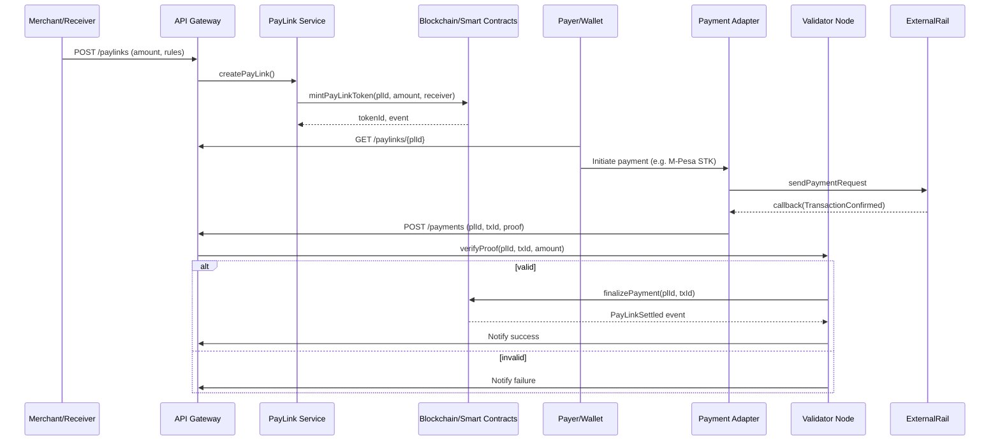
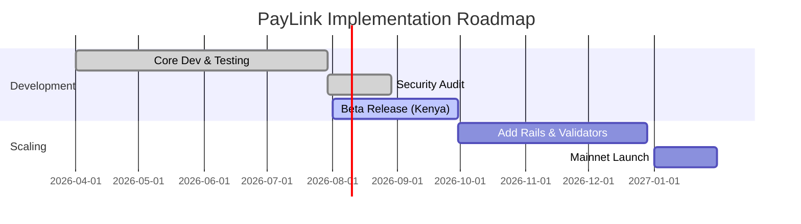

# PayLink Decentralized Payment Protocol – Detailed Specification  

## Executive Summary  
PayLink is a **decentralized payment coordination network** that connects any payment rail (MPesa, card networks, banks, crypto) to on-chain payment intents.  It uses **linkable NFT-based tokens (PayLinks)** as immutable authorization for payments.  Payers send money *directly* over existing rails to receivers, while PayLink’s blockchain finalises transactions via validator consensus.  This non-custodial design avoids expensive licensing (no e-money holding【13†L51-L58】) and enables **programmable payments** (escrow, vouchers, subscriptions) and true micropayments (fractions of cent) at minimal cost【39†L134-L142】.  The system is engineered for **high throughput** (design target ~10k–20k TPS to match card networks【26†L177-L183】) and **low latency** (sub-100ms finality).  

Key benefits: instant, trustless payments via simple links/QR codes; full auditability and fraud resistance via blockchain consensus; global reach (mobile wallets in emerging markets + cards/crypto).  We achieve high **scalability and availability** with microservices (Kubernetes), sharded data stores, and geo-distributed validators.  Multi-layer security (cryptographic proofs, validator quorum, audits) guards against double-spend and attacks【29†L254-L262】.  Microservices and smart contracts implement each function as state machines, enabling clean sharding and horizontal scaling.  

This specification covers goals, non-functional requirements, full architecture, detailed microservice design, data models, API contracts, cryptographic proofs, Solidity contracts (PayLink lifecycle, token, staking), tokenomics, validator consensus (Proof-of-Validation), gateway adapters (MPesa, Visa/Mastercard, banks, crypto), security, operations, monitoring, testing, deployment, cost, compliance, and a phased rollout plan.  The document is structured for engineering and product teams, with diagrams (Mermaid) and tables illustrating design choices.  

【36†embed_image】 *Figure: Conceptual view of PayLink’s blockchain-coordinated payments.*  

## Goals and Use Cases  
- **Link-Based Payments:** Any merchant or user can generate a PayLink (URL/QR code or NFT) for a payment request, escrow deposit, or voucher.  Payers simply scan the link and pay through their chosen method.  
- **Non-Custodial, Direct Settlement:** Funds flow **rail → receiver** without intermediate wallets.  PayLink only handles cryptographic proofs. This avoids holding customer funds and thus avoids PSP licensing【13†L51-L58】.  
- **Programmable Logic:** PayLinks carry on-chain rules (one-time or multi-use, expiry, multi-party splits).  Smart contracts automatically enforce conditions (e.g. release funds when goods delivered, or refund after timeout)【39†L156-L164】.  
- **Micropayments and Low Fees:** Supports tiny payments (e.g. $0.01) by batching on-chain settlements.  No fixed card fees; PayLink’s cost model can support high-frequency, low-value flows. Blockchain micropayments are faster, cheaper and more secure due to no intermediaries【39†L134-L142】.  
- **Emerging Market First (Then Global):** Launch in Kenya/East Africa (MPesa, mobile wallets) where Visa/Mastercard are expensive/inaccessible. Later add borderless rails (crypto, stablecoins) and global card networks.  
- **Offline and Hybrid Modes:** The protocol can be extended to support offline QR orders (store purchase offline, reconcile later) and hybrid on-chain/off-chain modes (fast micropayments on L2, settlement on L1).  
- **Ecosystem Integration:** Enable integration in ecommerce platforms, invoicing tools, peer-to-peer transfers, and marketplace escrow, with minimal developer effort (SDKs, REST APIs, CLI, etc.).  

These goals guide the architecture, which is built as microservices and smart contracts.  

## Non-Functional Requirements (NFRs)  

- **Scalability:** Design for 10k–20k TPS initially. Visa averages ~8.5k TPS and can peak >65k【26†L231-L239】. The system must scale horizontally (more validator nodes, gateway instances, DB shards) without re-architecting. Use partitioning (e.g. sharding by currency/region or PoL shards) and stateless microservices (Kubernetes) for elasticity.  
- **Latency:** Target <100 ms on-chain finality per PayLink after payment proof is submitted. MPesa/Cards typically respond in <2 seconds; our network should confirm the link in under 1 second for UX.  
- **Throughput:** The network should handle bursts (e.g. 100k events/sec internally) via message queues (Kafka/RabbitMQ). Avoid single-node bottlenecks by distributing services and using async event-driven flows.  
- **Reliability & Availability:** Aim for 99.9% uptime. Run redundant instances across multiple datacenters/regions. Use leader/follower failover for critical services. Card networks target “six-nines” availability【24†L44-L48】; we aim similarly through replication and self-healing (auto-restart, rolling updates).  
- **Security:**  
  - **Cryptographic:** Use proven algorithms (ECDSA/P-256 for signatures, SHA-256/HMAC). Employ VRF (e.g. Ristretto255 or EC-VRF) for randomness【22†L143-L152】.  
  - **Double-Spend Resistance:** Blockchain consensus ensures a PayLink can be used only once; validators detect conflicts to stop double-spends【29†L254-L262】.  
  - **Tamper-Proof:** Immutable blockchain and append-only logs. All state transitions (e.g. PayLink status) are logged on-chain or as unmodifiable events.  
  - **Best Practices:** Adhere to OWASP Top10 for APIs. PCI-DSS and ISO 27001 controls for any card/payment data【26†L199-L203】. Audit all smart contracts (static analysis, tests, third-party review).  
  - **Key Management:** Store all private keys (service accounts, HSM for validators) securely. Rotate regularly. Use multi-sig (e.g. Gnosis Safe) for governance actions (e.g. upgrading contracts).  
- **Maintainability:** 80/20 modular microservices (single-responsibility). Use domain-driven design (DDD): separate payment, paylink management, compliance, and payout concerns. Clear API contracts (OpenAPI, gRPC Protobuf).  
- **Compliance:**  
  - **Regulatory:** No money custody means PayLink is a “protocol” or “facilitator,” not a fund custodian【13†L51-L58】. However, we must implement KYC/AML checks on large transfers per jurisdiction (e.g. Kenya’s AML Act) and support audits. Data must comply with privacy laws (GDPR, Kenya Data Protection).  
  - **Payment Standards:** Support ISO 20022 messaging for modern rails【41†L300-L308】. For cards, follow PCI-DSS tokenisation standards (no raw PAN storage).  
  - **Reporting:** Provide transaction reports/records for tax/regulators.  

## Architecture Overview  

The system is **layered** into distinct microservices and state machines, each scalable and deployable independently. Key layers include:

- **Application Layer (Client/SDK):** Interfaces for users/merchants to create and pay links. This includes web/mobile apps and SDKs (JavaScript, Android/iOS, Flutter) that parse PayLink URIs, render payment UIs, and call backend APIs. Also CLI tools for developers.  

- **API Gateway & Auth:** A front-door (e.g. Kong, AWS API Gateway, or Envoy) provides TLS termination, OAuth2/JWT auth, rate limiting, and routing to internal services. It decouples clients from microservices. 

- **Microservices:** Each core function is a service or a state machine engine:  

  - **PayLink Service:** Manages creation and state of PayLinks. Stores PayLink metadata, mints NFTs on blockchain, enforces lifetime and usage limits. Emits domain events (`PayLinkCreated`, `PayLinkExpired`, etc.).  
  - **Payment Orchestrator:** Coordinates payment initiation. For each PayLink, it triggers the appropriate payment flow (e.g. call MPesa STK API, send card payment request) and collects results.  
  - **Proof Validator:** Receives callbacks/webhooks from payment rails, packages proofs, and validates them (checking signatures, amount/receiver). Passes proofs to validators.  
  - **Consensus Engine (Validator Service):** A distributed service (one per validator node) participating in Proof-of-Validation consensus. It verifies proofs against blockchain state and via cross-checking, then signs/votes.  
  - **Escrow Engine:** Manages conditional logic. If a PayLink is in escrow, this service monitors the conditions (e.g. third-party confirmation, timeouts) and triggers release or refund.  
  - **Wallet/Settlement Service:** Maintains internal wallets or token balances (for optional credit or stablecoin). Handles settlement from PayLinks into user balances, computing internal fees.  
  - **Fee & Treasury Service:** Applies fees, burns or allocates tokens as specified by tokenomics.  
  - **Compliance/Risk Service:** Monitors transactions (velocity checks, geo-patterns). Flags or holds suspicious PayLinks. Integrates with KYC providers (e.g. Jumio) for identity verification of merchants/senders above thresholds.  
  - **Notification Service:** Sends SMS/Email/Webhooks to users on state changes (e.g. “Payment received”, “PayLink expired”).  
  - **Analytics Service:** Real-time metrics and user analytics (transaction volumes, latencies, error rates), for dashboards.  

  Each microservice is built as a set of stateless pods and stateful backends (as needed). Business logic within services is implemented as clear **state machines**. For example, the PayLink state machine transitions: `CREATED → PENDING → VERIFIED/FAILED/EXPIRED`. These transitions are logged atomically, often with an event sourcing approach.  

- **Payment Gateway Adapters:** These run as microservices or gateways per rail. They translate between PayLink protocol and external APIs:  
  - **MPesa Adapter:** Uses Safaricom Daraja REST APIs (see below) to initiate and confirm payments.  
  - **Card Gateway Adapter:** Calls Visa DPS or Mastercard APIs (or a third-party gateway like Stripe).  
  - **Bank Adapter:** Interfaces with banking APIs (e.g. Equitel, MFS Africa, Swift).  
  - **Crypto Adapter:** Connects to blockchain nodes/oracles to listen for on-chain payments (websocket or RPC).  

- **Validator Network (Consensus Layer):** A P2P network of validator nodes. Each node runs the Consensus Engine microservice above. They form committees (via VRF) and reach consensus on proofs. They also run a blockchain client or consensus participant.  

- **Blockchain & Smart Contracts:** An EVM-compatible blockchain (e.g. Polygon or private Geth) stores PayLink tokens, validator stakes, and state. PayLink’s core contract logic lives here (discussed later).  

- **Data Storage:**  
  - **Relational DB (PostgreSQL)**: Stores user accounts, PayLink records (mirroring on-chain state for fast queries), payment logs, KYC data, and ledger entries.  
  - **Ledger (Append-Only) DB:** A special ledger database (could be implemented as append-only tables or a separate blockchain) to record all financial debits/credits for accounting.  
  - **Redis Cache:** For hot data (active PayLinks, sessions, rate limiting, VRF preimages).  
  - **Indexer/Cache:** Optional Elasticsearch or Redis streams to index on-chain events and feeds for quick lookups.  
  - **On-Chain Storage:** The blockchain itself keeps authoritative PayLink status and token balances.  

- **Event Bus & Messaging:** Internally, services communicate via message queues (Kafka/RabbitMQ) for events (e.g. PayLinkCreated, PaymentInitiated, ProofReceived). This decouples services and allows replay/reprocessing.  

- **Monitoring & Observability:** All services export Prometheus metrics (request rates, latencies, error counts) and logs (structured JSON) to a central system (Grafana, ELK). SLOs are defined (e.g. 99.9% success on payment finalization). Alerts notify on-chain consensus failures, service downtimes, or suspicious activities.  

The diagram below illustrates core interactions:



【34†embed_image】 *Figure: Conceptual P2P validator and blockchain network.*  

## Detailed Features by Microservice

### PayLink Service (Core)  
- **State Machine:** Manages PayLink lifecycle:  
  - **CREATED**: Link exists, awaiting payment.  
  - **PENDING**: Payment initiated (proof pending confirmation).  
  - **VERIFIED**: Payment completed successfully.  
  - **FAILED/CANCELLED/EXPIRED**: Payment did not occur or link canceled.  
- **API:** `POST /paylinks` (create link), `GET /paylinks/{id}`, `POST /paylinks/{id}/cancel`.  
- **Data Model:** Stores `PayLink(id, amount, currency, receiverId, creatorId, status, expiry, usage, metadata)`.  
- **Blockchain Interaction:** On creation, calls smart contract `createPayLink(plId, receiverAddress, amount, expiry, metadataHash)`. Listens to blockchain events for final status.  
- **Validation:** Checks inputs (positive amount, valid currency code, expiry in future).  
- **Expiries:** Runs scheduler to mark expired links (if `now > expiry`).  

### Payment Orchestrator  
- **State Machine:** For each PayLink, handle one or more Payment attempts: INITIATED → PROCESSING → CONFIRMED/FAILED.  
- **Integration:**  
  - Chooses adapter based on `allowed_rails`.  
  - For MPesa: calls Daraja STK Push (see example below).  
  - For card: calls card payment API (Visa/Mastercard DPS or Stripe).  
  - For crypto: generates wallet address or QR, monitors chain.  
- **Retry/Timeout:** If no payment confirmed within TTL, mark `FAILED` or retry with next rail.  
- **Fees:** Computes and reserves any processing fee (in PLN or fiat) and passes to Fee Service.  

**Daraja Example (MPesa STK Push):**  
We use Safaricom’s Daraja API【17†L131-L139】. A typical request:  
```json
POST /mpesa/stkpush/v1/processrequest
{
  "BusinessShortCode": "174379",
  "Password": "<Base64(shortcode+passkey+timestamp)>",
  "Timestamp": "20260330083000",
  "TransactionType": "CustomerPayBillOnline",
  "Amount": 2500,
  "PartyA": "254701234567",       // Customer MSISDN
  "PartyB": "174379",            // Paybill number
  "PhoneNumber": "254701234567",
  "CallBackURL": "https://api.paylink.app/mpesa/callback",
  "AccountReference": "PLK1001",
  "TransactionDesc": "PayLink payment"
}
```  
The Callback receives JSON with `CheckoutRequestID` and `ResultCode`. We construct a **Payment Proof**:  
```json
{
  "pl_id": "PLK1001",
  "rail": "mpesa",
  "tx_id": "MBPA123456789",
  "amount": 2500,
  "timestamp": 1711755000,
  "sender": "254701234567",
  "receiver": "254722345678",
  "rail_signature": "HMACorECDSA"
}
```  
This is sent to the Proof Validator.

### Gateway Adapter Nodes  
- **Role:** Act as intermediaries for each payment network. They expose endpoints/webhooks to external services.  
- **MPesa Adapter:** Handles OAuth token retrieval (client key/secret) and STK Push API calls. Listens to Daraja confirmation callbacks and publishes proofs internally.  
- **Card Adapter:** Integrates with a Payment Service Provider (e.g. Stripe, or Visa DPS). For card-not-present, takes card info (tokenized or manual entry) and calls charging API. Receives transaction ID or callback and creates proof.  
- **Bank Adapter:** For ACH/SWIFT, polls or receives webhook when a referenced transfer arrives at receiver’s account, then proofs it.  
- **Crypto Adapter:** Watches a blockchain node (via WebSocket RPC) for transactions to a dedicated address. When funds arrive, it generates a proof with the tx hash and included details.  

All adapters must sign the proof with a known key (or use TLS client cert) so validators can verify authenticity. They publish proofs to a shared queue or via a message bus.  

### Validator Network (Consensus)  
- **PoV Consensus:** Validators do not run a full classical blockchain consensus; they use **Proof-of-Validation** for each PayLink. For each incoming proof:  
  1. A committee of *n* validators (randomly chosen via VRF) receives the proof.  
  2. Each independently verifies: does `rail_signature` match public key? Does `amount` match PayLink? Is `tx_id` unique?  
  3. If valid, the validator signs a vote or directly calls `redeemPayLink(plId, proof)` on chain. Otherwise, it signals failure.  
  4. Once a quorum (e.g. 2-of-3) signs, the PayLink smart contract finalises the payment (marks it redeemed).  
- **VRF-based Selection:** At block intervals (or per proof event), a VRF (e.g. based on last block hash + validator secret) selects the committee to avoid bias【22†L143-L152】.  
- **Slashing and Staking:** Validators stake PLN tokens in the network contract. Misbehavior (e.g. signing conflicting proofs) triggers slashing of stake. Honest validators earn fees.  
- **Byzantine Fault Tolerance:** With quorum >50%, the system can tolerate up to f faulty nodes (e.g. f=1 in 3 validators).  

### Storage and Data Layers  
- **PostgreSQL:** Core relational DB for accounts, PayLinks (mirroring on-chain state), payments, KYC records, and system events. Use JSONB for flexible fields (metadata, proof payloads). See “Data Models” below.  
- **Append-Only Ledger:** Financial flows use a double-entry ledger (either a DB table or dedicated ledger engine). Each payment generates two entries (debit and credit)【13†L51-L58】. This ledger is immutable for audit.  
- **Redis:** In-memory caches for active sessions, rate limiting, ephemeral VRF seeds, etc. Also for pub/sub internal notifications.  
- **Blockchain:** All authoritative state (PayLink status, token balances, validator stakes) is on the blockchain contract. Index nodes or Oracles replicate relevant blockchain state to PostgreSQL for fast reads.  
- **Indexing and Search:** An indexer (could be part of an observer node) captures PayLink events and populates a search DB (e.g. Elasticsearch) for ad-hoc queries and analytics dashboards.  

【35†embed_image】 *Figure: Distributed microservice architecture with gateway adapters and validator nodes.*  

## Data Models and Schemas  

### SQL Schema (Postgres)

```sql
-- Users and KYC
CREATE TABLE users (
  user_id SERIAL PRIMARY KEY,
  name TEXT,
  phone VARCHAR(15) UNIQUE,
  email TEXT UNIQUE,
  kyc_status VARCHAR(10),  -- NONE, PENDING, VERIFIED
  created_at TIMESTAMP DEFAULT NOW()
);

-- PayLinks (mirrors on-chain)
CREATE TABLE paylinks (
  pl_id TEXT PRIMARY KEY,
  creator_id INT REFERENCES users(user_id),
  receiver_id INT REFERENCES users(user_id),
  amount NUMERIC(18,2) NOT NULL,
  currency CHAR(3) NOT NULL,
  status VARCHAR(10) NOT NULL,  -- CREATED, PENDING, VERIFIED, FAILED
  expiry TIMESTAMP,
  usage VARCHAR(10) DEFAULT 'single',  -- 'single' or 'multi'
  metadata JSONB,
  created_at TIMESTAMP DEFAULT NOW(),
  updated_at TIMESTAMP
);

-- Payment Proofs
CREATE TABLE payments (
  payment_id UUID PRIMARY KEY DEFAULT gen_random_uuid(),
  pl_id TEXT REFERENCES paylinks(pl_id),
  rail VARCHAR(20),
  tx_id TEXT,
  amount NUMERIC(18,2),
  sender_ref TEXT,     -- e.g. MSISDN for MPesa
  proof_hash TEXT UNIQUE,
  status VARCHAR(10),  -- RECEIVED, VALIDATED, FAILED
  created_at TIMESTAMP DEFAULT NOW(),
  validated_at TIMESTAMP
);

-- Ledger Entries (double-entry)
CREATE TABLE ledger_entries (
  entry_id SERIAL PRIMARY KEY,
  account_id INT,      -- link to users or system accounts
  debit NUMERIC(18,2) DEFAULT 0,
  credit NUMERIC(18,2) DEFAULT 0,
  currency CHAR(3),
  reference TEXT,      -- e.g. pl_id or external tx
  created_at TIMESTAMP DEFAULT NOW()
);

-- Validators and Stakes
CREATE TABLE validators (
  validator_id UUID PRIMARY KEY,
  address TEXT UNIQUE,
  stake_amount NUMERIC(18,2) DEFAULT 0,
  status VARCHAR(10) DEFAULT 'ACTIVE',
  joined_at TIMESTAMP DEFAULT NOW(),
  last_seen TIMESTAMP
);

-- Slashing Events
CREATE TABLE slashes (
  slash_id SERIAL PRIMARY KEY,
  validator_id UUID REFERENCES validators(validator_id),
  amount NUMERIC(18,2),
  reason TEXT,
  created_at TIMESTAMP DEFAULT NOW()
);
```

### On-Chain State (Smart Contracts)

In Solidity, the core contract might use:

```solidity
enum Status { NONE, CREATED, PENDING, VERIFIED, FAILED }

struct PayLink {
    address receiver;
    uint256 amount;
    uint256 expiry;
    Status status;
    bytes32 metadataHash;
}

mapping(bytes32 => PayLink) public paylinks;
mapping(bytes32 => bool) public usedProof; // prevents replay by storing hash(txId||plId)
```

- `Status` tracks the PayLink state.  
- `createPayLink(bytes32 plId, ...)` mints a new PayLink (sets status=CREATED).  
- `redeemPayLink(bytes32 plId, bytes calldata proof)` is called by consensus (or validators) to finalize. It checks `usedProof[proofHash] == false` and marks `status=VERIFIED`.  
- Validator votes or signatures can be submitted as part of `proof` to require multi-signature consensus.  

### Schema Features  
- **Append-Only Ledger:** All financial moves append to `ledger_entries`, ensuring immutability. Balances are derived by summing entries.  
- **Indexing Flags:** Both `payments` and `paylinks` tables have `status` for quick filtering (index on status).  
- **Redis Caches:** e.g. store `paylink:PL123 -> userSession` for fast session data (like OTP, temp state).  
- **Consensus State:** Validators periodically commit snapshots of committee state; these are logged for debugging.  

## Message and API Contracts  

### REST/gRPC API Examples

- **Create PayLink (REST):** `POST /paylinks`  
  **Request JSON:**  
  ```json
  {
    "creator_id": 123,
    "receiver_id": 456,
    "amount": 1500,
    "currency": "KES",
    "expiry": "2026-04-30T12:00:00Z",
    "usage": "single",
    "metadata": {"orderId": "INV1001"}
  }
  ```  
  **Response JSON:**  
  ```json
  {
    "pl_id": "PLK-20260330-0001",
    "status": "CREATED",
    "uri": "paylink://PLK-20260330-0001"
  }
  ```

- **Get PayLink:** `GET /paylinks/PLK-20260330-0001`  
  **Response:**  
  ```json
  {
    "pl_id": "PLK-20260330-0001",
    "amount": 1500,
    "currency": "KES",
    "receiver_id": 456,
    "status": "PENDING",
    "expiry": "2026-04-30T12:00:00Z",
    "proofs": [
      {"rail": "mpesa", "tx_id": "MBPA12345", "status": "VALIDATED"}
    ]
  }
  ```

- **Payment Webhook (Adapter → Gateway):** `POST /payments`  
  **Headers:** `Authorization: Bearer <ServiceToken>`  
  **Body:**  
  ```json
  {
    "pl_id": "PLK-20260330-0001",
    "rail": "mpesa",
    "tx_id": "MBPA12345",
    "amount": 1500,
    "sender": "254701234567",
    "receiver": "254722345678",
    "rail_signature": "abc123signature..."
  }
  ```  
  The gateway routes this to the validator consensus process.

- **WebSocket/Event Stream:** The API supports WS or Server-Sent Events for live updates. E.g. clients can subscribe to `ws://api.paylink.app/ws/paylinks/PLK-2026...` to receive JSON messages:
  ```json
  {"event": "PayLinkVerified", "pl_id": "PLK-20260330-0001", "tx_id": "MBPA12345", "timestamp":161" }
  ```

- **PayLink URI Scheme:** Format `paylink://{version}/{pl_id}` e.g. `paylink://1.0/PLK-20260330-0001`.  QR codes encode this URI. The client SDK resolves it to API calls.

### gRPC/Protobuf (for internal services)

```proto
service PayLinkService {
  rpc CreatePayLink(CreateRequest) returns (CreateResponse);
  rpc GetPayLink(PayLinkRequest) returns (PayLinkData);
}

message CreateRequest { int32 creatorId; int32 receiverId; double amount; string currency; int64 expiry; string usage; bytes metadata; }
message CreateResponse { string plId; string status; }

message PayLinkRequest { string plId; }
message PayLinkData { string plId; double amount; string currency; int32 receiverId; string status; int64 expiry; bytes metadata; }
```

### Proof Format and Crypto

- **Proof Contents:** `{ pl_id, rail, tx_id, amount, timestamp, sender, receiver }` signed or HMAC’ed. The `rail_signature` is computed by adapter’s private key. Validators verify this signature before accepting the proof.  
- **Signature Scheme:** Use ECDSA secp256k1 or Ed25519 (depending on chain) for rail signatures and validator votes. Rails (like Daraja) provide signed callbacks; we repackage them with our own signature for PoV.  
- **Replay Protection:** Compute `proof_hash = SHA256(pl_id || tx_id || amount)`. The smart contract stores this and rejects any duplicate. This prevents double redemption from retry or replay attacks【29†L254-L262】.  
- **VRF:** For randomness (validator selection), use a VRF function: input = last block hash + validator key; output = random bits + proof. We cite the concept: A VRF provides unpredictability with a public proof【22†L143-L152】.  

## Smart Contracts (Solidity)

We implement core contracts in Solidity (EVM 0.8.x). Key interfaces:

### 1. PayLinkContract (with PoV)  

```solidity
// SPDX-License-Identifier: MIT
pragma solidity ^0.8.20;

contract PayLinkContract {
    enum Status { NONE, CREATED, VERIFIED, FAILED }
    struct PayLink { address receiver; uint256 amount; uint256 expiry; Status status; bytes32 metadataHash; }
    mapping(bytes32 => PayLink) public paylinks;
    mapping(bytes32 => bool) public usedProof;

    // validators for PoV
    mapping(address => bool) public validators;
    uint256 public requiredValidations = 3;
    mapping(bytes32 => uint256) public voteCount;
    mapping(bytes32 => mapping(address => bool)) public voted;

    event PayLinkCreated(bytes32 indexed plId, address receiver, uint256 amount);
    event PayLinkVerified(bytes32 indexed plId, bytes32 proofHash);

    modifier onlyValidator() { require(validators[msg.sender], "Not validator"); _; }

    function createPayLink(bytes32 plId, address receiver, uint256 amount, uint256 expiry, bytes32 metadataHash) external {
        require(paylinks[plId].status == Status.NONE, "Exists");
        paylinks[plId] = PayLink(receiver, amount, expiry, Status.CREATED, metadataHash);
        emit PayLinkCreated(plId, receiver, amount);
    }

    function submitValidation(bytes32 plId, bytes32 proofHash) external onlyValidator {
        PayLink storage p = paylinks[plId];
        require(p.status == Status.CREATED, "Invalid state");
        require(block.timestamp <= p.expiry, "Expired");
        require(!usedProof[proofHash], "Proof used");

        require(!voted[plId][msg.sender], "Already voted");
        voted[plId][msg.sender] = true;
        voteCount[plId]++;

        if (voteCount[plId] >= requiredValidations) {
            p.status = Status.VERIFIED;
            usedProof[proofHash] = true;
            emit PayLinkVerified(plId, proofHash);
        }
    }

    function getStatus(bytes32 plId) external view returns (Status) {
        return paylinks[plId].status;
    }

    // Validator management
    function addValidator(address v) external {
        // ownership check omitted for brevity
        validators[v] = true;
    }
    function removeValidator(address v) external { validators[v] = false; }
    function setRequiredValidations(uint256 r) external { requiredValidations = r; }
}
```

This contract:  
- Maintains PayLink records.  
- Validators call `submitValidation(plId, proofHash)` after verifying off-chain that a payment occurred. Once enough votes, it marks the PayLink VERIFIED and prevents reuse of that proof.  
- Payment proofs are handled off-chain; only their hash (`proofHash = keccak256(txId, amount)`) is checked on-chain.  

### 2. PLN Token (ERC-20)  

```solidity
// SPDX-License-Identifier: MIT
pragma solidity ^0.8.20;
import "@openzeppelin/contracts/token/ERC20/ERC20.sol";

contract PLNToken is ERC20 {
    address public admin;
    constructor(uint256 initialSupply) ERC20("PayLink Token", "PLN") {
        _mint(msg.sender, initialSupply);
        admin = msg.sender;
    }
    function mint(address to, uint256 amount) external {
        require(msg.sender == admin, "Only admin");
        _mint(to, amount);
    }
    function burn(uint256 amount) external {
        _burn(msg.sender, amount);
    }
}
```

- Standard ERC-20 (via OpenZeppelin)【44†L103-L106】.  
- `initialSupply` set at deployment. Admin (owner) can mint (for rewards, treasury).  
- Burnable for fees.  

### 3. Staking and Slashing  

```solidity
// SPDX-License-Identifier: MIT
pragma solidity ^0.8.20;
import "@openzeppelin/contracts/utils/math/SafeMath.sol";

contract ValidatorStake {
    using SafeMath for uint256;
    IERC20 public pln;
    address public admin;
    uint256 public totalStake;
    mapping(address => uint256) public stakeOf;
    mapping(address => uint256) public penalty; // slashed amount

    event Staked(address indexed v, uint256 amt);
    event Unstaked(address indexed v, uint256 amt);
    event Slashed(address indexed v, uint256 amt);

    constructor(address plnToken) {
        pln = IERC20(plnToken);
        admin = msg.sender;
    }

    function stake(uint256 amount) external {
        pln.transferFrom(msg.sender, address(this), amount);
        stakeOf[msg.sender] = stakeOf[msg.sender].add(amount);
        totalStake = totalStake.add(amount);
        emit Staked(msg.sender, amount);
    }
    function withdraw(uint256 amount) external {
        require(stakeOf[msg.sender] >= amount, "Not enough stake");
        stakeOf[msg.sender] = stakeOf[msg.sender].sub(amount);
        totalStake = totalStake.sub(amount);
        pln.transfer(msg.sender, amount);
        emit Unstaked(msg.sender, amount);
    }
    function slash(address v, uint256 amount) external {
        require(msg.sender == admin, "Only admin");
        require(stakeOf[v] >= amount, "Insufficient stake");
        stakeOf[v] = stakeOf[v].sub(amount);
        totalStake = totalStake.sub(amount);
        penalty[v] = penalty[v].add(amount);
        emit Slashed(v, amount);
        // Optionally burn or transfer slashed tokens
    }
}
```

- Validators call `stake(...)` to lock PLN. Admin can slash. Slashed funds could be burned or redistributed.  
- In practice, slashing would be triggered by an on-chain governance vote or by the PayLink contract if misbehavior is proven.  

*(Note: These contracts use OpenZeppelin libraries and follow best practices. In production, careful audit and upgrade patterns should be applied.)*

## Tokenomics and Rewards  
- **Supply & Distribution:** Suppose 1 billion PLN total. Allocations: 10% ecosystem development, 10% early contributors, 10% investors, 20% reserves, 50% staking rewards. Tokens are divisible (18 decimals) per ERC-20 norm【44†L103-L106】.  
- **Inflation:** 5–10% annual inflation distributed as staking rewards. This yields ~5–10% APY for validators, aligning with typical PoS networks.  
- **Fees:** A small fee (e.g. 0.5% of payment, minimum KES1) is charged per PayLink settlement. Of this: 70% goes to validators (paid from the on-chain Treasury), 20% to a reserve/treasury, 10% is burned to reduce supply. Over time, burning plus continuous minting creates a balanced economy.  
- **Reward Flow:** When a PayLink is VERIFIED, the Fee Service calls `pln.mint(validatorAddress, reward)` to reward each validator based on stake weight and participation. Fees can also be paid in PLN (if users hold PLN balance).  

## Validator Selection and Consensus Parameters  
- **Committee Size:** Default 5 validators per proof (configurable).  
- **Quorum:** At least 3 out of 5 must sign. (Adaptable via contract parameter.)  
- **VRF Seed:** At each block or new PayLink creation, use chain randomness (e.g. RANDAO or Oracle) to seed a Verifiable Random Function. Validators run `VRF_SK(plId)` to see if they are selected to vote. This ensures unpredictability【22†L143-L152】.  
- **Slashing Rules:** If a validator signs a proof that is later proven invalid (e.g. conflicting tx), or signs twice for the same plId, the `slash()` function is invoked by contract owner or governance. Typically 50–100% of stake can be slashed.  
- **Validator Rotation:** Slashed or inactive validators lose eligibility. New validators can be approved by multisig governance.  

## Gateway Adapter Designs  

- **MPesa (Safaricom Daraja):** Daraja 2.0 APIs as above【17†L131-L139】. The adapter holds Safaricom API credentials. It implements REST endpoints `POST /mpesa/callback` to receive confirmations. It also polls for transaction status if needed. The payload schema matches Daraja docs.  
- **Visa/Mastercard:** Use an API Gateway or provider. Visa’s DPS offers JSON/ISO20022 APIs【41†L300-L308】. Sample Stripe-like flow: Send card token and amount, receive a charge ID. Example payload:
  ```json
  {
    "amount": 2000,
    "currency": "KES",
    "card_token": "tok_visa_123",
    "description": "PayLink PLK-12345"
  }
  ```
  Gateway returns `{ "status": "approved", "tx_id": "VISA_TX_7890" }`. We then form a proof.  
- **Banks:** E.g. Kenya Bank API (like Equitel Pay). Similar JSON or REST. The adapter monitors account transactions referencing `AccountReference = PLK-id`.  
- **Crypto:** Use standard protocols. E.g. for Ethereum: create a receiver address or smart contract that is unique per PayLink (deterministic by plId). Payer sends ETH/USDC to that address. The adapter monitors via Web3. Proof includes `tx_hash`, `chain_id`. For Bitcoin, use Lightning Network invoices or on-chain TX ID.  

For all adapters, sample proof structures (JSON) include plId, rail, tx_id, amount, currency, sender, receiver, timestamp, plus `rail_signature` if applicable.  

## Security Model  

- **Threats:** Double-spend, fake payment proofs, DDoS, insider collusion, key theft, contract bugs.  
- **Mitigations:**  
  - **Blockchain consensus** prevents double-spending (once verified, PayLink locked)【29†L254-L262】.  
  - **Multi-signature consensus** means one compromised node isn’t enough; slashing deters collusion.  
  - **Signed proofs:** Adapters must sign all proofs. Validators reject any proof without valid signature from known public key.  
  - **Rate Limiting & DDoS Protection:** API Gateway limits per-IP and uses CAPTCHA for GUI flows.  
  - **Audits:** Regular security audits of contracts and code. Bug bounty program.  
  - **Key Management:** HSMs for storing high-value keys. Use hardware security modules for validator nodes.  
  - **MultiSig Governance:** Critical operations (e.g. contract upgrade, slashing decisions) require multi-signature approval (e.g. 3-of-5 admin keys).  

- **Privacy & Compliance:** Use encryption for PII at rest. Log access and changes (immutable logs).  

## Monitoring & Observability  

- **Metrics:** Track TPS, latency, failed transactions. Use Prometheus/Grafana dashboards. Define SLOs (e.g. 99.9% of PayLinks should finalize within 1s).  
- **Alerts:**  Integrate Alertmanager to send emails/SMS on critical alerts (network partition, >5% failure rate, lost quorum).  
- **Logging:** Centralized logging (ELK or Loki). All service logs structured. On-chain events are also logged for reconciliation.  
- **Tracing:** Distributed tracing (OpenTelemetry) across API → services → adapters → blockchain.  

## Testing Strategy  

- **Unit Tests:** All services and contracts. Mock external networks (Daraja sandbox, card test modes).  
- **Integration Tests:** End-to-end flows in staging: e.g. simulate a PayLink creation and MPesa payment end-to-end. Use test credentials.  
- **Property/Fuzz Testing:** For smart contracts, use tools (e.g. Echidna, MythX) to fuzz test edge cases.  
- **Formal Verification:** Where feasible, formally verify critical contract invariants (like no double-spend, correct state transitions).  
- **Penetration Tests:** Web/API pentesting and bug bounty for frontends and Node endpoints.  

## Deployment Architecture (Kubernetes & CI/CD)  

- **Kubernetes:** All microservices and adapters run in Docker containers on Kubernetes. Use Helm charts or Terraform for IaC. Deploy in AWS/Azure/GCP (multi-AZ).  
- **Pods & Services:** Typical Kubernetes cluster with:  
  - API Gateway service,  
  - Multiple pods for PayLink Service, Orchestrator, Validator, Adapters, etc.,  
  - PostgreSQL in HA (3 replicas with Patroni), Redis cluster, Kafka cluster.  
- **Networking:** Each service listens on HTTP or gRPC ports (e.g. :80 or :443 through gateway). WebSockets on e.g. /ws path.  
- **CI/CD:** GitHub Actions or Jenkins pipelines: test → build Docker images → push to registry → deploy to dev/staging → manual approval → deploy to production. Use feature flags for toggling.  
- **Secrets:** Managed with Vault or K8s secrets (TLS keys, API tokens). Do not store plaintext in repos.  



## Cost Estimates  

| Component          | Qty  | Unit Cost (USD)        | Monthly Cost | Notes                                 |
|--------------------|------|------------------------|--------------|---------------------------------------|
| Kubernetes cluster | 3AKS | ~$150 each            | ~$450        | small to medium nodes                 |
| PostgreSQL DB      | 3    | ~$200 each (db.t3)     | ~$600        | Multi-AZ                              |
| Redis/Kafka        | 3+3  | ~$100 each            | ~$600        | High-throughput in-memory caching     |
| Validator Servers  | 5    | ~$200 each            | ~$1000       | For mainnet nodes                    |
| API Gateway        | 2    | ~$50 each             | ~$100        | Load-balancers                        |
| Monitoring stack   | 1    | $100                  | ~$100        | Grafana/Prometheus running            |
| **Total (est.)**   |      |                        | **~$2850**   | Base infrastructure (scale up later)  |

Costs scale with usage. Phase 1 (MVP) can run on $500–1000/mo (small single-node cluster). Full decentralized net might be $3000–5000/mo.  

## Developer Experience  

- **SDKs:** Provide official SDKs in Node.js, Python, Go, Java, Flutter that wrap PayLink APIs and help parse `paylink://` URIs.  
- **CLI Tool:** A command-line client to issue paylinks and simulate payments (useful for testing/integration).  
- **Documentation:** Full OpenAPI/Swagger docs. Tutorial guides, code samples, architecture diagrams.  
- **Sandbox/Testnet:** A sandbox environment with test PLN tokens and a testnet deployment (faucet funds) for development. Daraja sandbox mode integration.  
- **Community:** Developer forum or chat. 

## Compliance & Licensing  

Since PayLink never holds fiat, it **avoids costly PSP/e-money licensing**【13†L51-L58】. It is treated as a software layer or payment facilitation scheme.  However, if internal e-wallets or fiat pools are ever added, appropriate licensing would be required. In practice, users settle on-chain or via rails themselves.  

We comply with data regulations (GDPR, local laws) by minimising personal data. Logs and proofs avoid sensitive info. We will engage legal counsel in each launch country to validate no license is needed.  

## Migration & Interoperability  

- **Legacy Rails:** We interoperate with legacy systems via adapters. E.g. existing merchant payment pages can switch to PayLink by simple API integration.  
- **Accounting Systems:** Exportable CSV/JSON for ERP integration (OIPEX, Oracle).  
- **Blockchain Bridges:** In future, cross-chain PayLinks could be introduced (e.g. a PayLink on Ethereum bridged to a Solana pay).
- **Standards:** Consider aligning PayLink data formats with ISO 20022 fields for easy bank integration【41†L300-L308】.  

## Next Steps and Roadmap  

1. **Build MVP:** Deploy PayLink Chain (single validator) + one adapter (MPesa) + minimal UI. Test basic flow end-to-end.  
2. **Security Review:** Smart contract audit and security penetration test.  
3. **Pilot Launch:** Onboard a few local merchants, get live MPesa transactions. Gather feedback on UX, fees.  
4. **Expand Rails & Decentralize:** Add Visa/Mastercard via gateway, launch validator network (PoV). Implement staking contract.  
5. **Mainnet & Token Launch:** Issue PLN token, open staking rewards, launch governance. Roll out regional hubs.  
6. **Global Rollout:** Integrate other countries’ wallets/banks. Enhance scaling (sharding by region/currency).  

Each phase has clear deliverables, testing, and fallback plans. Regular reviews will ensure alignment with goals.

---

This specification provides a comprehensive blueprint for building PayLink. It addresses **each layer** – from mobile apps and microservices to blockchain contracts and consensus – and ensures the solution is robust, scalable, and compliant. The next immediate step is to develop a prototype for the core payment flow (paylink creation → MPesa payment → NFT redemption) to validate the architecture in practice.

