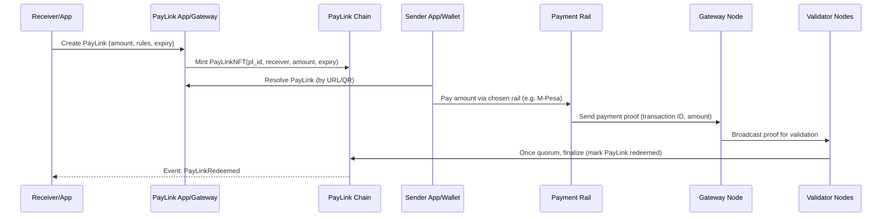
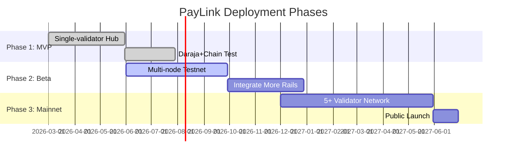

# PayLink System Design (2026) 

**Executive Summary:** PayLink is a purpose-built **decentralized payment coordination protocol and network**, not a money transmitter.  It uses **NFT-backed PayLinks** (ERC‑721 style tokens) as immutable payment authorizations, linking any payment rail (MPesa, card, bank, crypto) to on-chain logic.  Senders pay *directly* via the chosen rail; PayLink only verifies proofs and finalizes the payment on-chain.  This eliminates custodial risk and licensing needs【13†L51-L58】. PayLink enables programmable payments (escrow, subscriptions, vouchers) and micropayments (fractions of a cent) with near-zero fees, orders-of-magnitude lower than Visa/Mastercard interchange【39†L134-L142】.  

The network is designed for **scale and resilience**: Visa currently handles ~83,000 msgs/sec globally【24†L16-L23】 (322+ billion transactions/year【24†L44-L48】), and blockchain architectures often target 10k–20k TPS as a design goal【26†L177-L183】.  PayLink aims for sub-100 ms latency finality and 99.9%+ uptime via distributed validators and geo-redundancy, leveraging lessons from high-volume systems【24†L16-L23】【26†L177-L183】.  Security is paramount: PayLink uses cryptography, multi-signature consensus, and VRF-based randomness to prevent fraud and double‑spending【29†L254-L262】【22†L143-L152】.  By not holding user funds, PayLink avoids PSP/e-money licensing requirements【13†L51-L58】 while meeting AML/CFT and PCI compliance where applicable.  

The reference design below covers **all layers** – from user SDKs to on-chain contracts – with detailed schemas, protocols, and operational plans. Diagrams illustrate the architecture and data flows. Actionable next steps and a phased rollout checklist are provided at the end.

【36†embed_image】 *Figure: Blockchain-based payment coordination (conceptual illustration).*  

## Goals and Use Cases  

- **Link-Based Payments:** Anyone can create a PayLink (URL/QR/NFT) for a payment or escrow.  Payers simply scan/click and pay via their preferred method; no pre-existing account needed.  
- **Non-Custodial, Trustless:** No funds sit in LinkMint’s account.  Money flows rail→receiver.  PayLink chain only processes **proofs** of payment, similar to credit card settlement but decentralized.  
- **Programmable Logic:** PayLinks carry on-chain rules (one-time vs multi-use, expiry, escrow conditions).  E.g. only release funds when service is delivered, or split payments among parties.  Smart contracts enforce these immutably【10†L39-L47】【29†L254-L262】.  
- **Micropayments & Vouchers:** Support payments as small as KES 0.01 or less.  Enable tipping, content unlocks, pay-per-use services.  Traditional cards charge fixed fees that kill such cases; PayLink’s blockchain model handles tiny payments efficiently【39†L134-L142】.  
- **Emerging Markets + Global Rails:** Launch in Kenya (MPesa, local banks) then expand.  Also plug in crypto rails (e.g. USDC) for borderless flows.  Visa/Mastercard rails are available via gateways, but PayLink shines in markets where mobile money dominates【39†L134-L142】.  
- **User-Friendly & Viral:** Pay via simple links/QR codes.  “Click→pay” UX on mobile or web.  Encourages viral sharing (gift links, refunds, incentives).  

These goals drive the architecture below.  

## Non-Functional Requirements  

- **Scalability:** Target O(10,000) transactions/sec.  Visa processes ~8.5k TPS on average, >65k TPS peak【26†L231-L239】.  Aim to scale horizontally (more validators/nodes) as usage grows.  
- **Latency:** End-to-end payment confirmation <1 second.  MPesa/STK pushes happen in ~10–20 sec, but internal processing (proof validation, chain finality) should be <100 ms.  High-frequency use cases (e.g. vending machines, content paywalls) require instant feedback.  
- **Throughput:** Support bursts (e.g. 1000 TPS) with auto-scaling.  Use in-memory queues and partitioned event buses.  Target ordering of 100k messages/sec in event bus (Kafka/SQS) for internal ops, to avoid bottlenecks.  
- **Security:** Protect against fraud, DDoS, double spending, insider threats.  Use blockchain for **consensus-based finality**, preventing any single node from authorizing duplicate or invalid payments【29†L254-L262】.  Include cryptographic signatures on all proofs【17†L131-L139】.  Employ PCI-DSS and ISO 27001 practices【26†L199-L203】.  
- **Availability:** Aim 99.9%+ (five-nines) uptime.  Geo-replicated validators, redundant API gateways, hot standby systems.  No single point of failure: leader election for gateways, multi-AZ database clusters.  Recall Visa runs at 99.9999% uptime【24†L44-L48】.  
- **Compliance:**  
  - **Regulatory (Kenya):** Operating without custody means PayLink is not a PSP.  Per CBK law, any custodian requires a PSP/E-money license【13†L51-L58】.  By avoiding holding funds, we sidestep that.  We must still enforce KYC/AML on merchants and high-value Payers.  
  - **Data Protection:** GDPR/PDPA for user data; store personal data encrypted at rest.  
  - **PCI-DSS:** If processing card data (via gateway), ensure compliant channels (e.g. tokenization, no PAN storage).  
  - **Network Regulations:** For cross-border rails (SWIFT, Fedwire, SEPA), comply with messaging standards (ISO 20022) and sanctions/OFAC checks as needed.  
- **Maintainability:** Modular service architecture.  Clear API contracts (OpenAPI, gRPC).  Versioned smart contracts (proxy patterns) for upgrades.  Automated monitoring and alerting.  

## High-Level Architecture



【34†embed_image】 *Figure: Peer-to-peer validator network with blockchain (illustrative).*

The system is layered:

- **Application Layer:** Web/mobile frontends or third-party apps (e.g. marketplaces, SaaS) use PayLink.  They call our REST/gRPC APIs or use SDKs to create/resove PayLinks.  Also included are the user wallets/interfaces for scanning PayLinks.

- **API Gateway & Auth:** All external requests go through an API gateway (e.g. Kong or AWS API GW).  It handles HTTPS termination, authentication (OAuth2/JWT), rate limiting, logging, and routes to internal services.

- **PayLink Core Services:** Behind the gateway, microservices handle business logic: 
  - **PayLink Service:** CRUD for PayLink objects (storing metadata in DB, emitting events). 
  - **Payment Orchestrator:** Coordinates initiating and tracking payments on external rails.  
  - **Proof Validator:** Verifies incoming payment proofs and signals the chain.  
  - **Escrow Manager:** Manages conditional releases/refunds if escrow rules apply.  
  - **Compliance/Risk:** Monitors transactions, enforces KYC/AML thresholds (flags, holds).  
  - **Notification Service:** Sends SMS/email/push to users on events.  

- **Resolver/SDK:** Client libraries (JavaScript, Flutter, etc.) that parse PayLink URIs/QRs, display details, and invoke payments (e.g. opening M-Pesa STK prompt).  The resolver also communicates with the local node or gateway service to track status updates.

- **Gateway Nodes (Adapters):** These are bridges to external payment networks:
  - **MPesa Adapter:** Listens for Daraja callbacks (C2B, STK push). Packages proofs for validation. Uses Safaricom’s OAuth to get tokens for API calls【17†L131-L139】.  
  - **Card Gateway:** Integrates with Visa DPS or a payment gateway (e.g. Stripe). Submits authorizations and gets back transaction IDs.  
  - **Bank Transfer Adapter:** Uses APIs (e.g. Kenyan ACH/SWIFT APIs) to monitor incoming transfers or initiate debits, capturing confirmation IDs.  
  - **Crypto Adapter:** Interfaces with blockchains (e.g. an Ethereum node or oracle). It watches for on-chain payments (e.g. USDC to a address) and submits transaction hashes as proofs.

- **Validator Nodes:** A decentralized set of nodes (initially a few, then many) that run the consensus algorithm. They communicate P2P using a gossip protocol, sharing proofs and votes. A validator’s duties: verify proofs (signature + ledger check) and sign off on PayLink redemptions. These nodes stake PLN tokens and participate in slashing/incentives (see Tokenomics).

- **Consensus Layer (Proof-of-Validation):** A bespoke consensus: for each PayLink fulfillment, validators must reach quorum (e.g. 3 of 5) that the proof is valid. This yields immediate finality (no waiting for block confirmations). VRF-based committees ensure unpredictability of which validators vote on which proof【22†L143-L152】.

- **Blockchain (PayLink Chain):** A purpose-built chain (or smart contract on an EVM chain) holds the canonical state of each PayLink and enforces rules. We expect to use EVM-compatible (e.g. Polygon or a private chain) with a custom **PayLink Protocol** smart contract (see Smart Contracts section). The chain records PayLink creation (mint), status, and token transfers if used, plus validator votes.

- **Off-Chain Databases:** Core relational DB (e.g. PostgreSQL) stores user accounts, PayLink metadata, transaction logs, KYC records, ledger entries (double-entry for any on-chain/off-chain money moved), etc.  A key-value or document store (Redis) holds caches like active PayLink mappings. Also a time-series DB for metrics (Prometheus) and logs (Elasticsearch).

- **Indexing & Query:** An indexing service (can be built on Observers of the chain) provides fast lookup of PayLink status, payment history, and analytics. It feeds dashboards and APIs for apps to query.  

- **Monitoring & Observability:** Every layer emits metrics/logs. Kubernetes (or similar) with Prometheus/Grafana for health, ELK for logs. Alerting on failures, high latency, suspicious activity, etc.  

This layered architecture ensures clean separation of concerns, and each layer can scale independently.    

## Detailed Features by Layer

### Blockchain Layer

- **PayLink Smart Contract:**  
  - Stores PayLink records with fields: `plId (bytes32), receiver (address or identifier), amount, currency, expiry, status`, plus optional `metadataHash` (for off-chain data)【10†L39-L47】【10†L123-L131】.  
  - Supports `createPayLink(plId, receiver, amount, expiry, rulesHash)` and `redeemPayLink(plId, proofData)`.  
  - Enforces *one-time use* or limited redemptions.  
  - Checks expiry and authorized signers.  
  - Emits events (`PayLinkCreated`, `PayLinkSettled`).  

- **NFT/Tokenization (Optional):** Each PayLink could be represented as an ERC-721 token.  Minting the token = creating a PayLink. Ownership transfer semantics allow secondary markets or gift transfers (NFT standard with royalty hooks). We can follow ERC-721 EIP: e.g., `ownerOf(plId)`, `safeTransferFrom`【10†L123-L131】. On redemption, the NFT is burned or locked.  Using EIP-165/721 ensures wallet compatibility【10†L123-L131】.

- **Proof-of-Payment Verification:** On-chain, the `redeem` function requires a *proof* (e.g. {plId, txId, amount, signatures}).  The contract ensures `amount`/`receiver` match the PayLink, and uses previously whitelisted validator signatures. No state change (marking redeemed) occurs unless a quorum of validators have signed off on the proof. This guards against fake or replayed payments.  

- **Immutable Audit Trail:** All PayLink lifecycle events are recorded on-chain. No private modifications are possible. This provides an auditable ledger of payments and rule executions. It also simplifies dispute resolution: the truth is on-chain.  

- **Finality and Consensus:** Once validators submit enough attestations, the contract finalizes the PayLink. This finality is immediate (no block confirmations needed beyond consensus round). Blockchain state changes (token burns, transfers, event emits) are atomic with the proof validation.  

- **Escrow & Conditional Logic (Module):** An optional contract module can lock funds (in linked stablecoins or utility tokens) until conditions are met. For example, Party A deposits into escrow, and only when Party B confirms delivery does the NFT execute and release the funds. This uses multi-party state machines with on-chain triggers (approve, release, refund).  

### Payment Rail Layer

- **MPesa (Daraja) Integration:**  
  - **Daraja 2.0/3.0 APIs:** We will use Safaricom’s Daraja REST endpoints.  For *Lipa na M-Pesa Online* (STK Push), the JSON payload includes `BusinessShortCode`, `Password` (Base64 of Shortcode+PassKey+Timestamp), `Timestamp (yyyymmddhhiiss)`, `TransactionType ('CustomerPayBillOnline')`, `Amount`, `PartyA (sender MSISDN)`, `PartyB (receiver shortcode)`, `PhoneNumber`, `CallBackURL`, `AccountReference`, `TransactionDesc`【17†L131-L139】. 
```json
POST /mpesa/stkpush/v1/processrequest
{
  "BusinessShortCode":"174379",
  "Password":"<base64>",
  "Timestamp":"20260329120000",
  "TransactionType":"CustomerPayBillOnline",
  "Amount":1000,
  "PartyA":"254700000000",
  "PartyB":"174379",
  "PhoneNumber":"254700000000",
  "CallBackURL":"https://api.linkmint.local/mpesa/confirm",
  "AccountReference":"PL12345",
  "TransactionDesc":"PayLink #PL12345"
}
```
  - **Callbacks:** Safaricom calls our `CallBackURL` with the transaction result.  We parse the `CheckoutRequestID`, `ResultCode`, `ResultDesc`, and **post** a proof object: `{plId, rail:"mpesa", txId:CheckoutRequestID, amount, timestamp, signature}`.  This is relayed to validators.
  - **C2B/B2C/B2B APIs:** For other flows (business-to-customer disbursements, etc.), we use Daraja’s endpoints similarly with reference fields.
  
- **Card & E-commerce:**  
  - Integrate via payment gateway or bank API. For example, call **Visa DPS/ISO20022** API or Stripe-like gateway.  Payload (JSON or ISO20022) includes card PAN/token, expiry, CVV, amount, currency, merchant ID. Example (pseudo-JSON):
```json
POST /visa/v1/transactions
{
  "merchantId":"987654",
  "card":{"token":"tok_visa", "expiry":"12/27"},
  "amount":500,
  "currency":"KES",
  "reference":"PLK123456"
}
```
  - We then receive a transaction reference or callback from the gateway.  A proof `{plId, rail:"card", txId:VisaTxnRef, amount, signature}` is created.  
  - **ISO 20022:** Modern APIs (Visa DPS) use ISO 20022 (JSON-based) for richer data【41†L300-L308】.  The advantage is flexible, self-describing messages.  We will align with ISO 20022 fields to ease bank integrations【41†L300-L308】.  

- **Bank Transfers:**  
  - For direct bank debit, integrate with local API (e.g. Kenya Real-Time Gross Settlement or ACH).  Once a transfer is sent or received, we capture the transaction ID.  
  - Proof format similar: `{plId, rail:"bank", txId, amount, signature}`.  

- **Crypto Payments:**  
  - Accept payments in stablecoins (USDC/USDT) or native tokens.  A crypto wallet makes an on-chain transfer to a known address or contract.  We listen via a blockchain node or oracle.  When funds are received, we generate proof `{plId, rail:"crypto", txHash, amount, chainId}`.  Validators verify by querying the chain.  

In all adapters, the key is **proving** the payment. Each adapter should **sign** the proof with its private key (e.g. HMAC or ECDSA) to attest authenticity before broadcasting. Validators check these signatures. This prevents an attacker from forging proofs【17†L131-L139】.

### PayLink Protocol and APIs

- **PayLink URI Scheme:** We define a URI like `paylink://{plId}?version=1.0`.  This encodes a PayLink identifier.  Scanning a QR yields this URI (or we use a short URL that the resolver expands to the full object via API).  
- **REST API Endpoints:** (all JSON)
  - `POST /paylinks` – create a new PayLink (body: amount, currency, receiver, expiry, usage). Returns `pl_id`.  
  - `GET /paylinks/{pl_id}` – retrieve PayLink details and status.  
  - `GET /resolve/{pl_id}` – (same as GET) for convenience.  
  - `POST /paylinks/{pl_id}/cancel` – cancel an unused PayLink.  
  - `POST /payments` – (internal) register payment proofs (used by gateway nodes).  
  - `GET /payments/{id}` – get payment/proof status.  
  - Webhooks: Apps can register a webhook to be notified when `PayLinkRedeemed` event occurs.
- **gRPC/SDK:** Internally and in client SDKs, we provide gRPC bindings for high performance (e.g. streaming status). JSON/REST for external partners.  

**Message Formats:**  
- **PayLink Object (JSON):**  
```json
{
  "pl_id": "PLK1234567890",
  "amount": 1500,
  "currency": "KES",
  "receiver": "4qZx7...Tx1A",    // e.g. wallet address or userID
  "allowed_rails": ["mpesa","card","crypto"],
  "expiry": 1711929600,
  "usage": "single",
  "metadata": { "orderId": "INV-1001" },
  "signature": "0xabc..."        // Receiver’s signature (optional)
}
```  
- **Payment Proof (JSON):**  
```json
{
  "pl_id": "PLK1234567890",
  "rail": "mpesa",
  "tx_id": "MBPA1234ABCDE",
  "amount": 1500,
  "timestamp": 1711926000,
  "sender": "254700123456",
  "receiver": "254711234567",
  "proof_signature": "HMACorECDSA"
}
```  
Rails signatures and proof formats will use HMAC or ECDSA with a known key per adapter. We’ll also implement **anti-replay** by hashing `{pl_id, tx_id, amount}` and marking hashes used on-chain to prevent reuse (one tx only settles one PayLink)【29†L254-L262】.  

### Data Models and Storage

We use a combination of relational and ledger databases. All monetary flows (on-chain and off-chain) are recorded in a **double-entry ledger** to ensure consistency.

#### Relational Schemas (PostgreSQL)

```sql
-- Users and Accounts
CREATE TABLE users (
  user_id SERIAL PRIMARY KEY,
  name TEXT,
  phone VARCHAR(20),
  email TEXT,
  kyc_verified BOOLEAN DEFAULT FALSE,
  created_at TIMESTAMP DEFAULT NOW()
);
 
-- PayLinks
CREATE TABLE paylinks (
  pl_id TEXT PRIMARY KEY,
  creator_id INT REFERENCES users(user_id),
  receiver_id INT REFERENCES users(user_id),
  amount NUMERIC(18,2) NOT NULL,
  currency VARCHAR(3) NOT NULL,
  status VARCHAR(20) NOT NULL,
  expiry TIMESTAMP,
  usage VARCHAR(10) DEFAULT 'single',  -- 'single' or 'multiple'
  metadata JSONB,
  created_at TIMESTAMP DEFAULT NOW(),
  updated_at TIMESTAMP
);

-- Payment Proofs
CREATE TABLE payments (
  payment_id UUID PRIMARY KEY DEFAULT gen_random_uuid(),
  pl_id TEXT REFERENCES paylinks(pl_id),
  rail VARCHAR(20),
  tx_id TEXT,
  amount NUMERIC(18,2),
  proof_hash TEXT UNIQUE,
  status VARCHAR(20),  -- e.g. RECEIVED, VALIDATED, FAILED
  created_at TIMESTAMP DEFAULT NOW(),
  validated_at TIMESTAMP
);

-- Block events / On-chain logs
CREATE TABLE chain_events (
  event_id SERIAL PRIMARY KEY,
  event_type TEXT, -- e.g. "Mint", "Redeem"
  pl_id TEXT,
  block_number BIGINT,
  tx_hash TEXT,
  timestamp TIMESTAMP DEFAULT NOW(),
  payload JSONB
);

-- Double-entry Ledger
CREATE TABLE ledger_entries (
  entry_id SERIAL PRIMARY KEY,
  account_id INT,    -- internal wallet or external account ID
  debit NUMERIC(18,2) DEFAULT 0,
  credit NUMERIC(18,2) DEFAULT 0,
  currency VARCHAR(3),
  description TEXT,
  related_pl TEXT,
  created_at TIMESTAMP DEFAULT NOW()
);

-- Validators / Staking (for future)
CREATE TABLE validators (
  node_id UUID PRIMARY KEY,
  public_key TEXT,
  stake_amount NUMERIC(18,2),
  status VARCHAR(20),   -- ACTIVE, SLASHED, INACTIVE
  joined_at TIMESTAMP,
  last_signed TIMESTAMP
);

-- Misc: disputes, escrow, KYC, logs, etc as needed...
```

Key points:  
- **Immutable Ledger:** `ledger_entries` is append-only; each PayLink settlement generates two entries (debit sender, credit receiver) for full audit. This allows off-chain reconciliation with on-chain events.  
- **Payments Table:** Stores raw proofs; `proof_hash` (e.g. sha256 of tx details) prevents duplicates. Validators update `status`.  
- **Indexes and Caches:** Index on `pl_id`, `tx_id` for fast lookup. Redis cache for active PayLinks.

These schemas can be extended (e.g. splitting by currency or sharding heavy tables if needed).  

#### On-Chain State Schema

The smart contract maintains mappings:

```solidity
struct PayLink {
    address receiver;
    uint256 amount;
    uint256 expiry;
    Status status;
    bytes32 metadataHash;
}

mapping(bytes32 => PayLink) public paylinks; 
mapping(bytes32 => bool) public usedProofs;
```

- `Status` enum: `NONE, CREATED, VERIFIED, FAILED`.  
- `paylinks[plId]` stores the record.  
- `usedProofs[proofHash]` prevents proof replay.  

Validator signatures are verified off-chain (in Proof objects) and only upon consensus does `status` switch to `VERIFIED`.  

## Consensus and Validator Selection

We propose a **Proof-of-Validation (PoV)** consensus:

- **Validator Set:** Nodes stake PLN tokens to become validators. A minimum stake is required to join. A random (VRF-driven) committee of ~3–5 validators is selected per PayLink proof【22†L143-L152】.  
- **Voting:** When a proof arrives, the gateway broadcasts it. Validators independently verify (check rail authenticity, amount, recipient). Each valid validator signs off (e.g. ECDSA sig or on-chain vote). Once a quorum (e.g. 3 of 5) is reached, the PayLink is finalized on-chain.  
- **Finality:** This is immediate finality (no forks) since each proof has a one-off resolution. It’s not like block mining; it’s real-time consensus on discrete events.  
- **Slashing:** If a validator approves an invalid proof or double-signs, its stake can be slashed by protocol (via on-chain deposit). This disincentivizes collusion.  
- **Randomness:** We use a **VRF** for committee assignment. VRF yields a random output and proof anyone can verify【22†L143-L152】. For example, seed on the last block, plus validator’s key, determines eligibility. This prevents adversarial prediction of committees.  
- **Staking Rewards:** Validators earn a portion of transaction fees in PLN. E.g. 0.5–1% of PayLink volume could be reserved for staking rewards. The early phases may subsidize validators from a treasury allocation.

This model resembles a decentralized escrow: validators act as arbiter witnesses to real-world payment events. The model is **much faster** than PoW/PoS blockchains, since only small committees sign off on known proofs.

## Tokenomics (PLN)

- **PLN Token:** ERC-20 utility token used for staking, fees, and governance.  
- **Supply:** For example, fixed 1 billion tokens.  Allocation: 20% team/founders (4-year vesting), 30% treasury (development, partners), 10% early investors, 40% to staking rewards. (Exact numbers TBD by token sale/governance.)  
- **Staking:** Validators lock PLN to participate. The more stake, the higher the weight in random selection.  
- **Fees & Rewards:** Each PayLink settlement incurs a small fee (e.g. 0.5% of amount, min KES 1). Fees are split: 70% distributed as staking rewards to validators, 20% burned or to a treasury, 10% to infrastructure (devops). This creates inflation (through staking rewards) offset by occasional burn. For example, a 5% annual inflation rate might reward stakers, keeping interest ~5–10% APY (typical PoS) to secure network.  
- **Economics:** Low transaction fees compared to card interchange (~1–3%). PLN’s value is tied to adoption: more PayLinks = more fees burned and more demand for staking.  

*No primary source exists for our tokenomics design; this is custom. For context, many PoS chains target ~2–10% annual inflation for stakers.*

## Security Model

PayLink’s security hinges on multi-layer protections:

- **Blockchain Immutability:** Smart contracts are audited (Solidity best practices, OpenZeppelin libs). They enforce all business rules; no off-chain overrides. E.g. once a PayLink is redeemed on-chain, it cannot be re-used【29†L254-L262】.  
- **Cryptographic Proofs:** All off-chain data (payment proofs) is signed by the adapter’s private key. Validators verify these signatures, preventing forgery【17†L131-L139】. We use industry‐standard ECDSA/P-256 or RSA keys for adapters and validator vote signing.  
- **Re-entrancy and Access Control:** Contracts use `nonReentrant` guards. Minting/burning only by authorized admin (or factory contract). Multi-sig wallet holds admin keys (for contract upgrades or pausing the system if needed).  
- **Replay Protection:** Each `tx_id` and `proof_hash` is marked used after processing, so you can’t redeem the same payment twice【29†L254-L262】.  
- **Peer Validation:** Decentralized validators check independently. No single node can finalize an invalid payment. Collusion is guarded by slashing stakes.  
- **Audits:** All smart contracts and critical services will be third-party audited (e.g. Trail of Bits, OpenZeppelin). Regular bug bounties.  
- **Key Management:** Private keys for adapters and validators are stored in HSMs or secure enclaves (AWS KMS, Azure Key Vault). Rotate keys periodically.  
- **Monitoring & Alerting:** Suspicious patterns (e.g. many failed proofs from same IP, unusually large payments) trigger human review.  
- **Client Security:** SDKs/Resolver libraries validate inputs (QR/URI) to avoid spoofed links or unsafe redirects.  

【22†L143-L152】【29†L254-L262】 *A verifiable random function (VRF) ensures unpredictable validator selection, and blockchain consensus prevents the same payment being used twice.*  

## Integration: MPesa, Cards, Banks, Crypto

- **Safaricom Daraja (Kenya):** We integrate via **STK Push** and **C2B APIs**. Uses OAuth 2.0 to get an access token for requests【17†L131-L139】. Merchant shortcodes and passkeys are required for each account. Sample flow (Kenyan context):
  1. Receiver generates PayLink.  
  2. Payer clicks link; we trigger STK Push to `PartyA = payerMSISDN`.  
  3. Payer enters PIN on phone.  
  4. M-Pesa sends result to our callback URL.  
  5. We create a proof `{pl_id, rail:"mpesa", txId:<CheckoutID>, amount, signature}` and pass to validators.  

- **Card Networks (Visa/Mastercard):** We can plug into existing gateways (e.g. Stripe, Adyen) with a unified interface.  Alternatively, for direct issuer integration, Visa DPS provides ISO 20022 REST APIs【41†L300-L308】. We’d send JSON with `<amount, PAN/token, exp, cvv, merchantId, redirectUrl>`. Upon auth success/failure, create proof `{pl_id, rail:"card", txId:authCode, signature}`.

- **Banks:** Many banks (even in Africa) now offer APIs (e.g. MFS Africa, Equitel API). We implement rail adapters for any bank that provides transaction webhooks or polling. The adapter normalizes these to the same proof format.

- **Crypto:** Provide wallet integration (Web3) or QR for stablecoins.  Example: to pay in USDC on Solana/Ethereum, sender scans a QR that is a **Solana Pay** or **EIP-681** style URI. Once payment on chain, the adapter picks up the Tx hash and amount.  Signature: `{pl_id, rail:"crypto", txHash, amount, chainId}`. Validators independently call a blockchain RPC (or use proof-of-reserve style oracle) to verify the transfer.  

All adapters map to a **unified proof format** (see Message formats above) so that downstream services don’t care which rail was used. This “rail-agnostic” design means we can add new rails over time without changing core logic.  

## Operational Runbook

- **Deployment:** Use containerized microservices (Docker) orchestrated by Kubernetes (EKS/GKE/AKS). We’ll deploy in stages: dev (single node), staging (multi-node), production (multi-AZ). Use Helm/Terraform for IaC.  
- **Backups:** Regular backups of SQL DB to S3.  On-chain data is replicated on all nodes. A state snapshot and archives should be stored (e.g. IPFS or cloud bucket) weekly.  
- **Upgrades:** Smart contracts use UUPS/Proxy pattern. Governance (multi-sig) must approve upgrades. Off-chain code follows CI/CD with rolling updates.  
- **Disaster Recovery:** In case of total datacenter failure, standby clusters exist in other regions. DB replicas in multiple zones. Validators run on independent clouds.  A cold spare in a different geo can be hot-swapped if needed.  
- **Incident Response:** Logging and alerts for all critical failures. If a major flaw is found, system can be paused (via a circuit-breaker or emergency stop on chain). Recovery procedures (e.g. database restore, redeploy services) are documented in runbooks.

## Monitoring and Observability

- **Metrics:** Track TPS, latency, queue lengths, error rates. On-chain metrics: number of PayLinks created/redeemed per min. Use Prometheus + Grafana.  
- **Alerts:** Set alerts on anomalies (e.g. spike in failed proofs, high validator disagreements, one validator offline).  
- **Dashboards:** Real-time dashboard of active PayLinks, balances (if any internal wallet), system health. 
- **Logging:** Centralized logs (ELK or Loki) for all services. Audit logs for admin actions (key rotation, upgrades, KYC changes).  

## Testing and QA Strategy

- **Unit Tests:** Every service and smart contract function is covered by unit tests.  Mock external rails for adapters.  
- **Integration Tests:** Use simulated rails (e.g. Daraja sandbox) to test end-to-end PayLink flows. Emulate failure modes (network drop, rollback).  
- **Fuzz Testing:** Fuzz critical parsers (PayLink URIs, proofs).  
- **Formal Verification (Smart Contracts):** Use tools like Certora/Slither for core contracts to catch vulnerabilities (e.g. re-entrancy, overflow).  
- **Penetration Testing:** Engage security experts to pen-test APIs, validate cryptographic implementations, attempt break-ins.  
- **Testnet:** Before mainnet launch, deploy a public testnet of PayLink Chain and validators. Encourage community/testing partners to try test tokens and simulate rails.

## Deployment Architecture



- **MVP (2026-Q2):** Centralized validator, single gateway node.  Supports MPesa only. No token yet. *Goal:* prove PayLinks + NFT logic end-to-end【17†L131-L139】【29†L254-L262】.  
- **Beta (2026-Q3):** Add more rails (cards, crypto), multiple validators in staging, internal token. Onboard pilot merchants and partners.  
- **Mainnet (2026-Q4 and beyond):** Open staking, invite validators, go fully decentralized.  

**Infrastructure:** Cloud-hosted (AWS/Azure/GCP) initially for speed. K8s cluster per environment (dev/stage/prod). Each validator node is a container (or VM) behind a load balancer. Gateway and web/API servers autoscale on demand. CI/CD with automated tests on every commit (GitHub Actions or Jenkins). Infrastructure defined in Terraform (networks, DB clusters, K8s).

**Costs (Rough):** MVP: 1 K8s small instance, 1 DB, 2 vCPU total – < $500/month.  Mainnet (5 validators, 3 DB replicas, monitoring): ~$2000–5000/month initially.  With growth, costs scale linearly – but still low compared to card networks’ multi-million-dollar data centers【24†L16-L23】.

## Legal and Compliance (Non-Custodial Design)

By **never holding fiat**, LinkMint does **not become a PSP or e-money issuer**【13†L51-L58】. Each payment is between sender and receiver via regulated rails (e.g. Safaricom, local banks, card processors). PayLink’s role is similar to **an invoice or voucher protocol**. In Kenya, only PSPs (who hold funds) need CBK licenses【13†L51-L58】. We thus argue PayLink is exempt. Nevertheless, we implement robust AML/CFT checks on high-value flows to satisfy regulators.  

Cross-border: When enabling crypto or foreign rails, comply with international regulations (e.g. FATF travel rule, GDPR for data). Work with legal counsel in each target market.

## Developer Experience

- **SDKs:** Provide easy-to-use SDKs (JavaScript, Python, Go, Java, Flutter) to create/resolve PayLinks and listen for events.  
- **CLI Tool:** A command-line client to generate PayLinks, simulate payments, and query status.  
- **API Documentation:** Swagger/OpenAPI spec published on developer portal. Clear code samples (e.g. Node.js, cURL).  
- **Sandbox:** A testing sandbox environment with fake rails (simulated Daraja, card gateways) and testnet tokens. Developers can create dummy PayLinks for practice.  
- **Tools:** Chain explorer for PayLink chain, block explorers, and validator dashboards.  

## Phased Implementation Checklist

1. **Foundation:** Establish core team (blockchain, backend, fintech, legal). Define architecture and data models.  
2. **Core Development:** Write smart contracts (PayLink NFT, staking). Build backend services (PayLink CRUD, proof handler). Integrate Daraja sandbox.  
3. **Testing:** Unit/integration tests. Deploy to testnet (single-validator). Demonstrate an end-to-end MPesa payment.  
4. **Security Audit:** Audit contracts and critical components. Fix issues.  
5. **Beta Launch:** Invite limited merchants. Go multi-validator. Distribute PLN to validators. Collect feedback, iterate.  
6. **Scale Up:** Implement additional rails (cards via Stripe or DPS, crypto via oracles).  
7. **Mainnet & Compliance:** Finalize tokenomics, initiate governance DAO (if any), complete legal filings as needed. Public launch with media/marketing.

## Next Steps

- **Prototype Demo:** Build a minimal demo (create link → MPesa payment → NFT redemption) for early stakeholders.  
- **Partnerships:** Engage Safaricom, banks, and payment processors for integration support.  
- **Regulatory Engagement:** Confirm non-custodial model with regulators (CBK, data authorities).  
- **Fundraising:** Prepare whitepaper and pitch deck; approach investors specializing in fintech/blockchain.  
- **Open Standards:** Consider publishing the PayLink protocol as an open standard (like HTTP) to encourage adoption beyond our platform.  

PayLink turns **payments into programmable, transferable assets** without handling custody, combining the best of mobile money and blockchain. It fills a gap that traditional rails cannot: linkable, trustless, flexible, low-fee payments【39†L134-L142】【29†L254-L262】. This design document lays out the path from concept to a production-grade network.

