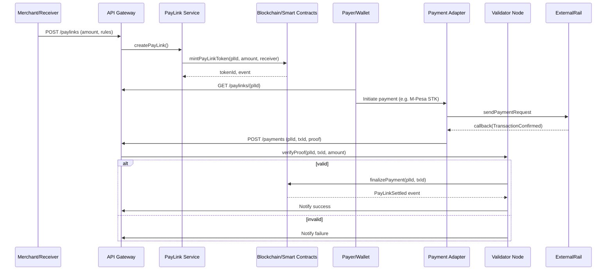
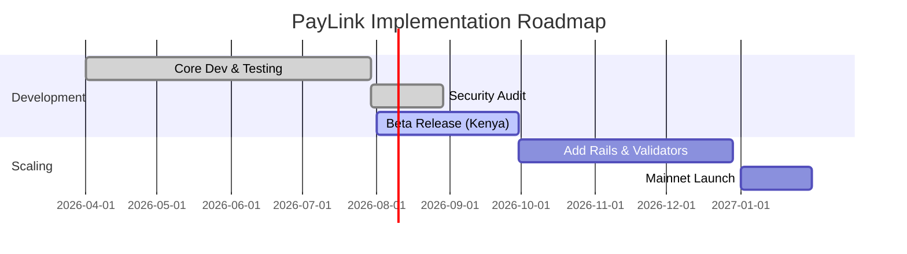

# PayLink Protocol -- Technical Specification

## Table of Contents

- [Overview](#overview)
- [Goals and Use Cases](#goals-and-use-cases)
- [Non-Functional Requirements](#non-functional-requirements)
- [Architecture](#architecture)
- [Microservice Specifications](#microservice-specifications)
- [Data Models](#data-models)
- [API Contracts](#api-contracts)
- [Smart Contracts](#smart-contracts)
- [Consensus: Proof-of-Validation](#consensus-proof-of-validation)
- [Tokenomics](#tokenomics)
- [Gateway Adapters](#gateway-adapters)
- [Security Model](#security-model)
- [Testing Strategy](#testing-strategy)
- [Deployment Architecture](#deployment-architecture)
- [Cost Estimates](#cost-estimates)
- [Monitoring and Observability](#monitoring-and-observability)
- [Compliance and Licensing](#compliance-and-licensing)
- [Migration and Interoperability](#migration-and-interoperability)
- [Phased Rollout](#phased-rollout)

---

## Overview

PayLink is a decentralized payment coordination network connecting any payment rail (MPesa, card networks, banks, crypto) to on-chain payment intents. It uses **linkable NFT-based tokens (PayLinks)** as immutable payment authorizations. Payers send money directly over existing rails to receivers while the PayLink blockchain finalizes transactions via validator consensus.

**Core design principles:**
- **Non-custodial:** Funds flow rail-to-receiver. PayLink only processes cryptographic proofs, avoiding PSP/e-money licensing.
- **Programmable:** On-chain rules enforce escrow, vouchers, subscriptions, splits, and expiry conditions.
- **Micropayment-capable:** Fractions-of-a-cent payments via batched on-chain settlement with no fixed card fees.
- **High throughput:** Design target 10k-20k TPS (Visa averages ~8.5k TPS, peaks >65k).
- **Low latency:** Sub-100ms on-chain finality after proof submission.



---

## Goals and Use Cases

| Use Case | Description |
|----------|-------------|
| **Link-Based Payments** | Any merchant/user generates a PayLink (URL/QR/NFT) for a payment request, escrow, or voucher. Payers scan and pay via their chosen method. |
| **Non-Custodial Settlement** | Funds flow rail-to-receiver directly. PayLink handles only cryptographic proofs. |
| **Programmable Logic** | On-chain rules: one-time/multi-use, expiry, multi-party splits, conditional release (escrow), auto-refund on timeout. |
| **Micropayments** | Payments as low as $0.01 via batched settlements. No fixed card fees. |
| **Emerging Markets First** | Launch in Kenya/East Africa (MPesa, mobile wallets). Expand to global cards, crypto, stablecoins. |
| **Offline/Hybrid Modes** | Offline QR orders (reconcile later), hybrid on-chain/off-chain (fast micropayments on L2, settlement on L1). |
| **Ecosystem Integration** | Ecommerce, invoicing, P2P transfers, marketplace escrow via SDKs, REST APIs, CLI. |

---

## Non-Functional Requirements

| Requirement | Target | Notes |
|-------------|--------|-------|
| **Scalability** | 10k-20k TPS | Horizontal scaling via more validators, gateway instances, DB shards. Stateless microservices on Kubernetes. |
| **Latency** | <100ms finality | After proof submission. End-to-end <1s including rail response. |
| **Throughput** | 100k events/sec internal | Kafka/RabbitMQ event bus. No single-node bottlenecks. |
| **Availability** | 99.9% uptime | Multi-AZ, leader/follower failover, rolling updates, self-healing. |
| **Security** | ECDSA/P-256, SHA-256, VRF | Double-spend resistance via consensus. OWASP Top 10. PCI-DSS/ISO 27001. |
| **Maintainability** | DDD microservices | Single-responsibility services, OpenAPI/gRPC contracts, clear state machines. |
| **Compliance** | Non-custodial model | KYC/AML on large transfers, GDPR/Kenya Data Protection, ISO 20022 for rails, PCI-DSS tokenization. |

---

## Architecture

### Layer Overview

```
┌─────────────────────────────────────────────────────────────┐
│  Application Layer (Web, Mobile, SDKs, CLI)                 │
├─────────────────────────────────────────────────────────────┤
│  API Gateway & Auth (Kong/Envoy, OAuth2/JWT, Rate Limiting) │
├─────────────────────────────────────────────────────────────┤
│  Core Microservices                                         │
│  ┌──────────┐ ┌───────────┐ ┌──────────┐ ┌──────────────┐  │
│  │ PayLink  │ │ Payment   │ │ Proof    │ │ Consensus    │  │
│  │ Service  │ │Orchestratr│ │Validator │ │ Engine       │  │
│  └──────────┘ └───────────┘ └──────────┘ └──────────────┘  │
│  ┌──────────┐ ┌───────────┐ ┌──────────┐ ┌──────────────┐  │
│  │ Escrow   │ │ Wallet/   │ │Compliance│ │ Notification │  │
│  │ Engine   │ │Settlement │ │ /Risk    │ │ Service      │  │
│  └──────────┘ └───────────┘ └──────────┘ └──────────────┘  │
│  ┌──────────┐ ┌───────────┐                                 │
│  │ Fee &    │ │ Analytics │                                 │
│  │ Treasury │ │ Service   │                                 │
│  └──────────┘ └───────────┘                                 │
├─────────────────────────────────────────────────────────────┤
│  Gateway Adapters (MPesa, Card, Bank, Crypto)               │
├─────────────────────────────────────────────────────────────┤
│  Validator Network (P2P gossip, VRF committees)             │
├─────────────────────────────────────────────────────────────┤
│  Blockchain & Smart Contracts (EVM, Solidity)               │
├─────────────────────────────────────────────────────────────┤
│  Data Layer (PostgreSQL, Redis, Kafka, Elasticsearch)       │
├─────────────────────────────────────────────────────────────┤
│  Monitoring & Observability (Prometheus, Grafana, ELK)      │
└─────────────────────────────────────────────────────────────┘
```

### Event Bus

Services communicate via Kafka/RabbitMQ for decoupled, replayable event-driven flows:

| Event | Producer | Consumers |
|-------|----------|-----------|
| `PayLinkCreated` | PayLink Service | Payment Orchestrator, Compliance/Risk, Analytics |
| `PayLinkExpired` | PayLink Service | Notification Service, Analytics |
| `PaymentInitiated` | Payment Orchestrator | Analytics, Compliance/Risk |
| `ProofReceived` | Proof Validator | Consensus Engine, Analytics |
| `ProofValidated` | Consensus Engine | PayLink Service, Notification, Fee & Treasury |
| `ProofRejected` | Consensus Engine | PayLink Service, Notification, Analytics |
| `PayLinkSettled` | Consensus Engine | Wallet/Settlement, Notification, Analytics |
| `EscrowCreated` | Escrow Engine | Notification, Analytics |
| `EscrowReleased` | Escrow Engine | Wallet/Settlement, Notification |
| `TransactionFlagged` | Compliance/Risk | Notification, Analytics |

---

## Microservice Specifications

### PayLink Service

**Responsibility:** Manages PayLink lifecycle. Stores metadata, mints NFTs on-chain, enforces lifetime and usage limits.

**State Machine:**
```
CREATED ──→ PENDING ──→ VERIFIED
   │           │
   │           └──→ FAILED
   │
   ├──→ CANCELLED
   │
   └──→ EXPIRED
```

| State | Description |
|-------|-------------|
| `CREATED` | PayLink exists, awaiting payment |
| `PENDING` | Payment initiated, proof pending confirmation |
| `VERIFIED` | Payment completed and settled on-chain |
| `FAILED` | Payment proof rejected or rail failure |
| `CANCELLED` | Cancelled by creator before payment |
| `EXPIRED` | Expiry time passed without payment |

**Operations:**
- `POST /paylinks` -- create PayLink, mint NFT on-chain
- `GET /paylinks/{id}` -- retrieve PayLink and status
- `POST /paylinks/{id}/cancel` -- cancel unused PayLink
- Scheduler: periodically marks expired PayLinks (`now > expiry`)

**Validation rules:** Positive amount, valid ISO 4217 currency code, expiry in future, creator must be authenticated.

### Payment Orchestrator

**Responsibility:** Coordinates payment initiation across rails. Routes to correct adapter, tracks payment lifecycle.

**State Machine:**
```
INITIATED ──→ PROCESSING ──→ CONFIRMED
                  │
                  └──→ FAILED
```

**Operations:**
- Select adapter based on `allowed_rails` in PayLink
- For MPesa: trigger Daraja STK Push
- For card: call card gateway API
- For crypto: generate wallet address/QR, monitor chain
- Timeout handling: if no confirmation within TTL, mark `FAILED` or retry with next rail
- Compute and reserve processing fee, pass to Fee & Treasury Service

### Proof Validator

**Responsibility:** Receives payment callbacks/webhooks from adapters, packages proofs, validates signatures and amounts, passes verified proofs to the Consensus Engine.

**Operations:**
- Receive proof from adapter (via event bus or direct call)
- Validate: adapter signature matches registered public key, amount matches PayLink, receiver matches, tx_id is unique
- Construct canonical proof object and broadcast to validators
- Reject malformed or unsigned proofs immediately

### Consensus Engine (Validator Service)

**Responsibility:** One instance per validator node. Participates in Proof-of-Validation consensus. Verifies proofs against blockchain state, signs/votes on valid proofs.

**Operations:**
- Receive proof broadcast via P2P gossip
- Check VRF eligibility for this proof's committee
- If eligible: independently verify proof, sign attestation
- Submit vote on-chain via `submitValidation(plId, proofHash)`
- Monitor quorum -- once reached, `PayLinkSettled` event emitted by contract

### Escrow Engine

**Responsibility:** Manages conditional PayLinks. Monitors conditions (third-party confirmation, timeouts), triggers release or refund.

**State Machine:**
```
ESCROW_CREATED ──→ CONDITIONS_MET ──→ RELEASED
       │                │
       └──→ TIMEOUT ──→ REFUNDED
```

**Operations:**
- Create escrow with conditions (delivery confirmation, time-lock, multi-party approval)
- Monitor condition events
- Trigger on-chain release or refund
- **Phase:** Core logic in Phase 2+

### Wallet/Settlement Service

**Responsibility:** Maintains internal wallets or token balances (for optional credit/stablecoin flows). Handles settlement from PayLinks into user balances and computes internal fees.

**Operations:**
- Credit receiver balance on `PayLinkSettled`
- Debit sender balance for pre-funded flows
- Track internal token balances (PLN)
- Generate ledger entries (double-entry)

### Fee & Treasury Service

**Responsibility:** Applies fees per tokenomics model, distributes to validators, burns tokens, allocates to treasury.

**Operations:**
- On `PayLinkSettled`: calculate fee (e.g. 0.5% of amount, min KES 1)
- Split: 70% validator rewards, 20% treasury, 10% burn
- Call `pln.mint(validatorAddress, reward)` for each participating validator
- Track cumulative fee metrics

### Compliance/Risk Service

**Responsibility:** KYC/AML monitoring, velocity checks, geo-pattern analysis, sanctions screening.

**Operations:**
- Screen users via KYC provider integration (e.g. Jumio)
- Evaluate transaction risk on `PayLinkCreated` and `PaymentInitiated`
- Flag or hold suspicious PayLinks
- Enforce thresholds per jurisdiction (Kenya AML Act)
- Emit `TransactionFlagged` for manual review

### Notification Service

**Responsibility:** Delivers SMS, email, push notifications, and webhooks on domain events.

**Operations:**
- Listen for domain events (`PayLinkSettled`, `PaymentFailed`, `EscrowReleased`, etc.)
- Route to appropriate channel (SMS, email, push, webhook)
- Webhook delivery: exponential backoff, max 5 retries over 24 hours
- Template management for notification content

### Analytics Service

**Responsibility:** Real-time metrics and user analytics for dashboards and reporting.

**Operations:**
- Aggregate transaction volumes, latencies, error rates
- Feed Grafana dashboards
- Generate reports for compliance/tax/regulatory purposes
- Track per-rail performance metrics

---

## Data Models

### PostgreSQL Schema

```sql
-- Users and KYC
CREATE TABLE users (
  user_id SERIAL PRIMARY KEY,
  name TEXT,
  phone VARCHAR(15) UNIQUE,
  email TEXT UNIQUE,
  kyc_status VARCHAR(10),          -- NONE, PENDING, VERIFIED
  created_at TIMESTAMP DEFAULT NOW()
);

-- PayLinks (mirrors on-chain state)
CREATE TABLE paylinks (
  pl_id TEXT PRIMARY KEY,
  creator_id INT REFERENCES users(user_id),
  receiver_id INT REFERENCES users(user_id),
  amount NUMERIC(18,2) NOT NULL,
  currency CHAR(3) NOT NULL,
  status VARCHAR(10) NOT NULL,     -- CREATED, PENDING, VERIFIED, FAILED, CANCELLED, EXPIRED
  expiry TIMESTAMP,
  usage VARCHAR(10) DEFAULT 'single',  -- 'single' or 'multi'
  metadata JSONB,
  created_at TIMESTAMP DEFAULT NOW(),
  updated_at TIMESTAMP
);

-- Payment Proofs
CREATE TABLE payments (
  payment_id UUID PRIMARY KEY DEFAULT gen_random_uuid(),
  pl_id TEXT REFERENCES paylinks(pl_id),
  rail VARCHAR(20),                -- mpesa, card, bank, crypto
  tx_id TEXT,
  amount NUMERIC(18,2),
  sender_ref TEXT,                 -- e.g. MSISDN for MPesa
  proof_hash TEXT UNIQUE,          -- SHA256(pl_id || tx_id || amount) for anti-replay
  status VARCHAR(10),              -- RECEIVED, VALIDATED, FAILED
  created_at TIMESTAMP DEFAULT NOW(),
  validated_at TIMESTAMP
);

-- Double-Entry Ledger (append-only)
CREATE TABLE ledger_entries (
  entry_id SERIAL PRIMARY KEY,
  account_id INT,                  -- link to users or system accounts
  debit NUMERIC(18,2) DEFAULT 0,
  credit NUMERIC(18,2) DEFAULT 0,
  currency CHAR(3),
  reference TEXT,                  -- e.g. pl_id or external tx
  created_at TIMESTAMP DEFAULT NOW()
);

-- Validators and Stakes
CREATE TABLE validators (
  validator_id UUID PRIMARY KEY,
  address TEXT UNIQUE,
  stake_amount NUMERIC(18,2) DEFAULT 0,
  status VARCHAR(10) DEFAULT 'ACTIVE',  -- ACTIVE, SLASHED, INACTIVE
  joined_at TIMESTAMP DEFAULT NOW(),
  last_seen TIMESTAMP
);

-- Slashing Events
CREATE TABLE slashes (
  slash_id SERIAL PRIMARY KEY,
  validator_id UUID REFERENCES validators(validator_id),
  amount NUMERIC(18,2),
  reason TEXT,
  created_at TIMESTAMP DEFAULT NOW()
);
```

**Design patterns:**
- `ledger_entries` is **append-only** -- balances derived by summing entries. Each payment generates a debit and credit entry.
- `payments.proof_hash` = `SHA256(pl_id || tx_id || amount)` prevents duplicate proof submission.
- Indexes on `paylinks.status`, `payments.pl_id`, `payments.tx_id` for fast filtering.
- JSONB for flexible `metadata` and `proof_payload` fields.
- Redis cache: `paylink:{pl_id} -> session` for active PayLink state, rate limiting, VRF preimages.

### On-Chain State (Solidity)

```solidity
enum Status { NONE, CREATED, PENDING, VERIFIED, FAILED }

struct PayLink {
    address receiver;
    uint256 amount;
    uint256 expiry;
    Status status;
    bytes32 metadataHash;
}

mapping(bytes32 => PayLink) public paylinks;
mapping(bytes32 => bool) public usedProof;     // hash(txId || plId) => used
```

- `createPayLink(bytes32 plId, ...)` sets `status = CREATED`
- `redeemPayLink(bytes32 plId, bytes calldata proof)` checks `usedProof[proofHash] == false`, requires validator quorum, sets `status = VERIFIED`
- Validator votes/signatures submitted as part of `proof` for multi-signature consensus

---

## API Contracts

### REST Endpoints

All endpoints versioned under `/v1`. Authentication: OAuth 2.0 Bearer token unless noted.

#### Create PayLink

```
POST /v1/paylinks
Authorization: Bearer <token>
```

**Request:**
```json
{
  "creator_id": 123,
  "receiver_id": 456,
  "amount": 1500,
  "currency": "KES",
  "expiry": "2026-04-30T12:00:00Z",
  "usage": "single",
  "allowed_rails": ["mpesa", "card"],
  "metadata": {"orderId": "INV1001"}
}
```

**Response (201):**
```json
{
  "pl_id": "PLK-20260401-0001",
  "status": "CREATED",
  "uri": "paylink://1.0/PLK-20260401-0001",
  "paylink_url": "https://pay.linkmint.io/PLK-20260401-0001",
  "qr_code_url": "https://api.linkmint.io/v1/paylinks/PLK-20260401-0001/qr",
  "created_at": "2026-04-01T08:00:00Z"
}
```

#### Get PayLink

```
GET /v1/paylinks/{pl_id}
```

**Response (200):**
```json
{
  "pl_id": "PLK-20260401-0001",
  "amount": 1500,
  "currency": "KES",
  "receiver_id": 456,
  "status": "PENDING",
  "expiry": "2026-04-30T12:00:00Z",
  "usage": "single",
  "allowed_rails": ["mpesa", "card"],
  "metadata": {"orderId": "INV1001"},
  "proofs": [
    {"rail": "mpesa", "tx_id": "MBPA12345", "status": "VALIDATED"}
  ],
  "created_at": "2026-04-01T08:00:00Z"
}
```

#### Cancel PayLink

```
POST /v1/paylinks/{pl_id}/cancel
Authorization: Bearer <token>
```

**Response (200):**
```json
{"pl_id": "PLK-20260401-0001", "status": "CANCELLED"}
```

#### Submit Payment Proof (Adapter -> Gateway)

```
POST /v1/payments
Authorization: Bearer <ServiceToken>
```

**Request:**
```json
{
  "pl_id": "PLK-20260401-0001",
  "rail": "mpesa",
  "tx_id": "MBPA12345",
  "amount": 1500,
  "timestamp": 1711929600,
  "sender": "254701234567",
  "receiver": "254722345678",
  "rail_signature": "abc123signature..."
}
```

**Response (202):**
```json
{"payment_id": "uuid", "status": "RECEIVED"}
```

#### Get Payment Status

```
GET /v1/payments/{payment_id}
```

**Response (200):**
```json
{
  "payment_id": "uuid",
  "pl_id": "PLK-20260401-0001",
  "rail": "mpesa",
  "tx_id": "MBPA12345",
  "status": "VALIDATED",
  "created_at": "2026-04-01T08:01:00Z",
  "validated_at": "2026-04-01T08:01:00Z"
}
```

#### Register Webhook

```
POST /v1/webhooks
Authorization: Bearer <token>
```

**Request:**
```json
{
  "url": "https://merchant.example.com/hooks/paylink",
  "events": ["PayLinkSettled", "PaymentFailed"],
  "secret": "whsec_..."
}
```

**Response (201):**
```json
{"webhook_id": "wh_123", "status": "active"}
```

### WebSocket / Server-Sent Events

Clients subscribe to live updates:
```
ws://api.linkmint.io/ws/paylinks/{pl_id}
```

Event payload:
```json
{
  "event": "PayLinkVerified",
  "pl_id": "PLK-20260401-0001",
  "tx_id": "MBPA12345",
  "timestamp": "2026-04-01T08:01:00Z"
}
```

### PayLink URI Scheme

```
paylink://{version}/{pl_id}
```

Example: `paylink://1.0/PLK-20260401-0001`

QR codes encode this URI. The client SDK resolves it to API calls via `GET /v1/resolve/{pl_id}`.

### gRPC/Protobuf (Internal Services)

```proto
service PayLinkService {
  rpc CreatePayLink(CreateRequest) returns (CreateResponse);
  rpc GetPayLink(PayLinkRequest) returns (PayLinkData);
}

message CreateRequest {
  int32 creator_id = 1;
  int32 receiver_id = 2;
  double amount = 3;
  string currency = 4;
  int64 expiry = 5;
  string usage = 6;
  bytes metadata = 7;
}

message CreateResponse {
  string pl_id = 1;
  string status = 2;
}

message PayLinkRequest {
  string pl_id = 1;
}

message PayLinkData {
  string pl_id = 1;
  double amount = 2;
  string currency = 3;
  int32 receiver_id = 4;
  string status = 5;
  int64 expiry = 6;
  bytes metadata = 7;
}
```

### Standard Error Format

```json
{
  "error": {
    "code": "PAYLINK_EXPIRED",
    "message": "This PayLink has expired and can no longer accept payments",
    "details": {"expired_at": "2026-03-28T00:00:00Z"}
  }
}
```

Error codes: `PAYLINK_NOT_FOUND`, `PAYLINK_EXPIRED`, `PAYLINK_ALREADY_REDEEMED`, `PAYLINK_CANCELLED`, `INVALID_PROOF`, `DUPLICATE_PROOF`, `UNAUTHORIZED`, `RATE_LIMITED`, `VALIDATION_ERROR`, `INTERNAL_ERROR`.

### Proof Format and Cryptography

**Canonical proof structure:**
```json
{
  "pl_id": "PLK-20260401-0001",
  "rail": "mpesa",
  "tx_id": "MBPA123456789",
  "amount": 2500,
  "timestamp": 1711755000,
  "sender": "254701234567",
  "receiver": "254722345678",
  "rail_signature": "HMACorECDSA"
}
```

- **Signature scheme:** ECDSA secp256k1 or Ed25519. Adapters sign `SHA256(pl_id || tx_id || amount || timestamp)` with their private key.
- **Replay protection:** `proof_hash = SHA256(pl_id || tx_id || amount)` stored on-chain in `usedProof`. Rejects any duplicate.
- **VRF:** Input = last block hash + validator key. Output = random bits + proof. Used for committee selection.

---

## Smart Contracts

All contracts target Solidity ^0.8.20, EVM-compatible chain, using OpenZeppelin libraries.

### PayLinkContract (Core + PoV)

```solidity
// SPDX-License-Identifier: MIT
pragma solidity ^0.8.20;

contract PayLinkContract {
    enum Status { NONE, CREATED, VERIFIED, FAILED }

    struct PayLink {
        address receiver;
        uint256 amount;
        uint256 expiry;
        Status status;
        bytes32 metadataHash;
    }

    mapping(bytes32 => PayLink) public paylinks;
    mapping(bytes32 => bool) public usedProof;

    // Validator consensus
    mapping(address => bool) public validators;
    uint256 public requiredValidations = 3;
    mapping(bytes32 => uint256) public voteCount;
    mapping(bytes32 => mapping(address => bool)) public voted;

    event PayLinkCreated(bytes32 indexed plId, address receiver, uint256 amount);
    event PayLinkVerified(bytes32 indexed plId, bytes32 proofHash);

    modifier onlyValidator() {
        require(validators[msg.sender], "Not validator");
        _;
    }

    function createPayLink(
        bytes32 plId,
        address receiver,
        uint256 amount,
        uint256 expiry,
        bytes32 metadataHash
    ) external {
        require(paylinks[plId].status == Status.NONE, "Exists");
        paylinks[plId] = PayLink(receiver, amount, expiry, Status.CREATED, metadataHash);
        emit PayLinkCreated(plId, receiver, amount);
    }

    function submitValidation(bytes32 plId, bytes32 proofHash) external onlyValidator {
        PayLink storage p = paylinks[plId];
        require(p.status == Status.CREATED, "Invalid state");
        require(block.timestamp <= p.expiry, "Expired");
        require(!usedProof[proofHash], "Proof used");
        require(!voted[plId][msg.sender], "Already voted");

        voted[plId][msg.sender] = true;
        voteCount[plId]++;

        if (voteCount[plId] >= requiredValidations) {
            p.status = Status.VERIFIED;
            usedProof[proofHash] = true;
            emit PayLinkVerified(plId, proofHash);
        }
    }

    function getStatus(bytes32 plId) external view returns (Status) {
        return paylinks[plId].status;
    }

    // Validator management (ownership checks omitted for brevity)
    function addValidator(address v) external { validators[v] = true; }
    function removeValidator(address v) external { validators[v] = false; }
    function setRequiredValidations(uint256 r) external { requiredValidations = r; }
}
```

**Behavior:**
- `createPayLink` mints a PayLink record on-chain with `CREATED` status
- Validators call `submitValidation(plId, proofHash)` after off-chain proof verification
- Once `voteCount >= requiredValidations`, PayLink transitions to `VERIFIED` and `proofHash` is marked used
- Payment proofs are verified off-chain; only `proofHash = keccak256(txId, amount)` is checked on-chain

### PLNToken (ERC-20)

```solidity
// SPDX-License-Identifier: MIT
pragma solidity ^0.8.20;
import "@openzeppelin/contracts/token/ERC20/ERC20.sol";

contract PLNToken is ERC20 {
    address public admin;

    constructor(uint256 initialSupply) ERC20("PayLink Token", "PLN") {
        _mint(msg.sender, initialSupply);
        admin = msg.sender;
    }

    function mint(address to, uint256 amount) external {
        require(msg.sender == admin, "Only admin");
        _mint(to, amount);
    }

    function burn(uint256 amount) external {
        _burn(msg.sender, amount);
    }
}
```

- Standard ERC-20 via OpenZeppelin
- `initialSupply` set at deployment (1 billion, 18 decimals)
- Admin can mint (for staking rewards, treasury allocation)
- Any holder can burn (for fee burning)

### ValidatorStake (Staking + Slashing)

```solidity
// SPDX-License-Identifier: MIT
pragma solidity ^0.8.20;

interface IERC20 {
    function transferFrom(address, address, uint256) external returns (bool);
    function transfer(address, uint256) external returns (bool);
}

contract ValidatorStake {
    IERC20 public pln;
    address public admin;
    uint256 public totalStake;

    mapping(address => uint256) public stakeOf;
    mapping(address => uint256) public penalty;

    event Staked(address indexed v, uint256 amt);
    event Unstaked(address indexed v, uint256 amt);
    event Slashed(address indexed v, uint256 amt);

    constructor(address plnToken) {
        pln = IERC20(plnToken);
        admin = msg.sender;
    }

    function stake(uint256 amount) external {
        pln.transferFrom(msg.sender, address(this), amount);
        stakeOf[msg.sender] += amount;
        totalStake += amount;
        emit Staked(msg.sender, amount);
    }

    function withdraw(uint256 amount) external {
        require(stakeOf[msg.sender] >= amount, "Not enough stake");
        stakeOf[msg.sender] -= amount;
        totalStake -= amount;
        pln.transfer(msg.sender, amount);
        emit Unstaked(msg.sender, amount);
    }

    function slash(address v, uint256 amount) external {
        require(msg.sender == admin, "Only admin");
        require(stakeOf[v] >= amount, "Insufficient stake");
        stakeOf[v] -= amount;
        totalStake -= amount;
        penalty[v] += amount;
        emit Slashed(v, amount);
        // Slashed tokens can be burned or redistributed
    }
}
```

**Notes for production:**
- Add UUPS proxy pattern for upgradeability
- Add `ReentrancyGuard` from OpenZeppelin
- Add cooldown period for withdrawals
- Slashing triggered by governance vote or on-chain evidence
- All contracts require third-party audit before deployment

---

## Consensus: Proof-of-Validation

### Parameters

| Parameter | Default | Configurable |
|-----------|---------|-------------|
| Committee size | 5 validators per proof | Yes (on-chain) |
| Quorum | 3 of 5 must sign | Yes (on-chain) |
| VRF seed | Last block hash + validator secret | Per proof event |
| Slashing penalty | 50-100% of stake | By governance |
| Byzantine tolerance | f < n/2 (e.g. 1 of 3) | Inherent |

### Flow

1. Gateway adapter receives payment confirmation from external rail
2. Adapter constructs proof, signs with ECDSA, publishes to event bus
3. Proof Validator validates structure/signature, broadcasts to validator network via P2P gossip
4. VRF selects committee: each validator computes `VRF_SK(plId)`, eligible if output < threshold
5. Committee members independently verify: adapter signature, amount match, receiver match, tx_id uniqueness, expiry
6. Each eligible validator calls `submitValidation(plId, proofHash)` on-chain
7. Once `voteCount >= requiredValidations`, contract emits `PayLinkVerified` -- immediate finality

### Slashing Rules

| Offense | Penalty |
|---------|---------|
| Signing proof with mismatched amount/receiver | 50-100% stake |
| Double-signing (conflicting attestations for same plId) | 100% stake |
| Extended downtime (missed committee participation) | Progressive (5-25% stake) |

Slashing invoked by admin/governance via `slash(address, amount)`. Slashed validators lose eligibility. New validators approved by multi-sig governance.

---

## Tokenomics

### PLN Token

| Property | Value |
|----------|-------|
| Standard | ERC-20 |
| Total supply | 1,000,000,000 PLN |
| Decimals | 18 |
| Inflation | 5-10% annual (staking rewards) |

### Allocation

| Allocation | Percentage | Vesting |
|-----------|------------|---------|
| Staking rewards | 50% | Distributed over time |
| Reserves/Treasury | 20% | Governance-controlled |
| Ecosystem development | 10% | Milestone-based |
| Early contributors | 10% | 4-year linear vesting |
| Investors | 10% | 1-year cliff, 3-year vest |

### Fee Model

Per PayLink settlement: **0.5% of amount** (minimum KES 1).

| Split | Percentage | Mechanism |
|-------|------------|-----------|
| Validator rewards | 70% | `pln.mint(validatorAddress, reward)` proportional to stake |
| Treasury/Reserve | 20% | Accumulated in governance-controlled wallet |
| Token burn | 10% | Deflationary pressure |

---

## Gateway Adapters

### MPesa (Safaricom Daraja)

**Auth:** OAuth 2.0 client credentials (`consumer_key`, `consumer_secret`) to obtain access token.

**STK Push (Lipa na M-Pesa Online):**
```json
POST /mpesa/stkpush/v1/processrequest
{
  "BusinessShortCode": "174379",
  "Password": "<Base64(shortcode + passkey + timestamp)>",
  "Timestamp": "20260401083000",
  "TransactionType": "CustomerPayBillOnline",
  "Amount": 2500,
  "PartyA": "254701234567",
  "PartyB": "174379",
  "PhoneNumber": "254701234567",
  "CallBackURL": "https://api.linkmint.io/adapters/mpesa/callback",
  "AccountReference": "PLK1001",
  "TransactionDesc": "PayLink payment"
}
```

**Callback handling:** Parse `CheckoutRequestID`, `ResultCode`, `ResultDesc`. On `ResultCode == 0` (success), construct proof with `tx_id = CheckoutRequestID` and publish.

**Additional flows:** C2B confirmation/validation URLs, B2C disbursements, B2B transfers -- all normalized to the same proof format.

### Card (Visa/Mastercard)

**Via gateway (Stripe/Adyen) or Visa DPS (ISO 20022):**
```json
POST /payments/charge
{
  "amount": 2000,
  "currency": "KES",
  "card_token": "tok_visa_123",
  "description": "PayLink PLK-12345"
}
```

**Response:** `{"status": "approved", "tx_id": "VISA_TX_7890"}`

Proof constructed with `tx_id = auth_code`. Card data always tokenized (PCI-DSS).

### Bank Transfer

- Integrate with bank APIs (Equitel, MFS Africa, Kenya RTGS/ACH)
- Monitor account transactions referencing `AccountReference = PLK-{id}`
- Webhook or polling-based confirmation
- Proof with `tx_id = bank_reference_id`

### Crypto

- Generate per-PayLink receiver address or use smart contract (deterministic by plId)
- Payment via EIP-681 URI (Ethereum) or Solana Pay QR
- Monitor via WebSocket RPC to blockchain node
- Proof with `tx_id = txHash`, `chain_id` for multi-chain support
- Validator verification: independent RPC call to source chain (trustless)

### Adapter Requirements

All adapters must:
1. Sign proofs with a registered private key (ECDSA or HMAC)
2. Use TLS client certificates for API communication
3. Normalize to the canonical proof format
4. Publish proofs to the event bus (Kafka topic: `payment.proofs`)
5. Handle retries and idempotency (proof_hash deduplication)

---

## Security Model

### Threat Matrix

| Threat | Mitigation |
|--------|-----------|
| Double-spend | Blockchain consensus + `usedProof` mapping prevents PayLink reuse |
| Fake payment proofs | Adapter signature verification + multi-validator consensus |
| DDoS | API gateway rate limiting, WAF, geo-distributed infra |
| Insider collusion | VRF-random committees, stake slashing makes collusion uneconomical |
| Key theft | HSMs for high-value keys, cloud KMS, periodic rotation |
| Contract bugs | OpenZeppelin base contracts, Certora/Slither, third-party audits, bug bounty |
| Replay attacks | `proof_hash` uniqueness enforced on-chain and in DB |
| Man-in-the-middle | TLS everywhere, signed proofs, ECDSA verification |

### Key Management

- Adapter private keys: HSMs or cloud KMS (AWS KMS, Azure Key Vault)
- Validator keys: Hardware security modules or secure enclaves
- Admin/governance keys: Gnosis Safe multi-sig (3-of-5)
- Rotation: Periodic with overlap period, no plaintext keys in code or config

### Access Control

- Smart contracts: `nonReentrant`, `onlyValidator`, `onlyAdmin`, `whenNotPaused`
- API: OAuth 2.0 (user endpoints), service tokens (adapter endpoints), API keys (partner endpoints)
- Infrastructure: RBAC on Kubernetes, network policies, private subnets for databases

---

## Testing Strategy

| Level | Scope | Tools |
|-------|-------|-------|
| **Unit Tests** | All services and contract functions | Jest/Vitest (services), Foundry forge test (contracts) |
| **Integration Tests** | End-to-end PayLink flows | Test containers, Daraja sandbox, card test mode |
| **Property/Fuzz Testing** | Smart contract edge cases | Echidna, MythX |
| **Formal Verification** | Contract invariants (no double-spend, correct state transitions) | Certora, Slither |
| **Penetration Testing** | API and web security | Third-party security firm, bug bounty |
| **Load Testing** | Throughput and latency targets | k6, Locust |

**Key test scenarios:**
- Create PayLink -> MPesa payment -> proof submission -> validator consensus -> on-chain settlement
- Duplicate proof rejection (replay protection)
- Expired PayLink payment attempt
- Validator slashing after invalid attestation
- Multi-rail fallback (MPesa fails, retry with card)
- Concurrent payments to same PayLink (race condition)

---

## Deployment Architecture

### Kubernetes Cluster

```
┌─────────────────────────────────────────────────┐
│  Kubernetes Cluster (EKS/GKE/AKS, Multi-AZ)    │
│                                                  │
│  ┌─────────────┐  ┌─────────────────────────┐   │
│  │ API Gateway  │  │ Microservice Pods       │   │
│  │ (2 replicas) │  │ PayLink Service (3)     │   │
│  └─────────────┘  │ Orchestrator (2)        │   │
│                    │ Proof Validator (2)     │   │
│  ┌─────────────┐  │ Consensus Engine (5)    │   │
│  │ PostgreSQL   │  │ Adapters (2 each)      │   │
│  │ (3 replicas) │  │ Notification (2)       │   │
│  └─────────────┘  │ Compliance (2)          │   │
│                    └─────────────────────────┘   │
│  ┌─────────────┐  ┌─────────────────────────┐   │
│  │ Redis Cluster│  │ Kafka Cluster (3 nodes) │   │
│  │ (3 nodes)   │  └─────────────────────────┘   │
│  └─────────────┘                                 │
│  ┌──────────────────────────────────────────┐    │
│  │ Monitoring (Prometheus, Grafana, ELK)    │    │
│  └──────────────────────────────────────────┘    │
└─────────────────────────────────────────────────┘
```

### CI/CD Pipeline

```
PR opened    → lint, unit tests, contract tests (forge test), Slither
PR merged    → build Docker images → push to registry → deploy to staging → integration tests
Release tag  → manual approval → deploy to production (rolling update)
```

GitHub Actions for all stages. Contract deployments require manual multi-sig approval. Feature flags for gradual rollout.

### Infrastructure as Code

- **Terraform:** VPC, subnets, RDS (PostgreSQL HA), ElastiCache (Redis), EKS cluster, load balancers, KMS, S3 buckets
- **Helm:** Per-service charts with environment-specific values
- **Secrets:** Vault or K8s Secrets (encrypted at rest). No plaintext in repos.

---

## Cost Estimates

| Component | Qty | Unit Cost (USD/mo) | Monthly Total | Notes |
|-----------|-----|-------------------|---------------|-------|
| Kubernetes cluster | 3 AZ | ~$150 each | ~$450 | Small/medium nodes |
| PostgreSQL (RDS) | 3 replicas | ~$200 each | ~$600 | Multi-AZ HA |
| Redis/Kafka | 3+3 nodes | ~$100 each | ~$600 | High-throughput |
| Validator servers | 5 | ~$200 each | ~$1,000 | Mainnet nodes |
| API Gateway/LB | 2 | ~$50 each | ~$100 | Load balancers |
| Monitoring stack | 1 | ~$100 | ~$100 | Prometheus/Grafana |
| **Total (Mainnet)** | | | **~$2,850** | Base infrastructure |

**Phase estimates:**
- MVP (Phase 1): $500-1,000/month (single-node cluster, single DB)
- Beta (Phase 2): $1,500-2,500/month (multi-validator staging)
- Mainnet (Phase 3): $2,850-5,000/month (full infrastructure, scales with usage)

---

## Monitoring and Observability

### Metrics (Prometheus)

- **Business:** PayLinks created/redeemed per minute, payment success rate by rail, settlement latency, fee revenue
- **System:** API latency (p50/p95/p99), TPS, queue depth, error rates, pod resource utilization
- **Blockchain:** Gas usage, contract call counts, validator participation rate, block time

### Dashboards (Grafana)

- Real-time PayLink activity (creation/redemption flow)
- Per-rail health (success rate, latency, error breakdown)
- Validator performance (uptime, attestation speed, stake distribution)
- System health (service status, resource utilization)

### Logging

- Structured JSON logs from all services
- Centralized in ELK/Loki
- Distributed tracing via OpenTelemetry (correlation IDs across services)
- Audit logs for admin actions
- On-chain events logged for reconciliation

### Alerting

| Severity | Condition | Channel |
|----------|-----------|---------|
| **Critical** | Validator offline, consensus failure, rail down, DB replication lag >30s | PagerDuty/SMS |
| **Warning** | Error rate >5%, latency p99 >2s, approaching rate limits, lost quorum | Slack |
| **Info** | Deployment completed, backup finished, certificate renewal | Email |

### SLOs

| Indicator | Target |
|-----------|--------|
| PayLink finalization latency | 99.9% < 1 second |
| API availability | 99.9% uptime |
| Payment proof validation | 99.95% success rate |

---

## Compliance and Licensing

- **Non-custodial model:** PayLink never holds fiat. Avoids PSP/e-money licensing requirements. Functions as a software protocol/payment facilitation layer.
- **KYC/AML:** Enforced on merchants and high-value senders per jurisdiction (Kenya AML Act, FATF travel rule for cross-border).
- **Data protection:** GDPR, Kenya Data Protection Act compliance. PII encrypted at rest, data minimization, deletion on request.
- **PCI-DSS:** Tokenized card data only. No raw PAN storage. Compliant gateway channels.
- **ISO 20022:** Payment message alignment for bank interoperability.
- **Reporting:** Transaction reports/records for tax and regulatory authorities.
- **Legal counsel:** Required per launch country to validate non-custodial exemption.

---

## Migration and Interoperability

- **Legacy rails:** Existing merchant payment pages integrate via simple API calls. Adapter architecture makes adding new rails straightforward.
- **Accounting systems:** Exportable CSV/JSON for ERP integration (SAP, Oracle, etc.)
- **Blockchain bridges:** Future cross-chain PayLinks (e.g., Ethereum PayLink bridged to Solana settlement).
- **Standards alignment:** ISO 20022 field mapping for bank API compatibility. EIP-681 for Ethereum payment URIs. Solana Pay for Solana rails.

---

## Phased Rollout



### Phase 1: MVP
- Single validator (centralized)
- MPesa adapter only (Daraja sandbox -> production)
- Core contracts on EVM testnet
- Services: PayLink Service, Payment Orchestrator, Proof Validator
- Basic web UI
- **Deliverable:** End-to-end MPesa payment -> NFT redemption

### Phase 2: Beta
- Multi-validator (3-5 nodes, staging)
- Card adapter (Stripe) + crypto adapter
- PLN token + staking contract deployed
- Escrow Engine + Compliance/Risk activated
- Pilot merchants (10-50)
- SDKs published (JavaScript, Flutter)
- **Deliverable:** Multi-rail, multi-validator under real load

### Phase 3: Mainnet
- 5+ validators, open staking
- All adapters production-ready
- Governance DAO for protocol upgrades
- Full SDK suite, developer portal, chain explorer
- Public launch
- **Deliverable:** Fully decentralized production network
