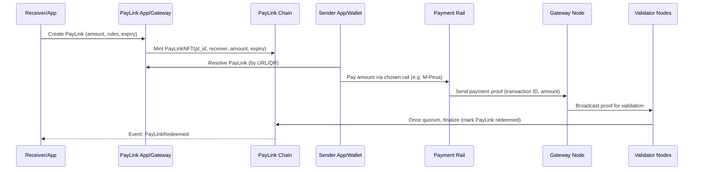

# LinkMint System Design

## Table of Contents

- [System Overview](#system-overview)
- [Architecture Layers](#architecture-layers)
- [Service Definitions](#service-definitions)
- [API Specification](#api-specification)
- [Data Models and Schemas](#data-models-and-schemas)
- [Smart Contracts](#smart-contracts)
- [Consensus: Proof-of-Validation](#consensus-proof-of-validation)
- [Payment Rail Integration](#payment-rail-integration)
- [Security Model](#security-model)
- [Deployment and Infrastructure](#deployment-and-infrastructure)
- [Monitoring and Observability](#monitoring-and-observability)
- [Phased Rollout](#phased-rollout)
- [Glossary](#glossary)

---

## System Overview

LinkMint implements the PayLink protocol -- a decentralized payment coordination system that uses **NFT-backed PayLinks** (ERC-721 style tokens) as immutable payment authorizations. Each PayLink links any payment rail (MPesa, card, bank, crypto) to on-chain logic, enabling programmable, trustless payments without custodial risk.

**How it works:** A receiver creates a PayLink (URL/QR/NFT) specifying amount, currency, and rules. A sender resolves the link and pays via their preferred rail. The payment rail sends confirmation to a gateway adapter, which constructs a cryptographic proof and broadcasts it to the validator network. Validators reach quorum, and the PayLink is settled on-chain with immediate finality.

**Core properties:**
- **Non-custodial:** No funds are held by LinkMint. Money flows sender-to-receiver via external rails. This eliminates PSP/e-money licensing requirements.
- **Rail-agnostic:** A unified proof format abstracts all payment rails. Core logic is rail-unaware.
- **Programmable:** PayLinks carry on-chain rules -- one-time/multi-use, expiry, escrow conditions, split payments.
- **Micropayment-capable:** Supports payments as small as KES 0.01 via blockchain efficiency.
- **Immediate finality:** Proof-of-Validation consensus settles payments in <100ms internally.



---

## Architecture Layers

The system is organized into 9 layers, each independently scalable:

### 1. Application Layer
Web (React), mobile (Flutter), third-party apps, and SDKs (JavaScript, Python, Go, Java, Flutter). These consume the REST/gRPC APIs to create and resolve PayLinks, display payment UIs, and listen for settlement events.

### 2. API Gateway and Auth
All external traffic enters through the API gateway (Kong or AWS API Gateway). Handles HTTPS termination, OAuth 2.0/JWT authentication, rate limiting, request logging, and routes to internal services.

### 3. Core Microservices
Six backend services handling business logic: PayLink Service, Payment Orchestrator, Proof Validator, Escrow Manager, Compliance/Risk Service, and Notification Service. Each owns its data domain and communicates via events (Kafka/SQS).

### 4. Payment Rail Adapters
Bridges to external payment networks. Each adapter receives rail-specific callbacks, normalizes them into the unified proof format, signs the proof, and broadcasts to validators.
- **MPesa Adapter** -- Safaricom Daraja (STK Push, C2B)
- **Card Adapter** -- Visa DPS, Stripe, Adyen
- **Bank Adapter** -- Local bank APIs, ACH, SWIFT
- **Crypto Adapter** -- On-chain listeners for USDC/USDT, EIP-681, Solana Pay

### 5. Validator Network
Decentralized nodes running the consensus algorithm. Communicate via P2P gossip protocol. Validators stake PLN tokens and are selected per-proof via VRF-based committee selection.

### 6. Consensus Layer (Proof-of-Validation)
A bespoke consensus mechanism where a VRF-selected committee of 3-5 validators must reach quorum that a payment proof is valid. Produces immediate finality -- no block confirmation waiting.

### 7. Blockchain (PayLink Chain)
EVM-compatible chain (Polygon or private) hosting the PayLink Protocol smart contracts. Stores canonical PayLink state, enforces rules, records lifecycle events, and prevents proof replay.

### 8. Off-Chain Infrastructure
- **PostgreSQL:** Primary relational store (users, paylinks, payments, ledger)
- **Redis:** Cache for active PayLink mappings and session data
- **Elasticsearch/ELK:** Log aggregation and search

### 9. Monitoring and Observability
Prometheus + Grafana for metrics and dashboards. ELK/Loki for centralized logging. Alerting on failures, latency spikes, and suspicious activity.

---

## Service Definitions

### PayLink Service
- **Responsibility:** CRUD operations for PayLink objects. Mints PayLink NFT on-chain upon creation.
- **Data owned:** `paylinks` table
- **Key operations:** Create PayLink, get PayLink, cancel PayLink, list PayLinks by user
- **Events produced:** `PayLinkCreated`, `PayLinkCancelled`, `PayLinkExpired`
- **Events consumed:** `PayLinkSettled` (from Proof Validator, to update local status)

### Payment Orchestrator
- **Responsibility:** Coordinates payment initiation across rails. Routes to the correct adapter based on `allowed_rails` in the PayLink. Tracks payment lifecycle.
- **Data owned:** Payment session state (in-memory/Redis)
- **Key operations:** Initiate payment, route to adapter, track status
- **Events produced:** `PaymentInitiated`, `PaymentCompleted`, `PaymentFailed`
- **Events consumed:** `PayLinkCreated` (to prepare routing), adapter callbacks

### Proof Validator (Off-Chain)
- **Responsibility:** Receives proofs from adapters, validates structure and signatures, broadcasts to the validator network, collects votes, submits finalization transaction to chain upon quorum.
- **Data owned:** `payments` table (proof records)
- **Key operations:** Receive proof, validate, broadcast, aggregate votes, finalize on-chain
- **Events produced:** `ProofReceived`, `ProofValidated`, `ProofRejected`, `PayLinkSettled`
- **Events consumed:** Adapter proof submissions

### Escrow Manager
- **Responsibility:** Manages conditional PayLinks (milestone-based, multi-party). Maintains state machines for escrow conditions. Triggers release or refund.
- **Data owned:** Escrow state records
- **Key operations:** Create escrow, check conditions, release funds, initiate refund
- **Events produced:** `EscrowCreated`, `EscrowReleased`, `EscrowRefunded`
- **Events consumed:** `PayLinkSettled`, external condition triggers
- **Phase:** Core escrow logic in Phase 2+

### Compliance/Risk Service
- **Responsibility:** KYC/AML checks on users and transactions. Threshold monitoring, sanctions screening, PCI-DSS enforcement for card flows.
- **Data owned:** KYC records, risk scores, compliance flags
- **Key operations:** Screen user, evaluate transaction risk, flag suspicious activity
- **Events produced:** `ComplianceCheckPassed`, `ComplianceCheckFailed`, `TransactionFlagged`
- **Events consumed:** `PayLinkCreated`, `PaymentInitiated`

### Notification Service
- **Responsibility:** Delivers notifications (SMS, email, push) and webhooks to partner applications on domain events.
- **Data owned:** Notification templates, webhook registrations, delivery logs
- **Key operations:** Send notification, deliver webhook, retry failed deliveries
- **Events consumed:** `PayLinkCreated`, `PayLinkSettled`, `PaymentFailed`, `EscrowReleased`, `TransactionFlagged`
- **Retry logic:** Exponential backoff for webhook delivery (max 5 retries over 24 hours)

---

## API Specification

All endpoints require authentication (OAuth 2.0 Bearer token) unless noted. Base URL: `/v1`.

### Create PayLink
```
POST /v1/paylinks
```
**Request:**
```json
{
  "amount": 1500,
  "currency": "KES",
  "receiver": "4qZx7...Tx1A",
  "allowed_rails": ["mpesa", "card", "crypto"],
  "expiry": 1711929600,
  "usage": "single",
  "metadata": { "orderId": "INV-1001" }
}
```
**Response (201):**
```json
{
  "pl_id": "PLK1234567890",
  "status": "CREATED",
  "created_at": "2026-03-29T12:00:00Z",
  "paylink_url": "https://pay.linkmint.io/PLK1234567890",
  "qr_code_url": "https://api.linkmint.io/v1/paylinks/PLK1234567890/qr"
}
```

### Get PayLink
```
GET /v1/paylinks/{pl_id}
```
**Response (200):**
```json
{
  "pl_id": "PLK1234567890",
  "amount": 1500,
  "currency": "KES",
  "receiver": "4qZx7...Tx1A",
  "allowed_rails": ["mpesa", "card", "crypto"],
  "expiry": 1711929600,
  "usage": "single",
  "status": "CREATED",
  "metadata": { "orderId": "INV-1001" },
  "created_at": "2026-03-29T12:00:00Z"
}
```

### Resolve PayLink
```
GET /v1/resolve/{pl_id}
```
**Auth:** Public (no authentication required). Returns payment-facing details for senders.

**Response (200):**
```json
{
  "pl_id": "PLK1234567890",
  "amount": 1500,
  "currency": "KES",
  "allowed_rails": ["mpesa", "card", "crypto"],
  "expiry": 1711929600,
  "status": "CREATED",
  "receiver_name": "Acme Store"
}
```

### Cancel PayLink
```
POST /v1/paylinks/{pl_id}/cancel
```
**Response (200):** `{"pl_id": "PLK1234567890", "status": "CANCELLED"}`

### Submit Payment Proof (Internal)
```
POST /v1/payments
```
Used by adapters to submit proofs. Requires adapter service credentials.

**Request:**
```json
{
  "pl_id": "PLK1234567890",
  "rail": "mpesa",
  "tx_id": "MBPA1234ABCDE",
  "amount": 1500,
  "timestamp": 1711926000,
  "sender": "254700123456",
  "receiver": "254711234567",
  "proof_signature": "0xabc..."
}
```
**Response (202):** `{"payment_id": "uuid", "status": "RECEIVED"}`

### Get Payment Status
```
GET /v1/payments/{payment_id}
```
**Response (200):**
```json
{
  "payment_id": "uuid",
  "pl_id": "PLK1234567890",
  "status": "VALIDATED",
  "rail": "mpesa",
  "tx_id": "MBPA1234ABCDE",
  "created_at": "2026-03-29T12:01:00Z",
  "validated_at": "2026-03-29T12:01:00Z"
}
```

### Register Webhook
```
POST /v1/webhooks
```
**Request:**
```json
{
  "url": "https://merchant.example.com/hooks/paylink",
  "events": ["PayLinkSettled", "PaymentFailed"],
  "secret": "whsec_..."
}
```
**Response (201):** `{"webhook_id": "wh_123", "status": "active"}`

### PayLink URI Scheme
```
paylink://{plId}?version=1.0
```
QR codes and short URLs resolve to the full PayLink object via the `/v1/resolve/{pl_id}` endpoint.

### Standard Error Format
```json
{
  "error": {
    "code": "PAYLINK_EXPIRED",
    "message": "This PayLink has expired and can no longer accept payments",
    "details": { "expired_at": "2026-03-28T00:00:00Z" }
  }
}
```
Common error codes: `PAYLINK_NOT_FOUND`, `PAYLINK_EXPIRED`, `PAYLINK_ALREADY_REDEEMED`, `INVALID_PROOF`, `UNAUTHORIZED`, `RATE_LIMITED`, `INTERNAL_ERROR`.

---

## Data Models and Schemas

### PostgreSQL Tables

```sql
-- Users and Accounts
CREATE TABLE users (
  user_id SERIAL PRIMARY KEY,
  name TEXT,
  phone VARCHAR(20),
  email TEXT,
  kyc_verified BOOLEAN DEFAULT FALSE,
  created_at TIMESTAMP DEFAULT NOW()
);

-- PayLinks
CREATE TABLE paylinks (
  pl_id TEXT PRIMARY KEY,
  creator_id INT REFERENCES users(user_id),
  receiver_id INT REFERENCES users(user_id),
  amount NUMERIC(18,2) NOT NULL,
  currency VARCHAR(3) NOT NULL,
  status VARCHAR(20) NOT NULL,           -- CREATED, VERIFIED, CANCELLED, EXPIRED, FAILED
  expiry TIMESTAMP,
  usage VARCHAR(10) DEFAULT 'single',    -- 'single' or 'multiple'
  metadata JSONB,
  created_at TIMESTAMP DEFAULT NOW(),
  updated_at TIMESTAMP
);

-- Payment Proofs
CREATE TABLE payments (
  payment_id UUID PRIMARY KEY DEFAULT gen_random_uuid(),
  pl_id TEXT REFERENCES paylinks(pl_id),
  rail VARCHAR(20),                      -- mpesa, card, bank, crypto
  tx_id TEXT,
  amount NUMERIC(18,2),
  proof_hash TEXT UNIQUE,                -- SHA-256 of {pl_id, tx_id, amount} for anti-replay
  status VARCHAR(20),                    -- RECEIVED, VALIDATED, FAILED
  created_at TIMESTAMP DEFAULT NOW(),
  validated_at TIMESTAMP
);

-- On-chain Event Log
CREATE TABLE chain_events (
  event_id SERIAL PRIMARY KEY,
  event_type TEXT,                       -- Mint, Redeem, Cancel
  pl_id TEXT,
  block_number BIGINT,
  tx_hash TEXT,
  timestamp TIMESTAMP DEFAULT NOW(),
  payload JSONB
);

-- Double-Entry Ledger
CREATE TABLE ledger_entries (
  entry_id SERIAL PRIMARY KEY,
  account_id INT,                        -- Internal wallet or external account ID
  debit NUMERIC(18,2) DEFAULT 0,
  credit NUMERIC(18,2) DEFAULT 0,
  currency VARCHAR(3),
  description TEXT,
  related_pl TEXT,                       -- Associated PayLink ID
  created_at TIMESTAMP DEFAULT NOW()
);

-- Validators (Phase 2+)
CREATE TABLE validators (
  node_id UUID PRIMARY KEY,
  public_key TEXT,
  stake_amount NUMERIC(18,2),
  status VARCHAR(20),                    -- ACTIVE, SLASHED, INACTIVE
  joined_at TIMESTAMP,
  last_signed TIMESTAMP
);
```

**Key design patterns:**
- `ledger_entries` is **append-only**. Each PayLink settlement generates two entries (debit sender, credit receiver) for full audit and off-chain/on-chain reconciliation.
- `payments.proof_hash` (SHA-256 of `{pl_id, tx_id, amount}`) prevents duplicate proof submission.
- Indexes on `pl_id`, `tx_id`, `status` for fast lookup. Redis cache for active PayLink mappings.

### On-Chain State (Solidity)

```solidity
enum Status { NONE, CREATED, VERIFIED, FAILED }

struct PayLink {
    address receiver;
    uint256 amount;
    uint256 expiry;
    Status status;
    bytes32 metadataHash;
}

mapping(bytes32 => PayLink) public paylinks;
mapping(bytes32 => bool) public usedProofs;    // Anti-replay: proof hash => used
```

### Message Formats

**PayLink Object:**
```json
{
  "pl_id": "PLK1234567890",
  "amount": 1500,
  "currency": "KES",
  "receiver": "4qZx7...Tx1A",
  "allowed_rails": ["mpesa", "card", "crypto"],
  "expiry": 1711929600,
  "usage": "single",
  "metadata": { "orderId": "INV-1001" },
  "signature": "0xabc..."
}
```

**Payment Proof:**
```json
{
  "pl_id": "PLK1234567890",
  "rail": "mpesa",
  "tx_id": "MBPA1234ABCDE",
  "amount": 1500,
  "timestamp": 1711926000,
  "sender": "254700123456",
  "receiver": "254711234567",
  "proof_signature": "HMACorECDSA"
}
```

---

## Smart Contracts

### Contract Architecture

All contracts use the **UUPS proxy pattern** for upgradeability. Upgrades require multi-sig governance approval. Built with OpenZeppelin base contracts.

### PayLinkProtocol.sol (Core)
- `createPayLink(bytes32 plId, address receiver, uint256 amount, uint256 expiry, bytes32 rulesHash)` -- Mints a PayLink NFT (ERC-721). Emits `PayLinkCreated`.
- `redeemPayLink(bytes32 plId, bytes calldata proofData)` -- Validates quorum of validator signatures against proof data. Checks amount/receiver match, expiry, and that `usedProofs[proofHash]` is false. Marks PayLink as `VERIFIED`, sets `usedProofs[proofHash] = true`, burns NFT. Emits `PayLinkSettled`.
- `cancelPayLink(bytes32 plId)` -- Only callable by creator before redemption. Burns NFT. Emits `PayLinkCancelled`.
- **Guards:** `nonReentrant`, `whenNotPaused`, expiry validation, authorized signer checks.
- **Events:** `PayLinkCreated(bytes32 plId, address receiver, uint256 amount)`, `PayLinkSettled(bytes32 plId, bytes32 proofHash)`, `PayLinkCancelled(bytes32 plId)`.

### PLNToken.sol (Phase 2+)
- Standard ERC-20 with mint/burn capabilities
- Fixed supply: 1 billion tokens
- Allocation: 20% team (4-year vesting), 30% treasury, 10% investors, 40% staking rewards
- Staking interface: `stake(uint256 amount)`, `unstake(uint256 amount)`

### ValidatorStaking.sol (Phase 2+)
- `stake(uint256 amount)` -- Lock PLN tokens, join active validator set
- `unstake(uint256 amount)` -- Withdraw staked tokens (cooldown period applies)
- `slash(address validator, uint256 amount, bytes calldata evidence)` -- Reduce stake for misbehavior
- `distributeRewards()` -- Distribute accumulated fees to active validators proportional to stake
- Fee split: 70% staking rewards, 20% treasury/burn, 10% infrastructure

### Security Practices
- OpenZeppelin base contracts (ERC-721, ERC-20, UUPS, ReentrancyGuard, Pausable)
- Formal verification: Certora for invariant checking, Slither for static analysis
- Multi-sig admin wallet (Gnosis Safe) for upgrades and emergency pause
- Third-party audits before each deployment phase
- Bug bounty program after mainnet launch

---

## Consensus: Proof-of-Validation

### Overview

Proof-of-Validation (PoV) is a bespoke consensus mechanism for real-time validation of discrete payment proofs. Unlike block-based consensus (PoW/PoS), each payment proof is resolved independently with immediate finality.

### Validator Set
Nodes stake PLN tokens to become validators. A minimum stake is required. The active validator set is maintained on-chain in the `ValidatorStaking` contract. **Phase 1 uses a single trusted validator; decentralized validation begins in Phase 2.**

### VRF Committee Selection
For each payment proof, a **Verifiable Random Function (VRF)** selects a committee of 3-5 validators from the active set:
1. Seed = hash(last block hash + proof ID)
2. Each validator computes VRF output using its private key
3. Validators with output below threshold are selected for the committee
4. VRF proof is verifiable by any party, preventing adversarial prediction

### Proof Lifecycle

1. **Adapter receives confirmation** from external payment rail (e.g., Daraja callback)
2. **Adapter constructs proof** -- normalizes to unified format, signs with its private key (ECDSA)
3. **Proof broadcast** to validator network via P2P gossip protocol
4. **Committee validators independently verify:**
   - Adapter signature is valid and from a registered adapter
   - Amount matches the PayLink's specified amount
   - Receiver matches the PayLink's receiver
   - PayLink is not expired
   - Proof hash has not been used (anti-replay)
5. **Each validator signs an attestation** (ECDSA signature over proof hash)
6. **Upon quorum** (e.g., 3 of 5), the proof submitter calls `redeemPayLink()` on-chain with aggregated signatures
7. **Smart contract verifies** quorum, updates PayLink status to `VERIFIED`, marks proof hash as used, emits `PayLinkSettled` event

### Finality
Immediate. Once the on-chain transaction confirms (single block), the PayLink is permanently settled. No confirmation waiting period.

### Slashing
Validators who approve invalid proofs or double-sign have their staked PLN reduced. Evidence is submitted on-chain via `slash()`. Slashing conditions:
- Signing off on a proof with mismatched amount/receiver
- Signing conflicting attestations for the same PayLink
- Extended downtime (missed participation in assigned committees)

### Rewards
Validators earn a share of PayLink transaction fees (0.5-1% of settlement amount) in PLN. Distribution is proportional to stake weight and participation rate. Early phases may supplement with treasury allocation.

---

## Payment Rail Integration

### Unified Proof Format

All adapters output the same structure, making the core system rail-agnostic:

```json
{
  "pl_id": "PLK1234567890",
  "rail": "<mpesa|card|bank|crypto>",
  "tx_id": "<rail-specific transaction ID>",
  "amount": 1500,
  "timestamp": 1711926000,
  "sender": "<sender identifier>",
  "receiver": "<receiver identifier>",
  "proof_signature": "<ECDSA signature by adapter>"
}
```

Each adapter signs proofs with its private key (ECDSA P-256). Validators verify these signatures against registered adapter public keys.

**Anti-replay:** `proof_hash = SHA256(pl_id + tx_id + amount)` is stored on-chain in `usedProofs`. One rail transaction settles exactly one PayLink.

### MPesa (Safaricom Daraja)

**Authentication:** OAuth 2.0 token from Safaricom's auth endpoint.

**STK Push (Lipa na M-Pesa Online):**
```json
POST /mpesa/stkpush/v1/processrequest
{
  "BusinessShortCode": "174379",
  "Password": "<Base64(Shortcode + PassKey + Timestamp)>",
  "Timestamp": "20260329120000",
  "TransactionType": "CustomerPayBillOnline",
  "Amount": 1000,
  "PartyA": "254700000000",
  "PartyB": "174379",
  "PhoneNumber": "254700000000",
  "CallBackURL": "https://api.linkmint.io/adapters/mpesa/confirm",
  "AccountReference": "PL12345",
  "TransactionDesc": "PayLink #PL12345"
}
```

**Callback handling:** Parse `CheckoutRequestID`, `ResultCode`, `ResultDesc` from Safaricom's callback. On success, construct proof with `tx_id = CheckoutRequestID`.

**Error handling:** Timeout (user didn't enter PIN), cancellation, insufficient funds -- all result in `PaymentFailed` event.

**Other flows:** C2B, B2C, B2B via corresponding Daraja endpoints with the same proof normalization pattern.

### Card (Visa DPS / Stripe)

**Integration:** Via payment gateway (Stripe, Adyen) or direct Visa DPS (ISO 20022 JSON):
```json
POST /visa/v1/transactions
{
  "merchantId": "987654",
  "card": {"token": "tok_visa", "expiry": "12/27"},
  "amount": 500,
  "currency": "KES",
  "reference": "PLK123456"
}
```

**Key requirements:**
- Tokenized card data only -- never store PAN (PCI-DSS compliance)
- Proof constructed with `tx_id = auth_code` from gateway response
- ISO 20022 field alignment for bank interoperability

### Bank Transfer

- Integrate with local bank APIs (Kenya RTGS, ACH, or bank-specific endpoints like MFS Africa, Equitel)
- Adapter monitors for incoming transfers via webhooks or polling
- Proof constructed with `tx_id = bank_reference_id`
- Normalize across different bank response formats

### Crypto

- Payment initiated via **EIP-681** (Ethereum) or **Solana Pay** URI in QR code
- Adapter monitors on-chain transfers to a known address via blockchain node or event listener
- Proof constructed with `tx_id = txHash`, includes `chainId` for multi-chain support
- Validators independently verify by querying blockchain RPC -- strongest proof model since verification is trustless

---

## Security Model

### Blockchain and Cryptographic Security
- **Immutability:** Smart contracts are the source of truth. Once a PayLink is redeemed on-chain, it cannot be re-used.
- **Cryptographic proofs:** All off-chain data (payment proofs) signed with ECDSA P-256 by adapter private keys. Validators verify signatures before attestation.
- **Replay protection:** `usedProofs[proofHash]` mapping on-chain prevents double-settlement. Each `{pl_id, tx_id, amount}` hash is unique.

### Access Control
- Smart contracts: `nonReentrant` guards, `onlyAuthorized` modifiers, `whenNotPaused` circuit breaker
- Admin operations: multi-sig wallet (Gnosis Safe) required for upgrades, pausing, key rotation
- API: OAuth 2.0 / JWT for user endpoints, service credentials for internal/adapter endpoints

### Decentralized Validation
- No single node can finalize a payment -- quorum of 3-of-5 validators required
- VRF prevents adversarial prediction of committee membership
- Slashing penalizes malicious validators, making collusion economically irrational

### Key Management
- Adapter and validator private keys stored in HSMs or cloud KMS (AWS KMS, Azure Key Vault)
- Periodic key rotation with overlap period
- No private keys in code, config files, or environment variables in plaintext

### Audits and Testing
- Third-party smart contract audits (Trail of Bits, OpenZeppelin) before each phase launch
- Certora formal verification for contract invariants
- Slither static analysis in CI pipeline
- Bug bounty program after mainnet
- Regular penetration testing of APIs and infrastructure

### Compliance
- **PCI-DSS:** Tokenized card data only, no PAN storage, compliant gateway channels
- **GDPR/PDPA:** Personal data encrypted at rest, data minimization, deletion on request
- **KYC/AML:** Compliance/Risk service screens users and transactions against thresholds and sanctions lists
- **DDoS:** Rate limiting at API gateway, WAF (Web Application Firewall), geo-distributed infrastructure

---

## Deployment and Infrastructure

### Environments

| Environment | Infrastructure | Purpose |
|-------------|---------------|---------|
| **Dev** | Docker Compose (local) | Individual developer testing |
| **Staging** | Single K8s cluster | Integration testing, multi-validator simulation |
| **Production** | Multi-AZ K8s cluster | Live traffic, geo-redundant |

### Container Strategy
Each microservice, adapter, and validator node runs as an independent Docker container. Images are built in CI, tagged with git SHA, and pushed to a container registry (ECR/GCR/ACR).

### Orchestration
- Kubernetes (EKS/GKE/AKS) with **Helm charts** per service
- Horizontal Pod Autoscaler for API-facing services
- StatefulSets for validator nodes
- Network policies for service isolation

### Infrastructure as Code
- **Terraform:** VPC, subnets, RDS (PostgreSQL), ElastiCache (Redis), EKS cluster, load balancers, KMS keys, S3 buckets
- **Helm:** Service-specific charts with environment-specific values files

### CI/CD Pipeline

```
PR opened        -> lint, unit tests, contract tests (forge test), Slither analysis
PR merged        -> deploy to staging, run integration tests
Release tagged   -> deploy to production (rolling update, canary optional)
```

GitHub Actions workflows for each stage. Contract deployments require manual approval.

### Database
- PostgreSQL with multi-AZ replicas (RDS)
- Automated daily backups to S3 with 30-day retention
- Point-in-time recovery enabled
- Read replicas for analytics queries

### Disaster Recovery
- Geo-replicated validator nodes across cloud providers
- Standby K8s clusters in alternate regions
- Database point-in-time recovery
- On-chain state replicated across all validator nodes
- Documented recovery procedures in `docs/runbooks/`

### Cost Estimates
- **MVP (Phase 1):** ~$500/month (1 small K8s cluster, 1 RDS instance, 2 vCPU total)
- **Mainnet (Phase 3):** ~$2,000-5,000/month (5+ validators, 3 DB replicas, monitoring stack)

---

## Monitoring and Observability

### Metrics (Prometheus)

**Business metrics:**
- PayLinks created/redeemed per minute
- Payment success rate (by rail)
- Settlement latency (proof received to on-chain finality)
- Active PayLinks count

**System metrics:**
- API latency (p50, p95, p99)
- TPS (transactions per second)
- Queue depth (Kafka/SQS)
- Error rates by service and endpoint
- Validator uptime and participation rate

**Blockchain metrics:**
- Gas usage per contract call
- Contract call counts
- Block time and chain health

### Dashboards (Grafana)
- **PayLink Activity:** Real-time creation/redemption flow, volume by rail
- **System Health:** Service status, latency, error rates, resource utilization
- **Validator Performance:** Uptime, attestation speed, stake distribution
- **Rail Health:** Per-adapter success rate, latency, error breakdown

### Logging (ELK/Loki)
- Structured JSON logs from all services
- **Correlation IDs** across services for distributed request tracing
- Audit logs for admin actions (key rotation, upgrades, KYC decisions)
- Log retention: 30 days hot, 1 year cold (S3)

### Alerting

| Severity | Condition | Channel |
|----------|-----------|---------|
| **Critical** | Validator offline, consensus failure, payment rail down, DB replication lag >30s | PagerDuty |
| **Warning** | Elevated error rates (>5%), high latency (p99 >2s), approaching rate limits | Slack |
| **Info** | Deployment completed, backup finished, certificate renewal | Email |

---

## Phased Rollout

### Phase 1: MVP (2026-Q2)
- Single validator (centralized, trusted)
- MPesa adapter only (Daraja sandbox, then production shortcode)
- Core contracts deployed to EVM testnet
- Services: PayLink Service, Payment Orchestrator, Proof Validator
- Basic React web UI for creating and resolving PayLinks
- **Goal:** End-to-end proof of concept -- create PayLink, pay via MPesa, settle on-chain

### Phase 2: Beta (2026-Q3)
- Multi-validator network (3-5 nodes in staging)
- Card adapter (Stripe) and crypto adapter added
- PLN token deployed, staking contract live
- Escrow Manager and Compliance/Risk services activated
- Pilot merchants onboarded (10-50)
- JavaScript and Flutter SDKs published
- **Goal:** Validate multi-rail, multi-validator architecture under real load

### Phase 3: Mainnet (2026-Q4+)
- 5+ validators with open staking
- All adapters production-ready
- DAO governance for protocol upgrades
- Full SDK suite (JS, Python, Go, Java, Flutter)
- Developer portal, sandbox environment, chain explorer
- Public launch with media and marketing
- **Goal:** Fully decentralized, production-grade payment coordination network

---

## Glossary

| Term | Definition |
|------|-----------|
| **PayLink** | An NFT-backed payment authorization (URL/QR/token) specifying amount, receiver, and rules |
| **PLN** | ERC-20 utility token used for validator staking, transaction fees, and governance |
| **Proof-of-Validation (PoV)** | Consensus mechanism where a VRF-selected validator committee verifies payment proofs |
| **VRF** | Verifiable Random Function -- produces random output with a proof anyone can verify |
| **Rail** | An external payment network (MPesa, Visa, bank, crypto blockchain) |
| **Adapter** | A bridge service that connects an external rail to the LinkMint proof system |
| **Proof** | A signed attestation that a payment occurred on an external rail |
| **Quorum** | The minimum number of validator signatures required to finalize a PayLink (e.g., 3 of 5) |
| **Slashing** | Penalty (stake reduction) for validators who approve invalid proofs or misbehave |
| **PayLink Chain** | The EVM-compatible blockchain hosting PayLink Protocol smart contracts |
| **UUPS** | Universal Upgradeable Proxy Standard -- pattern for upgradeable smart contracts |
| **Finality** | The point at which a PayLink settlement is irreversible |
| **Double-Entry Ledger** | Accounting pattern where every transaction creates a debit and credit entry |
